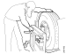

## Спецификациа

### Проверка и подесување

| Величина | вредност |
|-|-|
| Широчина, нов диск за сопирачка. | 45 mm |
| Широчина, минимална дозволена вредност. | 37 mm |
| Широчина, максимално дозволена разлика во широчината на дискот по целиот обем. | 0.08 mm |
| Широчина, максимално дозволено играње. | 0.02 mm |
| Пукнатини, максимално дозволена должина. | 40 mm |
| Пукнатини, максимално дозволена широчина. | 1.5 mm |

## Одржување

!!! warning "Предупредување"

    Работите на сопирачкиот систем може да ги извршува само персонал со доволна обука и знаење за потребната задача.

    Потребно е да се следат упатствата за да се избегнат повреди и оштетувања на опремата.

    Исто така е важно да се користат исправни делови бидејки отказ на сопирачката на пат може да има катастрофални последици.

### Замена на диск за сопирачка

***Алат***

| број | Опис | Илустрација |
| -|-|-|
| **87 596** | Чекан со тег | { width="160" } | 
| **94 401** | V блок | { width="120 } | 
| **98 402** | Држач | { width="120" } |
| **98 404** | Зглобен држач | { width="120" } |
| **98 560** | Клич 100 mm, 1", окаст | { width="120" } | 
| **98 590** | Извлакач | { width="120 } | 
| **99 307** | Држач Клич 80 mm, 1", окаст| { width="120" } |
| **99 311** | Заштитна чаура | { width="120" } |
| **99 345** | Адаптер | { width="120" } |
| **587 121** | Подигач на тркало | { width="120" } |
| **587 313** | Дигалка, за менувачот | { width="160" } |

Ако дискот треба да се мери тоа треба да се направи пред да се демонтира од возилото. Ова овозможува да се изврши исправна дијагноза, на пример вибрациите кои се резултат на разликата во широчина н не се појавуваат секогаш од двете страни на осовината. 

Ако на едната страна на осовината се менува дискот поради разлика во широчината или поради играње истот така треба да се замени и дискот од другата страна на осовината иако на пример има широчина од 40 mm. Ов асе прави со цел да се продолжи работниот век на дискот и влошките. Ако се менуваат дискови на осовината требада се заменат и влошките за сопирање.

!!! warning "Предупредување"

    Никогаш да не се работи под возило кое се потпира само на дигалки. Потребно е да се користат носачи за осовините. Ако возилото е со воздушна амортизација потребно е да се испразнат ваздушните јастуци.

| Операција | &nbsp; |
|-|-|
| 1. Да се подигне и потпре осовината. | &nbsp; |
| 2. Да се демонтира тркалото со помош на алатката ***587 121***. |{ width="300" } |
| 3. Да се демонтира клештата за сопирање. | &nbsp; |
| 4. Да се демонтира капачката од носачот на тркалото. Постојат три различни изведби на капачката. - **Изведба со нарежан отвор за завртка за избивање.**. Да се извади чепот од централниот отвор на капачката и да се постави завртка M20 со целосен навој и минимална должина од 50mm. Завртката да се заврти додека не се ослободи капачката. - **Изведба без нарежан отвор за завртка за избивање**. Да се извади чепот од централниот отвор на капачката и да се постави завртка M12. Со помош на чеканот со тег да се извлече капачката. - **Дизајн со осмоаголна капачка**. Да се демонтира капачката со помош на лост и клуч 100mm. - ***Да не се користи пнеуматски пиштол за заштрафување***  | { width="300" } |
| 5. Поради големата тежина на носачот на тркалото и дискот за сопирање упатно е користење на дигалка кога се врши демонтажа и монтажа. Да се постави носачот на тркалото na дигалката **587 313** со V блокот **98 401**, држачот **98 402**, зглобниот носач **98 404** и два адаптера **99 345**. | { width="300" } |
| 6. Да се одспои завртката од носачот на тркало со клучот 80mm или 100mm. | &nbsp; |
| 7. Да се извлече носачот со помош на извлакачот **98 590.**  - За предната осовина да се користи заштитната чаура **99 311* за да се заштити ракавецот на осовината. | { width="300" } |
| 8. Носачот на тркалото да се извади од дигалката и да се постави на рамно место внимавајки да не се оштети запчаникот за импулси. | &nbsp; |
| 9. Да се извадат завртките кои го држат дискот на носачот на тркало. | { width="300" } |
| 10. Да се постави нов диск за сопирање. **Момент на затегање** - 290 Nm. | { width="300" } |
| 11. Да се попстави носачот на тркалото на дигалката како што е предходно објаснето. | &nbsp; |
| 12. Да се подмачка ракавецот на осовината и внуимателно да се постави носачот на тркало на место.  За предната осовина да се користи заштитната чаура **99 311**. | &nbsp; |
| 13. Да се извади заштитната чаура,ако е користена. Да се подмачка одстојната подлошка и да се постави. Да се постави носачот на терет од подлошката во гнездото на ракавецот на осовината. | { width="300" } |