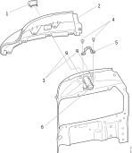

---
hide:
  - footer
---

## Намена

Чистење на челните светла.

{ width="800" }

1. *Пумпа за перење*
1. *Држач за монтажа*
1. *Телескопска бризгалка*

## Начин на работа

Чистењето на челните стакла се активира со притискање на прекинувачот  (S24), кој се наоѓа на крајот од рачката за давање на смер и вклучување на брисачи (S141). Контролната единица (CUV) преку излезот C16 а пореку релето (R93) праќа сигнал за активирање на високопритисната пумпа. Пумпата останува вклучена 1.6sec. По истекот на ова време пумпата може пак да се активира.

## Опис на работни задачи

### Демонтажа на телескопската бризгалка

{ width="600" }

1. *Усмерувач*
1. *Заптивка за капакот*
1. *Завртка M6*
1. *Капак на челните светла*
1. *Држач*
1. *Телескопска бризгалка*

| Операција |&nbsp;|
|-|-|
| 1.Да извади усмерувачот (1) со притискање на телескопската бризгалка и истовремено држење на капакот на челните светла. | &nbsp; |
| 2.Да се извадат трите завртки кои го држат капакот на челните светла (2). Да се олабави светлото за покажување на смер и челното светло да се извади надвор за да може да се пристапи на пластичните осигурачи на дното. | { width="400" }|
| 3.Да се извади приклучокот за цревото од телескопската бризгалка . Да се извадат завртките (3, 4) кои ја држат бризгалката. | { width="400" } |

