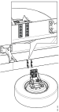

---
hide:
  - footer
---

## Спецификација

Момент на затегање: 170Nm.

## Монтажа

{ width="460" }

Носачот за резервно тркало може да се монтира било каде на возилото и на било која страна. Носачот на резервното тркало мора да се монтира со целата површина дирекно на рамот и поради тоа не може да се монтира во отворот на рамот на пр. заедно со држачот за петтото тркало.

Носачот треба да биде монтиран заедно со попречна греда која ќе апсорбира дел на напрегањето. Ако тоа не е можно, носачот на резервното тркало треба да с емонтира што е можно поблиску до попречната греда.

{ width="400" }

Носачот треба да се осигура со три завртки во секој од надворешните редови.

### Монтажа заедно со попречна греда

{ width="400" }

### Монтажа со навојни плочи

{ width="400" }

### Монтажа зедно со резервоар за воздух

{ width="400" }

