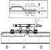

---
hide:
  - footer
---

## Спецификации

### Момент на затегање, фиксно петто тркало

!!! info "Важно"

    Ако има проблеми со лабави завртки или напукната плоча на петтото тркало прво треба да се надгради споевите со завртки ако има отстапување од фабричкото решение. Надградбата треба да биде со плоча со една класа појака цврстина.

**Стар дизајн**

{ width="600" }

- <small>M18: 290Nm</small>
- <small>M20: 420Nm</small>

**Нов дизајн**

{ width="600" }

<table class="table table-bordered">
<small>
    <tr>
        <td>A:</td>
        <td>290Nm</td>            
        <td>(H=22mm, Dmax=152 kN)</td>
    </tr>
    <tr>
        <td>A:</td>
        <td>290Nm</td>            
        <td>(H=40mm, Dmax=152kN)</small></td>
    </tr>
    <tr>
        <td>A:</td>
        <td>420Nm</td>           
        <td>(H=16mm, Dmax=260kN, 16+25mm Dmax=260kN)</td>
    </tr>
    <tr>
        <td>A:</td>
        <td>420Nm</td>           
        <td>(H=40mm, Dmax=260kN)</td>
    </tr>
    <tr>
        <td>B:</td>
        <td>530 Nm</td>
        <td>&nbsp;&nbsp;</td>
    </tr>
</table>

## Момент на затегање, модуларна плоча со отвори

{ width="600" }

- <small>А: 360Nm + 90°</small>
- <small>B: 450Nm</small>

