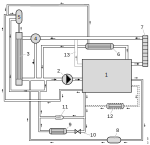
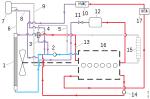
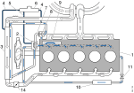
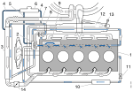
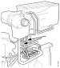
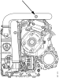

---
hide:
  - footer
---

## Општо

Системот за ладење ја одржува работната температура на мотор на соодветно ниво. Ова е исклучително важно за оперативните трошоци и работниот век на моторот.

### 13 литарски мотор со SCR или EGR [XPI]

<small>Се однесува за мотори со цилиндерски блок од втора генерација.</small>

<figure markdown>
  { width="600" }
  <figcaption>Шема на разладниот систем</figcaption>
</figure>

  

    <table class="table table-bordered">
        <tr>
            <td> <small>1.Мотор</small></td>
            <td>&nbsp;&nbsp;</td>
            <td><small>5.Експанионен резервоар</small></td>            
            <td>&nbsp;&nbsp;</td>
            <td><small>9.Изменувач на топлина</small></td> 
            <td>&nbsp;&nbsp;</td>
            <td><small>13.Алтернативна врска кога се нема ладилник за ретардерот</small></td>  
        </tr>
        <tr>
            <td><small>2.Пумпа за разладната течност</small></td>
            <td>&nbsp;&nbsp;</td>
            <td><small>6.Ладилник за EGR</small></td>            
            <td>&nbsp;&nbsp;</td>            
            <td><small>10.Изменувач на топлина</small></td>
            <td>&nbsp;&nbsp;</td>         
        </tr>
        <tr>
            <td><small>3.Ладилник</small></td>
            <td>&nbsp;&nbsp;</td>
            <td><small>7.Ладилник на ретардерот</small></td>            
            <td>&nbsp;&nbsp;</td>
            <td><small>11.Преливен вентил</small></td>
            <td>&nbsp;&nbsp;</td>   
            <td>&nbsp;&nbsp;</td>              
        </tr>
        <tr>
            <td><small>4.Термостат</small></td>
            <td>&nbsp;&nbsp;</td>
            <td><small>8.Вентил за ладење на SCR системот</small></td> 
            <td>&nbsp;&nbsp;</td>           
            <td><small>12.Воден греач во кабината</small></td>
            <td>&nbsp;&nbsp;</td>
            <td>&nbsp;&nbsp;</td>   
        </tr>        
    </table>
  

## Начин на работа

### Шема на делување на 13 литарски мотори

{ width="32" } &nbsp; - топла разладна течност

{ width="32" } &nbsp; - Разладна течност која поминала низ изменувач на топлина или чија температура се регулира со мешање наладна и топла раззладна течност.

{ width="32" } &nbsp; - ладна разладна течност

{ width="32" } &nbsp; - преливна цевка

{ width="900" }

  

    <table class="table table-bordered">
    <small>
        <tr>
            <td><small>1.Ладилник</small></td>
            <td>&nbsp;&nbsp;</td>            
            <td><small>7.Експанионен резервоар</small></td>
            <td>&nbsp;&nbsp;</td>
            <td><small>13.Алтернативна врска кога се нема ладилник за ретардерот</small></td>
        </tr>
        <tr>
            <td><small>2.Пумпа за разладната течност</small></td>
            <td>&nbsp;&nbsp;</td>           
             <td><small>8.Статичка линија</small></td>
            <td>&nbsp;&nbsp;</td>
            <td><small>14.Компресор за воздух</small></td>
            <td>&nbsp;&nbsp;</td>
        </tr>
        <tr>
            <td><small>3.Бајпас линија</small></td>
            <td>&nbsp;&nbsp;</td>
            <td><small>9.Преливна цевка од моторот</small></td>
            <td>&nbsp;&nbsp;</td>
            <td><small>15.Ретардер</small></td>
        </tr>
        <tr>
            <td><small>4.Термостат/Двоен термостат</small></td>
            <td>&nbsp;&nbsp;</td>
           <td><small>10.HVAC (водно вебасто)</small></td>
            <td>&nbsp;&nbsp;</td>
            <td><small>16.Мотор</small></td>
        </tr>
        <tr>
            <td><small>5.Управувачка линија за двојниот термостат</small></td>
            <td>&nbsp;&nbsp;</td>
            <td><small>11.вентил од SCR системот</small></td>
            <td>&nbsp;&nbsp;</td>
            <td><small>17.WTA(изменувач на топлина вода-воздух)</small></td>
        </tr>
        <tr>
             <td><small>6.Преливна гранка на ладилникот</small></td>
            <td>&nbsp;&nbsp;</td>
            <td><small>12.Резервоар за редуктант</small></td>
            <td>&nbsp;&nbsp;</td>
           <td>&nbsp;&nbsp;</td>
        </tr>
        
    </table>
  

Разладниот систем работи на надтемпература што значи дека разладната течност има поголема точка на вриење.

Кога термостатот (4) отвара, разладната течност оди дирекно во ладилникот (1) и потоа тече хоризонтално низ келиите за ладење. Разладната течност се лади со воздухот од вентилаторот кој поминува низ келиите за ладење и ветарот предизвикан од движењето на возилото нанапред.

При ниска температура на разладната течност термостатот е затворен и целокупната количина на разладна течност цилкулира преку бајпас линијата (3) без притоа да помине низ ладилникот. Бидејки возилото има автоматски менувач и/или ретардер има двоен термостат.

Кога моторот (16) ќе ја достигне работната температура тогаш термостатот е во средна, отворена позиција. Тогаш разладната течност циркулира низ двата бајпас канали и преку термостатот оди во ладилникот. Ако температурата на разладната течност е висока целокупната количина на разладната течност преку термостатот оди во ладилникот. Тогаш отворите на бајпас линиите се комплетно затворени.

Пумпата за разладна течност (2) ја пумпа разладната течноста преку ладилникот за масло а од тука во каналите на цилиндерскиот блок. Течноста струи околу цилиндерските кошулици а потоа оди нагоре кон цилиндерските глави. Течноста од цилиндерските глави се собира во колекторот на цилиндерскиот блок.

Од тука течноста струи наназад преку каналите во цилиндерскиот блок кон приклучокот на задниот дел од моторот. На овој приклучок е приклучен ладилникот на ретардерот од каде ракладната течност оди  кон термостатот.

Од истиот приклчучок разладната течност оди во SCR системот и ладилникот на EGR-от.

SCR системот ја користи разладната течност за да го загрее редуктантот во резервоарот (12). Протокот го регулира вентилот (11).

EGR-от ја користи разладната течност за да ја намали температурата на издувните гасови.

Воздучниот компресор (14) се лади со разладната течност која ја добива од излезот на ладилникот за масло.

Експанзиониот резервоар (7) е поврзан со меоторот и ладилникот преку вентилациони цевки (6, 9), што значи дека овој резервоар го одзрачува системот за ладење и спречува формирање на воздушни чепови.

Во системот има статична линија (8) помеѓу влезната страна на пумпата и експанзиониот резервоар. Ова на пумпата и дава константен надпритисок со што се намалува можноста за оштетување поради кавитација.

Греачот во кабина  (10) ја користи топлината на повратната течност за греење.

Ако возилото е опремено со со WTA 6kW греач (17), што е граеч за моторот и кабината, протокот варира според подесувањето на WTA греачот. Повеќе информации можат да се најдат во документацијата за WTA 2 помошниот греач.

Ако возилото е опремено со WTA 3kW греач (17), тогаш разладната течност се користи само за загревање на кабината но не и за моторот.

Друга опрема со која може да биде снабдено возилото е SSH што е всушност циоркулациона пумпа која се користи да се одземе заостанатата топлина откако моторот ќе се изгасне.

Кога температурата на разладната течност е прениска или пак превисока се пали сигнална сијалица. Како мерка за предпазливост, кога температурата на разладната течност е превисока, се намалува влечниот момент на моторот.

### Шематски приказ на струење на разладната течност кај 13 литарски мотор

Се однесува на 9, 11, 12 и 13 литарски мотори без разлика на генерацијата на цилиндеррскиот блок. 

<figure markdown>
  { width="600" }
  <figcaption>Шематски приказ на струење на разладната течност - возило со или без SCR систем</figcaption>
</figure>

<figure markdown>
  { width="600" }
  <figcaption>Шематски приказ на струење на разладната течност - со EGR</figcaption>
</figure>

  

    <table class="table table-bordered">
    <small>
        <tr>
            <td><small>1.Цилиндерски блок</small></td>
            <td>&nbsp;&nbsp;</td> 
            <td><small>4.Одзрачување</small></td>
            <td>&nbsp;&nbsp;</td>
            <td><small>7.Бајпас линија</small></td>             
            <td>&nbsp;&nbsp;</td>      
            <td><small>10.Резервоар за редуктант</small></td>    
            <td>&nbsp;&nbsp;</td>  
            <td><small>13 EGR вентил</small></td>
        </tr>
        <tr>
            <td><small>2.Пумпа за разладната течност</small></td>
            <td>&nbsp;&nbsp;</td>  
            <td><small>5.Статичка линија</small></td>                 
            <td>&nbsp;&nbsp;</td>
            <td><small>8.Термостат</small></td>             
            <td>&nbsp;&nbsp;</td>
            <td><small>11.Вентил за вода во SCR системот</small></td>
            <td>&nbsp;&nbsp;</td>
            <td><small>14.Електро клапна</small></td>
            
        </tr>
        <tr>
            <td><small>3.Разладни ќелии</small></td>
            <td>&nbsp;&nbsp;</td>
            <td><small>6.Експанионен резервоар</small></td>                      
            <td>&nbsp;&nbsp;</td>
            <td><small>9.Ладилник за масло</small></td>            
            <td>&nbsp;&nbsp;</td>   
            <td><small>12.Ладилник за EGR</small></td>         
            <td><small>&nbsp;&nbsp;</small></td>
        </tr>
    </table>
  

## Опис на работни задачи

### Празнење на разладната течност

!!! warning "Предупредување"

    Ако моторот е со работна температура, разладната течност е многу топла и може да предизвика изгореници.

!!! info "Важно"

    Не ед озволено да се внесува голема количина на разладна течност преку експанзиониот резервоар. Полнењето преку експанзиониот сад доведува до заробување на воздух што може да предизвика оштетување на заптивките на осовината на пумпата.

!!! info "Важно"

    Да не се стартува моторот додека не се наполни пропишаната количина на разладна течност. Стартување со недоволна количина на разладна течност може да доведе до оштетување на заптивките на осовината на пумпата.

| Операција | &nbsp; |
|-|-|
| 1.Внимателно да се отвори капачката од експанзиониот резервоар. Системот е со надпритисок. | &nbsp; |
| 2.Да се демонтира гумениот чеп и приклучокот за полнење | { width="400" } |
| 3.Да се поврзе цревото од коиличката за разладна течност **588 540** на приклучокот за празнење кој се навоѓа под браникот на кабината. Да се испразни и собере разладната течност. За постарата верзија на количка потребен е адаптерот **99 301**. | { width="400" } |
| 4.Да се поврзе цревото од коиличката за разладна течност **588 540** на приклучокот за празнење на десната страна на моторот (гледано од позади). Да се испразни и собере разладната течност. За постарата верзија на количка потребен е адаптерот **99 301**. | { width="400" } |

### Полнење на разладната течност

!!! info "Важно"

    Не ед озволено да се внесува голема количина на разладна течност преку експанзиониот резервоар. Полнењето преку експанзиониот сад доведува до заробување на воздух што може да предизвика оштетување на заптивките на осовината на пумпата.

!!! info "Важно"

    Да не се стартува моторот додека не се наполни пропишаната количина на разладна течност. Стартување со недоволна количина на разладна течност може да доведе до оштетување на заптивките на осовината на пумпата.

| Операција | &nbsp; |
|-|-|
| 1.Да се демонтира гумениот чеп и приклучокот за полнење. | { width="400" } |
| 2.Да се поврзе цревото од коиличката за разладна течност **588 540** на приклучокот за празнење кој се навоѓа под браникот на кабината. Да се дополни, инсталацијата со разладна течност. 
За постарата верзија на количка потребен е адаптерот **99 301**. | { width="400" } |
| 3.Да се провери дали цевките за дренажа се блокирани или оштетени. Има дренажна цевка од радиаторот и од моторот. | { width="360" } |
| 4.Да се откопчаат цевките за дренажа од експанзиониот резервоар. Да се постави корито за да се собере разладната течност од цевките за дренажа. | &nbsp; |
| 5.Да се извади капачката од експанзиониот резервоар. Да се постави греењето на максимално ниво (MCC). | &nbsp; |
| 6.Со помош на количката да се наполни системот со разладна течност се додека низ цевките за дренажа не протече течност без заробен воздух. За квалитетот на разлладната течност и потребната количина да се види [00:16-15] | &nbsp; |
| 7. Дренажните цевки да се вратат на место и да се наполни со разладна течност то максималното ниво на експанзиониот резервоар. | &nbsp; |
| 8. Да се изврши тест за притисок на системот за ладење.[] | &nbsp; |
| 9. Следното се однесува за ретардерот. Да се поврзе адаптерот **99 301** со црево на приклучокот за одзрачување на ладилникот на ретардерот. Да се продолжи со полнење на разладна течност  со помош на количката **588 540**, како што е опишано погоре и да се собере мешавината на разладна течност и воздух од ретардерот. Да се полни се додека од ладилникот на ретардерот не протече течност без заробен воздух. Да се дополни разладната течност до максималното ниво на експанзиониот резервоар. | { width="360" } |
| 10.Да се одспои количката и да се стартува моторот. Греачот ACC да се постави на максимално ниво. Да се остави моторот да работи 15 минути на празен од. | &nbsp; |
| 11.Да се изгасне моторот и да се надополни разладната течност до максимално ниво преку експанзиониот сад. | &nbsp; |
| 12.Поради можноста да има заробен воздух во инсталацијата експанзиониот сад треба да се надополни откако моторот ќе ја достигне работната температура и кога термостатот ќе отвори. Потребно е да моторот работи извесно време додека не исчезне воздухот од инсталацијата што може да предизвика потреба за повторно надополнување со разладна течност. | &nbsp; |

!!! warning "Предупредување"

    Помошен уред за греење на вода

    Пред да се стартува овој уред инсталацијата на разлдната течност треба да се одзрачи. Во спротивно греаќот може да се прегрее и во најлош случај да доведе до пожар на возилото.

!!! info "Важно"

    Помошни кола

    Ако на возилото се вгради систем поврзан со ситемот за ладење истиот треба да има точка за одзрачување сместена на највисоката точка и во текот на полнењето на системот за ладење истата да биде отворена. Полнењето на овие помошни кола да се остварува како што е опишано погоре.

!!! info "Важно"

### Тест за притисок на системот за ладење

| Операција | &nbsp; |
|-|-|
| 1.Да се извади капачката од експанзиониот резервоар. | &nbsp; |
| 2.Да се провери дали е оштетена контакната површина на грлото за полнење и заптивката на капачката. | &nbsp; |
| 3.Да се провери нивото на разладна течност и да се дополни ако е потребно. | &nbsp;  |
| 4.Да се врати на место капачката.| &nbsp; |
| 5.Со пумпање да се подига притисокот се додека вентилот за полнење не отвори. За HPI мотор вентилот треба да отвори на **0.6 - 0. 9bar**.  | &nbsp; |
| 6.Да се престане со пумпањето и да се овозможи на вентилот за полнење да затвори. Притисокот во системот не смее да падне под **0.5bar**. Ако ова барање не е исполнето станува збор за внатрешно или надворешно течење на вентилот за полнење. **Вентил за полнење** Да се провери вентилот ако е потребно да се замени со нов. **Надворешно течење** Надворешното течење може да се примети по течењето на разладната течност на земја. Прво треба да се проверат цревата и споевите. **Внатрешно течење** Внатрешното течење во моторот може да предизвика појава на бел издувен чад и присуство на разладна течност во маслото на моторот. Тогаш единствено решение е поправка на моторот. Внатрешно течење на ладилникот за масло може да доведе до појава на масло во разладната течност или разладна течност во маслото. Дефектниот филтер за масло треба да се замени со исправен. | &nbsp; |

### Проверка на антифриз

Инструкциите за проверка на антифриз како и табелата за дозирање се наоѓаат овде: [Инструкции за одржување за група 1-3 P, G, R, и T серија]()

Информации за разладна течност и волумени се овде: [Гориво, масла и течности]()

### Чистење на разладниот систем

Пред да се отпочне со чистење на системот за ладење да се изврши тест за притисок. После чистењето на системот да се постави нов термостат и капачка за експанзионит резервоар ако истекување на масло ги оштетило заптивките. Ако моторот е опремен со филтер за разладна течност истиот да се замени.

!!! info "Важно"

    Да се очистат внимателно сите траги на масло во системот бидејки може да се оштетат гумените црева и заптивките.

Особено е важно системот да се очисти темелно од остатоци на масло. 

Ако инсталацијата е екстремно нечиста потребно е неколку кратно чистење. Чистењето треба да се врши со голема концентрација на средство за перење (max.  10%) и во време траење не помало од 30 min.

Средството за перење кое се препорачува ако се нема **2 479 017** е течен сапун за машинско миење на садови кој не пени. Концентарацијате треба да биде 1% (0.1/10 L). 

Ако се користи течен сапун за садови тогаш треба да се извади само термостатот и да се испере. Кога се пере на овој начин температурата на моторот треба да биде над 70°C и поради тоа термостатот треба да работои нормално. После перењето системот треба да се исплакне со нормална вода при што моторот реба да работи најмалку 5min. Плакнењето треба да се повтори три пати по што треба да се постави нов термостат и системот да се наполни со разладна течност.

!!! info "Важно"

    Да не се полни топол мотор со ладна вода бидејки како резултат на разлика во температурите каналите за ладење во блокот на моторот можат да се оштетат.
| Операција | &nbsp; |
|-|-|
| 1.Да се очисти количката и наполни со 10-15L топла вода и да се поврзе. | &nbsp; |
| 2.Да се постави адаптерот **588 872** или соодветна капачка со приклучок за црево на експанзиониот сад. | &nbsp; |
| 3.Да се исплакне експанзиониот резервоар со 10L на вода, преку приклучокот за приклучокот з аполнење и дренажа. |&nbsp; |
| 4.Да се приклучи количката и да се испразни системот за ладење. |&nbsp; |
| 5.Да се подигне кабината. |&nbsp; |
| 6.Да се открие причината за појавата на нечистотии и да се отклони. |&nbsp; |
| 7.Да се извади термостатот и да се замени со термостат прилагоден (полн проток) за чистење на системот. Термостатот се прилагодува на следниот начин. - Да се отстранат нитните со стругање -  Да се извадат вентилите на термостатот. - Да се монтира вака прилагодениот термостат како држач за заптивка|{ width="360" } { width="360" }  |
| 8.Да се врати кабината назад. | &nbsp; |
| 9.Да се очисти количката и да се наполни со топла вода. | &nbsp; |
| 10.Да се приклучи количката. | &nbsp; |
| 11.Да се извади капачката од експанзиониот сад и да се замени со адаптерот ***588 872*** или соодветна капачка со црево. Додека мотопрот работи околу 10 min. , на празен од, да се измие системот со топла вода. При тоа системот треба да работи под максимален проток односно греачите во кабина да се постават на максимално ниво. | &nbsp; { width="360" }|
| 12.Да се исклучи моторт и да се испразни системот за ладење.| &nbsp; |
| 13.Ако е потребно да очисти експанзиониот резервоар, со вадење на сите цевки, со средство за одмастување и четка за садови.| &nbsp; |
| 14.Да се испразни и очисти.| &nbsp; |
| 15.Сапунот треба да сочинува 5-10% од вкупниот волумен (во зависност од количината на нечистотија). Првично сапунот треба да се раствори во мала количина на топла вода (10-15 L) во количката. Да се наполни системот.| &nbsp; |
| 16.Да се загрее моторот до работна температура со течен сапун под оптеретување во време траење од 5-30 min. (во зависност од количината на нечистотии). При тоа системот треба да работи под максимален проток односно греачите во кабина да се постават на максимално ниво.| &nbsp; |
| 17.Да се исклучи моторот. Извесна количина на нечистотија ќе се собере во експанзиониот резервоар. Да се приклучи количката. Капачката од експанзиониот ресервоар да се замени со ***588 872** адаптерот или соодветна капачка со црево.| &nbsp; |
| 18.Да се испразни системот за ладење.| &nbsp; |
| 19.Да се очисти количката и да се наполни со топла вода | &nbsp; |
| 20.Да се приклучи количката и да наполни системот со вода. Потоа водата да се испушти. | &nbsp; |
| 21.Да се извади капачката од експанзиониот сад и да се замени со адаптерот ***588 872*** или соодветна капачка со црево. Да се исплакне системот со топла вода преку истекување на водата низ оваа капачка пр празен од и во време траење од 10 min. При тоа системот треба да работи под максимален проток односно греачите во кабина да се постават на максимално ниво. | &nbsp; |
| 22.Да се поврзе количката ***588 540*** и да се испразни системот за ладење. | &nbsp; |
| 23.Ако е потребно да се испере експанзиониот сад со вадење на сите црева и четка за перење на садови. | &nbsp; |
| 24.Да се подигне кабината. | &nbsp; |
| 25.Да се постави нов термостат. | &nbsp; |
| 26.Да се проверат и по потреба заменат оштетените гумени црева.| &nbsp; |
| 27.Да се врати назад кабината.| &nbsp; |
| 28.Да се очисти количката ***588 540*** и да се поврзе на системот за ладење. Системот да се наполни со разладна течност. | &nbsp; |
| 29.Да се загрее моторот до работна температура и да се надополни со разладна течност ако е потребно. | &nbsp; |
| 30.Да се провери дали има уште нечистотии и масло во експанзиониот резервоар. При ова треба да се донесе одлука дали ќе се чисти целиот систем или само експанзиониот сад. | &nbsp; |

