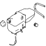
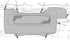
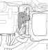
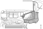
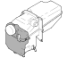

---
hide:
  - footer
---

## Општо

### Намена

Кога разладната течност се загреваа таа се шири. За справување со зголемениот волумен во разладниот систем е вграден ексапнзионен резервоар кој исто така служи и за одзрачување на разладниот систем.

<figure markdown>
  { width="500" }
  <figcaption>Експанзионен резервоар</figcaption>
</figure>

## Начин на работа

Експанзиониот резервоар е приклучен на моторот и ладилникот преку цевки за одрзачување што значи дека тој служи за одрзачување на системот за ладење.

Врската кон експанзиониот резервоар од ладилникот има неповратен вентил кој го спречува протокот на разладната вода низ ладилникот кога се користи помошен греач на пример Webasto.

Експазиониот резервоар е сместен над највисоката точка на ладилникот и моторот и има цевка за полнење и капачка.

Во експанзиониот резервоар е исто така вграден проточен вентил кој отвара на 0.7 или 0.9 bar во зависност од типот на моторот.Кого моторот ќе се олади после возење проточниот вентил отвара за да се изедначи разликата во притисокот.

Помеѓу влезот на пумпата за разладна течност и експанзиониот сад е вградена статичка цевка. Оваа врска овозможува да пумпата секогаш работи со константеннадпритисок и со тоа се намалува опасноста од оштетувања поради кавитација.

На експанзиониот сад има ознаки кои го покажуваат минималното и максималното ниво кога моторот е ладен.

На некои изведби на експанзионен резервоар во капачката има вградено сигурносен вентил. При надпритисок од околу 1.2bar сигурносниот вентил отвара и го намалува притисокот на водата и пареата.

## Одржување

### Замена на флексибилните црева

!!! info "Важно"

    Кај цревата кој кои и кај кои при демонтажа е утврдено оштетување да се заменат со нови.

### Замена на вентил за контрола на притисок

| Операција |&nbsp;|
|-|-|
| 1.Да се испушти разладната течност. [види овде](020001.md#одржување) | { width="400" } |
| 2.Да се извади рачката за пумпата за подигање на кабина (1) и држачите на рачката (2). Да се одспои конекторот (3). | { width="400" }|
| 3.Да се извади капакот на греачот. | { width="400" } |
| 4.Да се извади завртката за обезбедувањена на вентилот за вода и да се демонтираат цревата. Да се извади прекинувачот навентилот. Да се одспои вентилот и да се извади. | { width="400" }|
| 5.Да се демонтира лајсната под челнното стакло. | { width="400" } |
| 6.Да се извади намотката за перење од приклучокот на неповратниот вентил | &nbsp; |
| 7. Да се извади приклучокот за моторот за брисачи | &nbsp; |
| 8. Да се извади капакот од вентилот за кочење со нога | &nbsp; |
| 9. Да се извди носачот за цевката за воздух од брисачите. | { width="400" } |
| 10.Да се извади склопот на брисачи. | { width="400" } |
| 11.Да се извади заштитниот капак на експанзиониот резервоар. | &nbsp; |
| 12.Да се извадат завртките што го држат греачот. | { width="400" } |
| 13.Да се одспојат цревата од експанзиониот резервоар. | &nbsp; |
| 14.Да се извадат завртките кои го држат експанзиониот резервоар. | { width="400" } |
| 15.Внимателно да се повлече нанапред експанзиониот резервоар и греачот и да се извади вентилот за притисок. | { width="400" } |
| 16.Да се постави нов вентил за притисок, да се прицврсти на резервоарот. | { width="400" } |
| 17.Да се прицврсти експанзиониот резервоар и да се приклучат цревата. | &nbsp; |
| 18.Да се прицврсти греачот. | &nbsp; |
| 19.Да се стават брисачите и да се монтира моторт за брисачи. | &nbsp; |
| 20.Да се склопи за намотката за перење. | &nbsp; |
| 21.Да се закачи вентилот за вода и да се прицврсти на место. Да се приклучат цревата за разладна течност. | &nbsp; |
| 22.Да се монтира капакот на греачот. | &nbsp; |
| 23.Да се монтира рачката за пумпата за кабина заедно со држачите. Да се поврзе конекторот на капакот на греачот. | &nbsp; |
| 24.Да се наполни системот за ладење. | &nbsp; |

### Замена на клима уредот, дезајн 2

#### Демонтажа на експанзиониот резервоар

| Операција |&nbsp;|
|-|-|
| 1.Да се намали нивото на разладна течност во системот. Да се испушти разладната течност од експанзиониот резервоар. | { width="400" }|
| 2.Да се извади рачката за подигање на кабината , вклучувајки ги и држачите. | { width="400" } |
| 3.Да се откопча конекторот за сушачот на воздух. | { width="400" } |
| 4.Да се демонтира надворешното кучиште. | { width="400" } |
| 5.Да се демонтира лајната под челното стакло. | { width="400" } |
| 6.Да се демонтираат цревата за течност за перење на стакла од брисачите. | { width="400" } |
| 7.Да се отспои конекторот од моторот за брисачи и да се отстранат држачите за кабелот. | { width="400" } |
| 8.Да се одспои драчот за компримиран воздух од држачот за брисачи. | { width="400" } |
| 9.Да се демонтира носачот на брисачи. | { width="400" } |
| 10.Да се демонтира конекторот за моторот на вентилаторот. | { width="400" } |
| 11.Да се демонтира моторот од вентилаторот. | { width="400" } |
| 12.Да се демонтира сезорот за ниво од експанзиониот резервоар. | { width="400" } |
| 13.Да се демонтира вентилот за вода и преливниот вентил и да се тргнат на страна. По следниот редослед: - Да се одспојат горните стеги на цревата. - Да се извади вентилот за вода од држачот. - Да се помести нагоре вентилот за вода за да може да се извади од држачот. - Да се излечат краевите на цревата. - Да се извадат компонентите и да се тргнат на една страна. |  { width="400" } |
| 14.Да се демонтира сензорот за температура на испарувачот. | { width="400" } |
| 15.Да се демонтираат држачите на кабли и да се тргнат држачите од пластичното кучиште на испарувачот. Да се постават држачите на една страна. | &nbsp; |
| 16.Да се тргне на страна кучиштето од испарувачот и да се закачи на решетката од предната маска. | { width="400" } |
| 17.Да се извади пластичното кучиште од изменувачот на топлина.  | &nbsp; |
| 18.Да се демонтира експанзиониот резервоар. Да се провери дали заштитната навлака против UV зрачење е оштетена. Во случај на оштетување мора да се замени. Заштитната навлака се порачува оделно од експанзиониот резервоар. | { width="400" } |

#### Монтажа на експанзиониот резервоар

| Операција |&nbsp;|
|-|-|
| 1.Да се провери дека келиите за измена на толина од ладилникот не се притиснати.|&nbsp;|
| 2.Да се постави експанзиониот резервоар.|&nbsp;|
| 3.Да се постави пластичното кучиште со изменувачот на топлина во исправна позиција.|&nbsp;|
| 4.Да се прицврсти пластичното кучиште со изменувачот на топлина во исправна позиција. Да се провери дали каблите се притиснати. |  { width="400" } |
| 5.Да се постави носачот на вентилот за вода. |&nbsp;|
| 6.Да се зацврстат каблите од цевката на испарувачот. Првато треба да се зацврстат каблите од сензорот.|&nbsp;|
| 7.Да се постави сензорот за температура на испарувачот. | { width="400" } |
| 8.Да се постави ветилот за вод и преливниот вентил. По следниот редослед: - Краевите на цревата да се прикачат на цевките од изменувачот на топлина. - Да се постави вентилот за вода на внатрешниот држач. - Да се прицврсти вентилот за вода на држачот. - Да се прицврстат држачите за црева на место. | { width="400" } |
| 9.Да се постави сензорот за ниво на разладна течност. | { width="400" } |
| 10.Да се постави моторот од вентилаторот. | { width="400" } |
| 11.Да се постави конекторот од вентилаторот. | { width="400" } |
| 12.Да се постави конекторот за вентилот за вода. | &nbsp; |
| 13.Да се стегнат електричните кабли. | &nbsp; |
| 14.Да се монтира носачот на брисачите. | { width="400" } | 
| 15.Да се монтира моторот за брисачите и да се стегнат електричните кабли.| &nbsp; |
| 16.Да се носачот за цревата од компримиран воздух на носачот на брисачите. | { width="400" } |
| 17.Да се монтираат цревата за течноста за чистење на предно стакло. | { width="400" } |
| 18.Да се постави лајсната над челното стакло. | { width="400" } |
| 19.Да се постави надворешниот капак. | { width="400" } |
| 20.Да се поврзат конекторите од ...reciver dryer | { width="400" } |
| 21.Да се монтира држачот за рачката за подигање на кабината и да се постави рачката на место. | { width="400" } |
| 22.Да се провери дали цревата за одзрачување на клима уредот се поврзани.| &nbsp; |
| 23.Да се наполни системот со разладна вода.[види овде](020001.md#одржување) | { width="400" } |
| 24.Да се провери дали вентилациониот систем и клима уредот работат исправно.| &nbsp; |
