---
hide:
  - footer
---

## Начин на работа

Ладилникот се состои од два разладни резервоари и разладни келии кои ги поврзуваат.

Разладните келии се направени од хоризонтални канали од тенки алуминиумски цевки. Помеѓу цевките се вметнати алуминимски фолии за да се зголеми ефектот на одавање на топлина.

Влезот на ледилникот е приклучен на кучиштето од термостатот.

Излезот од ладилникот е поврзан на влезот на пумпата за разладна течност.

## Опис на работни задачи

### Замена на флексибилните црева

!!! info "Важно"

    Кај цревата кој кои и кај кои при демонтажа е утврдено оштетување да се заменат со нови.

### Демонтажа на ладилникот

Се однесува само за возила преден рам со широчина од со 1 140 mm 

!!! important "Важно"

    Кај возила опремени со сензор за растојание да се демонтира сензорот заедно со неговиот држач од браникот ако смета при демонтажа на ладилникот.

| Операција | &nbsp; |
|-|-|
| 1.Да се испушти разладната течност. [види овде](020001.md#одржување) | { width="400" } |
| 2.Ако возилото има воздишна амортизација да се испушти воздухот од системот. | &nbsp; |
| 3.Да се подигне кабината. | &nbsp; |
| 4.Да се демонтира горниот капак за рециркулација (1). Да се демонтираат двете торзиони шипки од страните на ладилникот. | { width="600" } |
| 5.Да се демонтира цревото (1) за влезен воздух од ладилникот за влезен воздух. Да се одспои цевката за разладна течност и цревото 92) од ладилникот на EGR-от. | { width="600" } |
| 6.Да се откопча конекторот за сушачот на воздух. | &nbsp; |
| 7.Да се одспојат цревата за разладна течност помеѓу моторот, ладилникот и експансиониот резервоар. Цревата треба да се одспојат од страната на моторот. Да се олабават стегите (2). | 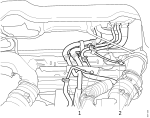{ width="600" } |
| 8.Да се олабават носачите за цревата помеѓу моторот, ладилникот т експанзиониот резервоар. | &nbsp; |
| 9.Да се спушти кабината. | &nbsp; |
| 10.Да се отвори предната решетка. Да се демонтира долната решетка. Да се демонтира средишната плоча кај решеката од ладилникот. | &nbsp; |
| 11.Да се стегнат заедно сите црева за разладна вода така да не сметаат при работа. |
| 12.Да се одспои пониското црево помеѓу моторот и ладилникот. | &nbsp; |
| 13.Ако кабината на возилото има воздушна амортизација да се одспои рачката од вентилот за нивелирање. | { width="600" } |
| 14.Ако возилото е опремено со хидрауличко команда на спојката тогаш треба да се одспои и носачот на хидрауличкото црево така да хидрауличкото црево може да се постави над радијаторот. | { width="600" } |
| 15.Да се подигне кабината на предните ивици за да се демонтират заштитата од превртување и ладилникот. | &nbsp; |
| 16.Да се извади завртката на понискиот држач на пружината на кабината, потоа завртката за заштитата од превртување и на крај завртката од кабината. | 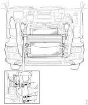{ width="600" } |
| 17.Да се извадо заштитата од превртување. | &nbsp; |
| 18.Да се извадат држачите кои ги држат цревата на ладилникот. | 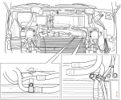{ width="600" } |
| 19.Да се извади носачот на ладилникот и да се продржи со стеги. | 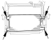{ width="600" } |
| 20.Ако возилото има ладилник за масло за менувцачот да се одспои брзата спојка за поврзување на ладилникот за масло наменувачот и да се тргне на страна ладилникот за масло. | &nbsp; |
| 21.Да се извадат носачите на предно светло 91) и држачите од ладилникот (2). | { width="600" } |
| 22.Да се постават долги завртки во навојните отвори од држачите на ладилникот. Овие завртки да се искористат како потпори при подигање на ладилникот. | { width="600" } |
| 23.Да се расклопи ладилникот прво со вадење на капакот за вентилаторот на ладилникот (1) потоа со вадење на ладилникот за влезен воздух (2) и ладилникот за EGR (3). | { width="600" }|

### Монтажа на ладилникот 

| Опеарација | &nbsp;|
|-|-|
| 1.Да се склопи ладилникот прво со монтирање на ладилникот (1), потоа со монтирање на ладилникот (2) за влезниот воздух), со монтирање на ладилникот за EGR и на крај со поставување а капакот за вентилаторот. | { width="600" }|
| 2.Да се постават долги завртки во навојните отвори од држачите на ладилникот. Овие завртки да се искористат како потпори при подигање на ладилникот. Ладилникот да се постави на место. | { width="600" }|
| 3.Да се постават држачите на ладилникот со 90° агол помеѓу држачите и ладилникот. Да се зацврстат држачите на шасијата . | 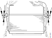{ width="600" } |
| 4.Да се постават држачите за челни главни светла. | &nbsp; |
| 5.Да се постави на место ладилникот за маслсо на менувачот и да се приклучи брзата спојка. | &nbsp; |
| 6.Да се постави кондензаторот. |&nbsp; |
| 7.Да се постават држачите кои ги држат цевките на кондезторот. | &nbsp; |
| 8.Да се постави заштитата од превртување. | &nbsp; |
| 9.Да се постават завртките за прицврстување на кабината и да се затегнат на спојот. | 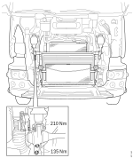{ width="600" } |
| 10.Да се спушти кабината. | &nbsp; |
| 11.Ако кабината на возилото има воздушна амортизација да се постави врската за рачката за нивелирање на левата страна. | { width="600" } |
| 12.Да се наполни инсталацијата со воздух така да кабината дојде на нормална височина . Тогаш да се притегнат завртките за кабината. | &nbsp; |
| 13.Ако возилото има хидрауличка команда на спојката да се прикачи хидрауличкото црево на сајлата за држење.| &nbsp; |
| 14.Да се Прикачи долното црево за разладна течност помеѓу моторот и ладилникот од оздола. | &nbsp; |
| 15.Да се постават капаците на одбојникот заедно со долната предна решетка и средишната плоча на решетката од ладилникот. | &nbsp; |
| 16.Да се спушти кабината. | &nbsp; |
| 17.Да се постават носачите за цревата помеѓу моторот, ладилникот и експанзиониот резервоар. | &nbsp; |
| 18.Да се постават цревата за разладна течност (1) и држачите (2). | { width="600" } |
| 19.Да се монтираат цревата за влезен воздух (1) на ладилникот за влезниот воздух. Да се монтира цевката за ладење и спојното црево (2) н аводно ладениот ладилник за EGR. | { width="600" } |
| 20.Ако возилото има клима уред да се постави носачот за цевките. | &nbsp; |
| 21.Да се посртави горниот капак за рециркулација  (1). Да се постават торзионите шипки (2) од двете страни на ладилникот. | { width="600" } |
| 22.Да се наполни системот за разладна течност. | &nbsp; |

### Замена на држачи 

#### Вадење

|Операција | &nbsp; |
|-|-|
| 1.Да се постави пластична стега низ држачот. | 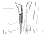{ width="600" } |
| 2.Со помош на два одвртувачи да се отвори држачот. Кабелот да се држи затегнат за да не одлета држачот кога ќе се отвори. | 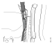{ width="600" } |

#### Поставување

|Операција | &nbsp; |
|-|-|
| 1.Држачот се поставува на место кога ладилникот и ладилникот за влезен воздух се држат заедно. | &nbsp|
| 2.Со помош на алатката ***588 999*** да се постави држачот на место.а одзрачување на клима уредот се поврзани. | 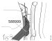{ width="600" } |

### Надворешно перење на ладилникот и ладилникот за влезен воздух

За да го дадат полниот капацитет на ладење ладилникот, лдилникот за влезен воздух и ладилникот за масло треба да бидат чисти и да овозможат непречен проток на воздух низ нив. Бидејки воздухот поминува низ неколку ладилника секој од нив треба да е чист.

<figure markdown>
  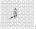{ width="600" }
  <figcaption>Нечистотија во ладилникот која го спречува протокот на воздух</figcaption>
</figure>

Кога ладилникот се пере тоа треба да се прави од внатрешната страна за да испадне нечистотијата. Чистењето од надворешната страна ќе ја заглави нечистотијата во ладилникот.

|Операција | &nbsp; |
|-|-|
| 1.Да се демонтира ладилникот. | &nbsp|
| 2.Да се раздвојат ладилникот, ладилникот за влезен воздух и ладилникот за EGR за да можат да се исперат оделно. | &nbsp;|
| 3.Да се затворат влезовите во ладилникот за да се спречи навлегување на средството за чистење во ладилникот. | { width="600" } |
| 4.Да се испрска ладилникот со средство за перење и да се остави да делува. | &nbsp;|
| 5.Да се испере ладилникот со топла вода . Перењето треба да трае онолку колку што е потребно да се може да се гледа низ ладилникот. | 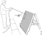{ width="600" } |
| 6.Внимателно да се исплакне нечистотијата што ќе се појави на предната страна на ладилникот. | &nbsp;|
| 7.Да се исплакне нечистотијата од внатрешната страна на ладилникот со млаз под голем притисок. Да се прска под агол од 90° и од далечина најмалку од 50cm. | { width="600" } |
| 8.Со компримиран воздух да се продува течноста од радиаторот, пак работејки од внатрешната страна. | &nbsp;|
| 9.Истите постапки да се повторат со ладилникот за влезен воздух и ладилникот за масло. | &nbsp;|
| 10.Да се отстранат заптивките од ладилниците и ладилникот повторно да се склопи. | &nbsp;|

