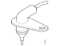
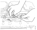

---
hide:
  - footer
---

## Општо

{ width="400" }

## Спецификација

Отпорност (20°C): 2419 ± 85&ohm;

Подрачје на мерење: од -40 до 120°C.

## Начин на работа

Сензорот ја мери температурата на воздухот на влезната цевка помеѓу турбо полначот и ладилникот за воздух за полнење.

Контролната единица на моторот ја користи оваа информација за да го контролира односот помеѓу влезниот воздух и издувните гасови од EGR вентилот кои одат во моторот. Сензорот исто така овозможува да се надгледува дали температурата на влезниот воздух во ладилникот е поголема од колку што материалот на ладилникот може да издржи.

Ако температурата на поголема од колку што е дозволено контролната единица н амоторт ја ограничува снагата на моторот преку намалување на вбризганато гориво.

Сензорот е NTC тип што значи дека при пораст на температурата отпорноста на сензорот опаѓа. Отпорноста на сензорот с епретвара во напонски влез за контролната единица. Ако вредностите на напонот с евон одредени граници контролната единица ќе работи според програмираните вредности и при тоа ќе се генерира код на грешка. Во оваа ситуација моторот ќе реагира поспоро при притискање на педалата за гас.

## Опис на работни задачи

### Замена на сензорот

<figure markdown>
  { width="400" }
  <figcaption>При замена на сензорот да се користи заштитата 1 855 015</figcaption>
</figure>

