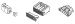
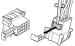
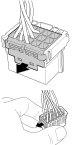
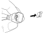
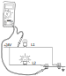
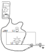
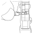
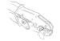

---
hide:
  - footer
---

## Општо

### Надградба

!!! info "Важно"

    За да се спречи појава на неправилности и дефекти на надградбите, Scania препорачува да се користи склопот на диоди (D18) за функциите кои користат диоди. Склопот на диоди треба да се напојува преку 2A осигурач.

### Намена

Намената на оваа страна е да ја објасни поправката на каблите и примарниот и секундарен забравник на конекторите.

## Спецификација 

### Изолација

Каблите кои се користат на возилото се со следната изолација: ***PVC, PUR, RADOX***.

Каблите кои се приклучени на инструмент таблата мораат да издржат температура најмалку до 105C.

### Пресек на каблите

Каблите во кабината треба да имаат најмал пресек од 0.75mm², освен ако не е специфицирано поинаку.

Каблите вон кабината треба да имаат минимален пресек  од 1.5mm².

| Снага (W) | пресек на кабелот (mm²|
|-|-|
| 0-100 | 0.75|
| 101-200 | 1.0 |
| 201-400 | 1.5 |
| 401-600 | 2.5 |
| 601-1000 | 4.0 |
| 1001-1400 | 6.0 |
| 1401-1900 | 10.0 |
| 1901-2500 | 16 |

### Алат

| број на алатот | намена | цртеж |
|-|-|-|
| 588 207 | Рачна алатка за пресување на терминали и спојки, | { width="200" } |
| 588 220 | Рачна алатка за отстранување на изолација. | { width="200" } |
| 588 220 | Рачна алатка за отстранување на изолација на кабли, 0.5-4mm². | { width="200" } |

## Начин на работа

### Конектори и терминали, општи информации

Следното е само општа информација околу каблите и терминалите на каблите. За подетална информација да се виде овде: [Конектори и терминали на каблите](160003.md).

За да се осигура дека исправен конектор е приклучен на соодветниот конектор, конекторите се различно кодирани така да си одговараат само меѓусебно. Постои механичко како и кодирање по боја.

Во конекторите се употребуваат заптивки и воведни заптивки за проводникот за конектори кои се изложени на тешки работни услови, на пример ако се монтирани на моторот или рамот. Заптивките спречуваат појава на корозија и заптиваат при температурни промени и вибрации.

<figure markdown>
  { width="400" }
  <figcaption>1. воведна заптивка</figcaption>
</figure>

#### Примарен забравник на терминалите

Постојат неколку типови на примарни забравници за терминалите на конекторите. 

Примарниот забравник е јазиче поставено на терминалот.

<figure markdown>
  { width="300" }
  <figcaption>единечен примарен забравник</figcaption>
</figure>

<figure markdown>
  { width="300" }
  <figcaption>двоен примарен забравник</figcaption>
</figure>

#### Секундарен забравник на терминалите

Постојат неколку различни типови на секундарни забравници за конекторите.

<figure markdown>
  { width="500" }
  <figcaption>забравување со капачка</figcaption>
</figure>

<figure markdown>
  { width="400" }
  <figcaption>подолжен забравник по целата должина на конекторот</figcaption>
</figure>

<figure markdown>
  { width="300" }
  <figcaption>подолжен забравник по целата должина на конекторот од страна на кабелот</figcaption>
</figure>

<figure markdown>
  { width="400" }
  <figcaption>внатрешен забравник</figcaption>
</figure>

### Прицврстување на терминалот на кабелот

Методата која Scanija ја користи за прицврстување на терминалот на кабелоте е пресување. Пресувањето се врши со за тоа посебна наменета клешта. Пред да се прицврсти терминалот се поставува воведната заптивка, ако е потребно, и потоа терминалот се мнетнува во конекторот.

Кај методата на прицврстување со пресуване важно е да се одбере правиот терминал, заптивка и клештата за пресување. Исто така е од особено значење терминалот да се постави исправно во клештата.

### Означиување на каблите

На електричнит ешеми за серијата R се нацртани сите кабли.

Пример на ознака на кабел.

-BMS212.GN-0.75 [P2:A-2]

BMS: Ознака на системот. Оваа е означено и на самиот кабел на возилото, така да е лесно да се одреди електричната шема за кабелот.

212: Сериски број за кабелот. Ова е означено и на самиот кабел.

GN: Код на бојата, во случајот зелена

0.75: пресек на кабелот

[P2:A-2]: Адреса која покажува каде оди другиот крај на кабелот, во овој случај пин A-2 на централната контролна единица. Како секој кабел е представен н аелектричните шеми, означиувањето на адресата е дадена само за кабли кои се долги и кои тешко се пратат.

Кодот на бои кој се употребува е:

BK: црна

BN: кафеава

BU: сина

GN: зелена

OG: портокалова

PK: розева

RD: црвена

VT: виолетова

WH: бела

YE: жолта

## Одржување

### Испитување кабел

!!! info "Информација"

    Мерењата секогаш треба да се вршат од задната страна на конекторот. За конектори со заптивки да се одбере друга мерна точка.

{ width="300" }

- Никогаш да не се поставува осигурач со поголема ампеража од дозволената.

{ width="240" }

- Да се избегнува да се менува осигурач доидека има мапојување. Ова е со цел да се избегне пожар во држачот на осигурачот.

- Кога се врши мерење да не се прободува изолацијата на кабелот, особено ако е вон кабината, Влагата и солта можат да навлезат и низ таков мал отвор и со врем еда доведат до прекин н апроводникот. Вака добиениот прекин е скоро неможно да се види. Ако е потребно, подобро е кабелот да се пресече а по мерењето да се спои со водонепропустлива спојка.

{ width="400" }

!!! warning "Предупредување"

    Никогаш да не се сече повеќежилен кабел под напојување. Постои можност да дојде до краток спој, лични повреди и оштетување на опремата.

### Испитување на куса врска

#### Куса врска, општо

Постојат различни типови на куса врска.

При куса врска често гори осигурачот, престанува функцијата и се генерира код на грешка.

<figure markdown>
  { width="300" }
  <figcaption>куса врска на земја кај заземјено струјно коло</figcaption>
</figure>

Кабелот за сијалицата за сопирање е со куса врска на земја бидејки завртката ја пробила изолацијата и поминала низ кабелот. Во нормален случај овој кабел се заземјува преку сијалицата кога ке се затвори прекинувачот за сопирачката.

<figure markdown>
  { width="300" }
  <figcaption>куса врска проводник со проводник кој е под напојување</figcaption>
</figure>

Овој тип на куса врска не води до горење на осигурачот туку до погрешно функционирање на струјното коло и до генерирањена код на грешка.

<figure markdown>
  { width="300" }
  <figcaption>завртка која пробива повеќежилен кабеле</figcaption>
</figure>

#### Испитување на куса врска

Кабел од страна на напојувањето:

-Да се исклучи напојувањето или со одспојување или со вадење на соодветниот осигурач.

-Да се измери отпорноста на кабелот спрема земја. Отчитување на бескрајна вредност значи дека дека кабелот не е во спој со земја. Отчитување на нула или многу мала вредност на отпорноста значи дека кабелот е во спој со земја.

Кабел од страна на заземјувањето:

-Да се постапи на ист начин како и во горниот случај.

### Испитување на осигурач

| операција | &nbsp; |
|-|-|
| Да се извади заштитната капачка |&nbsp; |
| Да се провери дали осигурачот е исправно поставен во држачот. | &nbsp; |
| Да се извади осигурачот. | &nbsp; |
| Да се измери отпорноста на осигурачот. Ако вредноста е над 10&ohm;, да се замени со нов |  &nbsp; |
| Да се постави заштитната капачка |&nbsp; |

### Испитување на отворено струјно коло

Ако постои отворено струјно коло, вообичаено осигурачот не гори. Така наречено струјно искрење може да настане кога кабел под напојување ќе се повлече, свитка или пресече. Во овој случај осигурачот може да изгори. Кога постои отворено струјно често се генерира код на грешка.

{ width="300" }

**мерење на отпорност**

- Да се исклучи напојувањето на возилото
- Да се измери отпорноста од излезот на осигурачот до потрочувачот. Ако вредноста е нула, кабелот е здрав.

**мерење на напон**

- Прекинот на кабелот може да се одреди со мерење на напонот почнувајки го мерењето од од почетокот на кабелот и одејки кон потрошувачот.

### Испитување на пад на напон

Кога кабел, без напојување, се испитува со мерење на отпорност може да се добијат погрешни резултати кои погрешно покажуваат дека кабелот е исправен.

**Пример:** Нека некоја светилка не работи. Ако се извади сијалицата и се мери напон дирекно во држачот може да се измери напон од 24V и да се помисли дека сијалицата е прегорена. Ќе се постави нова сијалица но и таа нема да свети. Кога се мери отпорност оптертувањето на кабелот е толку ниско што и само една жила да остане ќе се добие отчитување кое покажува дек акабелот е здрав. но под оптеретување на тоа место доаѓа до пад на напон и потрошувачот, во случајот сијалицата не добива доволен напон да светне.

Во ваков случај треба да се мери напон на сијалицата дирекно на влезот на држачот. Ако се измери 24V тогаш падот на напонот е во држачот. Ако мерењето покажува низок напон тоа е поради лошо заземјување или пад на напон пред сијалицата. Во здраво коло падот на напонот не треба да е поголем од 1V.

{ width="400" }

### Испитување на лошо заземјување

Лошото заземјување во струјните кола на светилките и сигналните сијалици се манифестира со слабо светење.

При испитувањето се користи истата метода како и при пад на напон.

| грешка | скица |
|-|-|
| Добро заземјување за волтметарот. Добар напон за линијата L1 но сијалицата на линијата L1 свети слабо. |  { width="360" } |
| Добро заземјување за волтметарот. Лошо заземјување за линијата L1. Волтметарот покажува мал напон а сијалицата L1 свети слабо. | { width="360" }  |
| Добро заземјување на линијата L2 и волтметарот. Волтметарот очитува 0V. | { width="360" } |
| Лошо заземјување поврзано на L1 и инструментот. Сијалицата на линијата L1 свети слабо и инструментот покажува мал напон. Ова може погрешно да се разбере како слабнапон за линијата L1. | { width="360" }|

***Пример 1 и 2***

Завртрката за заземјување е откачена но на неа сеуште се терминалите од струјните кола. Сега струјата не се заземјува како што е предвидена туку преку друга точка за заземјување. струјата оди во друго струјно коло и на овој начин струјните кола се изложени н адефектот.

 { width="360" } 

- Пример 1
- При затварање на контактот струјата оди низ сијалицата, до дефекната завртката за заземјување од тука до моторот, преку моторот до другата сијалица и преку сијалицата на земја. На овој начин сијалиците светат а моторот врти во обратна насоока.

{ width="360" } 

- Пример 2
- При затварање на контактот струјата оди низ сијалицата, до дефекната завртката за заземјување од тука до намотката на релето преку сијалицата и на земја. На овој начин се активира релето и го исклучува моторот а сијалиците светат.

### Проверка на CAN кабли

CAN комуникацијата е дизајнирано добро да се справи со пречки. За да се намали ризикот од пречки каблите се испреплетени. Ова е поради тоа што системот ја отчитува напонскатаразлика помеѓу двете жици за да ја одреди логичката состојба 1 или 0. Ако иста пречка ги погоди двете жици тогаш ќе нема напонска разлика. Што е поголемо растојанието помеѓу жиците поголем е ризикот дека една жица ќе биде изложена на пречки.

Како напонот на CAN H и CAN L постојано се менува, CAN комуникацијата не може да се провери само со волтметар. Но може да се провери дали крајните отпорници се здрави.

За да функционира CAN линијата мора да постојат два завршни отпорника. Завршниот отпорник може да биде или еден отпорник или разделник. Разделникот во исто време е и филтер за високите фрекфенции. Крајните отпорници можат да се проверат со мерење на отпорност помеѓу CAN H и CAN L. Мерењето се ври на конекторот за секоја CAN линија. Една мерна сонда се поставува на контактен пин од белите кабли а со другата сонда на контактен пин со друга боја.  Отпорот на секоја CAN магистрала треба да биде 60&ohm;. Ако отпорот е 120&ohm; тоа значи дека недостасува завршен оторник. Ако отпорот е 30&ohm; или  40&ohm; тоа значи дека има еден или два отпорника повеќе на линијата.

### Спојување на кабли

Спојување на кабли треба да се избегнува бидејки претставува слаба точка и можен извор за дефекти. Со цел да не се менува конектор понекогаш ќе се јави потреба да се спои една жила од кабелот.

| операција | &nbsp; |
|-|-|
| Да се избере должина на кабелот така да може да биде прав и заштитен. | &nbsp; |
| Да се огули кабелот со алатката ***588 220***. | { width="360" } |
| Да се исечат каблите така да се преклопуваат според одредена мерка. | &nbsp; |
| Да се отстрани изолација во должина од 7mm. | { width="360" }  { width="360" }|
| Да се постават 40mm спојки. | &nbsp; |
| Да се пресуваат спојките со клештата ***588 207***. |&nbsp; |
| Да се приложи топлина на спојките. |  { width="360" } |
| Да се постави заптивна цевка врз целиот кабел и да се загрее. | &nbsp; |
| Да се испита кабелот на прекин и кусаврска. | &nbsp; |

### Пресување на терминали

При пресувањето на терминали треба да се внимава на изборот на терминалот, воведната заптивка и клештата за пресување.

#### Терминал без воведна заптивка

| Операција | &nbsp; |
|-|-|
| 1.Да се огули крајот на кабелот малку повеќе од должината на делот за пресување на терминалот. |  { width="300" } |
| 2.Да се постави терминалот во клештата за пресување.| { width="300" } |
| 3.Внимателно да се стегне клештата околу терминалот се додека се обезбеди од придвижување.| &nbsp; |
| 4.Да се провлече кабелот во клештата за пресување така да огулениот дел дојде до крајот на контакниот дел на терминалот. Треба да се увери дека заптивката правилно навлегла во терминалот.| &nbsp; |
| 5.Да се затегне клештата до крајната позиција и да се држи оваа позиција.| &nbsp; |
| 6.Внимателно да се намести терминалот додека е во клештата.| { width="300" } |
| 7.Да се притисне рачката од клештата додека не отпушти. Да се извади терминалот од клештата.| &nbsp; |

#### Терминал со воведна заптивка

| Операција | &nbsp; |
|-|-|
| 1.Да се постави воведната заптивка на кабелот пред да се отстрани изолацијата.|  { width="300" } |
| 2.Да се огули крајот на кабелот малку повеќе од должината на делот за пресување на терминалот. |  { width="300" } |
| 3.Да се турне кабелот нанапред до работ на изолацијата.| &nbsp; |
| 4.Да се постави терминалот во клештата за пресување.| { width="300" } |
| 5.Внимателно да се стегне клештата околу терминалот се додека се обезбеди од придвижување.| &nbsp; |
| 6.Да се провлече кабелот во клештата за пресување така да огулениот дел дојде до крајот на контакниот дел на терминалот. Треба да се увери дека заптивката правилно навлегла во терминалот.| &nbsp; |
| 7.Да се затегне клештата до крајната позиција и да се држи оваа позиција.| &nbsp; |
| 8.Внимателно да се намести терминалот додека е во клештата.| { width="300" } |
| 9.Да се притисне рачката од клештата додека не отпушти. Да се извади терминалот од клештата.| &nbsp; |

