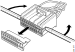

---
hide:
  - footer
---

## Рачен алат за пресување и расклопување.

Подоле е дадена листа, нумерички подредена според бројот на терминалот.

Ако е прикажано "N/A" тоа значи дека се нема информација за алатот. Ознаката "без забравник" значи дека не треба алат.

### Терминали: 199949 - 813512

| терминал | клешта | алат за расклопување | пример на употреба |
|-|-|-|-|
| 199949 | [588 202](tools/588202.md), влошка 1mm² | [588 209](588209.md), [2 267 654](2267654.md) | конектор, 5-pin (Coni) |
| 199950 | [588 202](tools/588202.md), влошка 1mm² | [588 209](588209.md), [2 267 654](2267654.md) | конектор, 5-pin (Coni) |
| 199955 | [99 493](tools/99493.md), влошка B | [588 209](588209.md), [2 267 654](2267654.md) | конектор, 5-pin (Coni) |
| 199957 | [99 493](tools/99493.md), влошка B | [588 209](588209.md), [2 267 654](2267654.md) | конектор, 5-pin (Coni) |
| 341332 | [588 207](tools/588207.md), влошка 0.5-1.0 | без забравник | спојка, црвена |
| 341333 | [588 207](tools/588207.md), влошка 1.5-2.5 | без забравник | спојка, сина |
| 341334 | [588 207](tools/588207.md), влошка 4.0-6.0 | без забравник | спојка, жолта |
| 394741 | [588 202](tools/588202.md), влошка 1 [99 491](tools/99491.md) | прастенаст терминал | прастенаст терминал, универзален |
| 402544 | [588 207](tools/588207.md), влошка 0.5-1.0 | без забравник  | равен пин, машко, изолиран, црвен |
| 446821 | [99 492](tools/99492.md), влошка A | [2 267 654](2267654.md) | PCR I&M инструменти |
| 807067 | [588 202](tools/588202.md), влошка 1 [99 495](tools/99495.md) | прастенаст терминал | прастенаст терминал, универзален |
| 807068 | [99 495](tools/588207.md), влошка B | прастенаст терминал  | прастенаст терминал, универзален |
| 807069 | [99 495](tools/588207.md), влошка B | прастенаст терминал  | прастенаст терминал, универзален |

***Терминали: 813870 - 814544***

***Терминали: 814545 - 815670***

***Терминали: 815671 - 815840***

***Терминали: 815841 - 815911***

## Конектори

Електричниот систем на возилата SCANIA содржи голем број на конектори. Овие конектори собрани заедно претставуваат илјадници спојни места.

Повеќето конектори се означени со код. Кодот се содржи од големата латинична буква C, после која следи сериски број, на пример C4.

Постојат повеќе типови на конектори кои можат да имаат и до 70 терминали. Терминалите можат да бидат рамни или округли и од различен материјал: рамни - фосфор бронза, обложени со месинг, обложени со злато. Контактите обложени со злато се користат кај конекторите каде се бара голем спроводливост. Повеќето конектори се кодирани со коден број. Кодот се содржи од големата буква ц на латиница C после која следи сериски број, на пример C4.

Конекторите се конструирани да издражат вибрации, температурни промени, влага итн. Но тие лесно можат да се оштетат со неправилно ракување. Оштетувањата се најчесто поради големам струја, влага и неправилно одспојување.

Особено е важно да се користи исправен алат кога се работи со терминалите на конекторрите.

***Конектори***

Конекторите се поврзуваат дирекно на електричните компоненти. Конекторите за електричните компоненети како вентили, електро мотор во својот код ја немаат буквата C. нивниот код е идентичен со кодот на електричнат акомпобента, на пример V117.

### Примарно забравување на терминалите во конекторот
 
Постојат неколку различни типови на примерни забравници за терминалите за конектори. Примарниот забравник е јазиче за забравување сместено на смаиот терминал.

{ width="200" }

<small>*единечен примарен забравник*</small>

{ width="200" }

<small>*двоен примарен забравник*</small>

###Секундарно забравување на терминалите во конекторот

Постојат неколку различни типови на секундарни забравници за терминалите за конектори.

{ width="360" }

<small>*забравување со поклопец*</small>

{ width="300" }

<small>*забравување со забравник кој поминува низ целиот конектор*</small>
    
{ width="240" }

<small>*забравување со забравник кој поминува низ целиот конектор*забравување со забравник кој поминува низ целиот конектор од страна на проводниците</small>   
    
 
{ width="300" }

<small>*внатрешен забравник</small> 

### Кодирање на конекторите

За да се обезбеди дека одреден конектор е приклучен на соодветен конектор, конекторите се кодираат така да можат да се спојат само помеѓу себе.

Постои механичко кодитрање а кај конекторите во боја и така наречена кодирање со боја.

### Заптивање на конектори

Кога проводниците се изложени на влијанието од околината, на пример проводниците на моторот или рамот, се користат заптивни утичници.

{ width="300" }

<small>*заптивна утичница</small>

### Означување на кабли

На електричните шеми за PRT возилат се внесени сите кабли.

Пример за означување на кабел.

EEC261.YE-1 [P2:C6]

- EEC: ознака на системот. Оваа е исто така означено и на самиот кабел.
- 261: сериски број на проводникот. Оваа е исто така означено и на самиот кабел.
- YE: код на бојата на проводникот, во случајов жолта.
- 1: пресек на проводникот.
- [P2:C6-2]: адреса кој кажува каде е приклучен другиот крај на проводникот, пин 2 на конекторот C6. Како секој кабел е претставен на електричниоте шеми, адресата се означува само на многу долги
    кабел, кои тешко се следат (не и на овој).

***Кодови за бои***

- BK-black-crna
- BN-brown-кафеава
- BU-blue-сина
- GN-green-зелена
- GY-grey-сива
- OG-orange-портокалова
- PK-pink-розева
- RD-red-црвен
- VT-violet-виолетова
- BU-blue-сина
- WH-white-бела
- YE-yellow-жолта

## Одржување

### Коонтрола на конектори и терминали

#### Проверка за повторна употреба

{ width="360" }

Кога се исклучува конектор од компонента (на пример пумпа за редуктант) секогаш треба да се провери дали конекторот на компонентата е лабав.

Внимателно да се повлече конекторот од компонентата и да се проверете дали терминалите се свиткани, 'рѓосани или вовлечени.

#### Влага

Влагата во конекторите тешко се открива, но може да предизвика дефекти во системот. Ако се открие влага, конекторот треба да се исуши со контакт спреј. Алтернативно, може користи и пиштол за топол воздух поставен на најниско ниво.

!!! info "Важно"

    Да не се користи компримиран воздух за чистење на конекторите, бидејки компримитраниот воздух може да содржи влага.
    
#### Свиткани или деформирани терминали

Ако терминалите се свиткани или деформирани треба да се заменат со нови.

#### Рѓосани терминали

Ако терминалите се рѓосани треба да се заменат со нови и тоа обавезно како пар.

#### Извлечени терминали

Треба да се провери дали има вовлечени терминалии во конекторот. Ако има терминалот треба да се турне назад во конекторот од задната страна. Ако терминалот не се забравува, мора да се замени со нов.

### Пресување на терминали

#### Стегање на кабелски терминали, општи информации

Методот што Scania го користи за прицврстување на кабелските терминали на каблите се нарекува стегање (пресување). Кога се стега, со клешта, клештата внимателно да се затега додека не го забрави терминалот. Потоа во терминалот се вметнува проводникот, со заптивка ако е потребно.

Кога се користи овој метод од особена важност е да се избере исправен терминал, заптивка и клешта за стегање. Исто така, неопходно е правилно да се постави терминалот во гнездото на назабената плочка за стегање. Ова е бидејки:

- Премал или преголем терминал предизвикува лош контакт, дозволува да влезе влагаили ќе остави проводникот да се олабави.
- Неправилна заптивка е ризик од навлегување на влага.
- Неправилна клешта за стегање, неправилна назабена плошка или погрешно поставен терминал во назабената плочка предизвикува олабавување на проводникот или кршење на терминалот.
- Различните назабени плошки за стегање имаат различни ознаки, на пр. A, B или C, и тоа во зависност од пресекот на кабелот, кабелскиот терминал и заптивката што се користи. Наведената површина се однесува на металниот дел од кабелот кој се онарекува проводник.

Конечно, кабелот и заптивката мора да се вметнат правилно во кабелскиот терминал, бидејќи:

- Доколку голем дел од проводникот не е покриен со изолацијата или со стегата од терминалот, се зголемува ризикот врската да не биде правилно заптивена.
- Доколку делот од проводникот кој се стега не е стегнат по целата должина, врската ќе биде послаба.
- Доколку има влакна од проводникот што излегуваат надвор од стегата на терминалот, постои ризик од кратки споеви со други кабелски терминали, а и врската ќе биде послаба.

<figure markdown>
  { width="300" }
  <figcaption><small>1. Делот од проводникот кој се стега 2. Сигурносен прстен против извлекување 3. Исправно стегање на терминалот 4. Премал и преголем пресек на кабелот</small></figcaption>
</figure> 

#### Стегање на терминал без заптивка

| Операција | &nbsp; |
|-|-|
| 1. Да се отстрани изолацијата на кабелот во должина малку поголемна од делот за стегање на терминалот. | { width="240" } |
| 2. Да се постави терминалот во клештата за стегање.| { width="240" } |
| 3. Да се стегне терминалот во позиција за поставување на кабелот. | &nbsp; |
| 4. Да се вметне кабелот во клештата за стегање така да го достигне крајот за стегање на терминалот. | &nbsp; |
| 5. Да се притисне клештата до крајната позиција и да се држи. | &nbsp; |
| 6. Ако е потребно да се исправи терминалот додека е во клештата.| { width="240" } |
| 7. Да се стегне клештата додека не се ослободи. Да се извади терминалот од клештата. | &nbsp; |

Да се провери дали стегањето е исправно.

#### Стегање на терминал без заптивка

| Операција | &nbsp; |
|-|-|
| 1. Да се навлече заптивката на кабелот пред отстранување на изолацијата.| { width="240" } |
| 2. Да се отстрани изолацијата на кабелот во должина малку поголемна од делот за стегање на терминалот.| { width="240" } |
| 3. Да се повлече заптивката до крајот на изолацијата.| &nbsp; |
| 4. Да се постави терминалот во клештата за стегање.| { width="240" } |
| 5. Да се стегне терминалот во позиција за поставување на кабелот.| &nbsp; |
| 6. Да се вметне кабелот во клештата за стегање така да го достигне крајот за стегање на терминалот. Да се провери дека заптивката е правилно поставена во терминалот. |&nbsp; |
| 7. Да се притисне клештата до крајната позиција и да се држи.| &nbsp; |
| 8. Ако е потребно да се исправи терминалот додека е во клештата.| { width="240" } |
| 9. Да се стегне клештата додека не се ослободи. Да се извади терминалот од клештата.| &nbsp; |

### Конектор со 10 терминали и 2.8mm рамна утичница

**Алат**

| број | Опис | Илустрација |
| -|-|-|
| **99 586** | Алатка за демонтажа на терминал од конектор | { width="300" } | 

**Поврзување**

{ width="300" }

**Контрола**

Мерењата треба да се вршат од страната на кабелот а не на челото на терминалот бидејки истиот може да се оштети.

{ width="300" }  

**Демонтажа**

| Операција | &nbsp; |
|-|-|
| 1. Да се одбрави секундарната брава со буткање на кабелот на страна приближно 1mm. | { width="300" } |
| 2. Да се одбрави примарната брава со преклопување на јазичињата на терминалот со помош на алатката ***99 586*** Забелешка: Алатот 99 586 е замена за алатот 588 192. |{ width="240" } |
| 3. Да се извлече терминалот со влечење на кабелот. | &nbsp; |

### Конектор со 6-21 терминали и 2.8mm рамен утикач

***Алат***

| број | Опис | Илустрација |
| -|-|-|
| **99 586** | Алатка за демонтажа на терминал од конектор | { width="300" } | 

**Поврзување**

{ width="240" } 

{ width="240" }     
        
{ width="240" }  

**Демонтажа- машко**

| Операција | &nbsp; |
|-|-|
| 1. Да се одбрави секундарната брава со буткање на горниот дел еден клик приближно 1mm, со употреба на пример на пенкало. | { width="240" } |
| 2. Да се одбрави примарната брава со преклопување на јазичињата на терминалот со помош на алатката ***99 586*** Забелешка: Алатот 99 586 е замена за алатот 588 192. |{ width="240" } |
| 3. Да се извлече терминалот со влечење на кабелот. | &nbsp; |

  
**Демонтажа- женско**

| Операција | &nbsp; |
|-|-|
| 1. Да се одбрави секундарната брава со извлекување на целата брава од конекторот. | { width="240" } |
| 2. Да се одбрави примарната брава со преклопување на јазичињата на терминалот со помош на алатката ***99 586*** Забелешка: Алатот 99 586 е замена за алатот 588 192. |{ width="240" } |
| 3. Да се извлече терминалот со влечење на кабелот. | &nbsp; |

 

### Конектор со 3 терминали и 2.8mm рамна утичница

***Алат***

| број | Опис | Илустрација |
| -|-|-|
| **99 586** | Алатка за демонтажа на терминал од конектор | { width="300" }| 

**Поврзување**

{ width="300" }

{ width="300" }

**Контрола**

Мерењата треба да се вршат од страната на кабелот а не на челото на терминалот бидејки истиот може да се оштети.

{ width="300" }  

**Демонтажа**

| Операција | &nbsp; |
|-|-|
| 1. Да се одбрави секундарната брава со отварање на бравата на страна на конекторот со одвртувач. | { width="300" } |
| 2. Да се одбрави примарната брава со преклопување на јазичињата на терминалот со помош на алатката ***99 586*** Забелешка: Алатот 99 586 е замена за алатот 588 192. |{ width="240" } |
| 3. Да се извлече терминалот со влечење на кабелот. | &nbsp; |

  

### Конектор со 4 и 6 терминали и 0.64mm рамна утичница

**Алат**

| број | Опис | Илустрација |
| -|-|-|
| **99 510** | Адаптер | { width="300" }| 
| **99 586** | Алатка за демонтажа на терминал од конектор | { width="300" }| 

**Контрола**

| Операција | &nbsp; |
|-|-|
| 1. Да се одбрави зелената секундарна брава на следниот начин: да се притисне бравата низ отворот на горната страна на конекторот и да се држи притисната. | &nbsp; |
| 2. Да се одбрави примарната брава со преклопување на јазичињата на терминалот со помош на алатката ***99 586*** Забелешка: Алатот 99 586 е замена за алатот 588 192. |{ width="240" } |
| 3. Мерењето да се врши од страна на терминалите. Кога се мери отпорност да се користи кабелот 99 510. |  { width="300" } |

**Демонтажа**

Да се одбрави примарната брава со притискање на јазичето од страна на терминалите со помош на алатката **99 589**. Во исто време влечејки го кабелот да се извлече терминалот.
   
 { width="300" } 

### Конектор со 30 и 40 терминали и 0.64mm рамен утикач

| број | Опис | Илустрација |
| -|-|-|
| **99 510** | Адаптер | { width="300" }| 
| **99 586** | Алатка за демонтажа на терминал од конектор | { width="300" }| 

**Контрола**

| Операција | &nbsp; |
|-|-|
| 1. Да се одбрави секундарна брава со помош на одвртувач и да се извлече внатрешното кучиште. | { width="300" } |
| 2. Мерењето да се врши од страна на терминалите. Кога се мери отпорност да се користи кабелот **99 510**. |{ width="240" } |
| 3. Да се одбрави примарната брава со притискање на јазичето со помош на алатката **99 589** или мал одвртувач. Во исто време да се извлече терминалот со влечење на кабелот. | { width="300" } |

### 36 терминали, 1.5 рамна утичница

**Алат**

| број | Опис | Илустрација |
| -|-|-|
| **99 583** | Алатка за демонтажа на терминал од конектор | { width="300" }| 

**Поврзување**

{ width="500" }

{ width="300" }

**Контрола**

Мерењата треба да се вршат од страната на кабелот а не на челото на терминалот бидејки истиот може да се оштети.

{ width="300" }

**Демонтажа**

| Операција |  |
|-|-|
| 1. Да се одбрави внатрешнат брава со внимателно прискање отпозади за да се створи притисон. Да се подигната јазичиња од двете страни за да може внатрешната брава да се ослободи. | { width="300" }    { width="300" }    { width="300" }|
| 2. Да се одбрави секундарната брава со повлекување на внатрешниот дел од конекторот. Внатрешниот дел на конекторот се состои од три поединачни конектора. |{ width="240" } |
| 3. Да се одбрави примарната со превртување на јазичињата на терминалот со помош на алатот **99 583**. | { width="300" } |
| 4. Да се извлече терминалот со повлекување на кабелот. | &nbsp; |
 

### 7 терминали, 1.5 кружна утичница и утикач

**Алат**

| број | Опис | Илустрација |
| -|-|-|
| **99 581** | Алатка за демонтажа на терминал од конектор | { width="300" } | 
| **2 267 654** | Алатка за демонтажа на терминал од конектор | { width="100" }| 

**Поврзување**

{ width="300" }

**Контрола**

Мерењата не треба да се вршат од страната на кабелот за да не се оштети заптивката.

**Демонтажа**

| Операција |  |
|-|-|
| 1. Да се одбрави примарната брава со преврување на јазичињата на кружниот утикач со помош на алатката **2 0267 654** или **99 581**, во зависност од дизајнот. | { width="300" }   { width="300" } |
| 2. Да се притисне алатката 2 267 654 а терминалот да се извлече со повлекувањње на кабелот. |{ width="240" } |

### 2-12 терминали, 1.6 кружна утичница и утикач

**Алат**

| број | Опис | Илустрација |
| -|-|-|
| **99 591** | Алатка за демонтажа на терминал од конектор | { width="300" }| 

**Поврзување**

{ width="300" }

{ width="300" }

{ width="300" }

**Демонтажа**

| Операција |  |
|-|-|
| 1. Да се одбрави секундарната брава со алатката **99 591** со притискање на чаурата. | { width="300" } |
| 2. Алатката **99 591** да се заврти 90 степени и да остане под забравникот. |{ width="240" } |
| 3. Да се извлече забравникот. | &nbsp; |
| 4. Со помош на алатката **99 591** или мал одвртувач да се одбрави примарната брава. |{ width="240" } |    
| 5. Да се извлече терминалот со влечење на кабелот. | &nbsp; | 

### 5 терминали, 1.6mm кружна утичница и утикач

***Алат***

| број | Опис | Илустрација |
| -|-|-|
| **20267 654** | Алатка за демонтажа на терминал од конектор | { width="100" }| 

**Поврзување**

{ width="300" }

{ width="300" }

**Демонтажа**

Да се одбрави примарната брава со алатката 2 267 654 со притискање на чаурата.

{ width="300" }

### 1-10 терминали, 2.1mm кружна утичница и утикач

**Алат**

| број | Опис | Илустрација |
| -|-|-|
| **588 194** | Алатка за демонтажа на терминал од конектор | { width="300" } | 
| **2 267 654** | Алатка за демонтажа на терминал од конектор | { width="100" }| 

***Поврзување***

{ width="300" }

<small>Горен дел: бело = чаура</small> 
<small>Долен дел: црно = иглица</small>

***Демонтажа на чаура***

1. Да се одбрави примарната брава со алатката 588 194 со притискање на чаурат.

{ width="300" }
   
 
 ***Демонтажа на иглица***

Да се одбрави примарната брава со алатката 2 267 654.

{ width="300" }

***Монтажа на чаура и иглица***

1. Да се притисне терминалот со алатката 99 587.
   
{ width="300" }

### 66 терминали, 2.5 кружна утичница и утикач

**Алат**

| број | Опис | Илустрација |
| -|-|-|
| **99 584** | Алатка за демонтажа на терминал од конектор | { width="300" } | 

**Поврзување**

{ width="400" }

<small>Предна страна, кружен ракавец</small>

{ width="400" }

<small>Предна страна, крижна иглица</small>

{ width="400" }

<small>Страна на кабелот, кружен ракавец</small>

{ width="400" }

<small>Страна на кабелот, кружна иглица</small>

***Контрола***

Мерењата не треба да се вршат од страната на кабелот за да не се оштети заптивката.

***Демонтажа***

| Операција |  |
|-|-|
| 1. Да се одбрави секундарната брава со лизгање на страна до еден клик, приближно 2 mm. | { width="300" } |
| 2. Да се постави алатката 99 584 над терминалот до дното на конекторот за да се одбрави примарната брава. |{ width="300" } |
| 3. Да се извлече терминалот со влечење на кабелот. | &nbsp; |     
   

### 4 терминали, 2.5 кружна утичница и утикач

**Алат**

| број | Опис | Илустрација |
| -|-|-|
| **99 584** | Алатка за демонтажа на терминал од конектор | { width="300" } | 

**Поврзување**

{ width="300" }

**Контрола**

Мерењата не треба да се вршат од страната на кабелот за да не се оштети заптивката.

**Демонтажа**

Да се одбрави примарната брава со преврување на јазичињата на кружниот утикач со помош на алатката 99 584.

{ width="300" }

{ width="300" }
   

### 2-12 терминали, 3.5mm кружна утичница и утикач

**Алат**

| број | Опис | Илустрација |
| -|-|-|
| **99 584** | Алатка за демонтажа на терминал од конектор | { width="300" } | 

**Поврзување**

{ width="300" }

{ width="300" }

**Демонтажа**

Да се одбрави примарната брава со преврување на јазичињата на кружниот утикач со помош на алатката 99 584.
   
{ width="300" } 

### 10 терминали, конектор за XENON главни светла.

**Алат**

| број | Опис | Илустрација |
| -|-|-|
| **99 584** | Алатка за демонтажа на терминал од конектор | { width="300" } | 

**Поврзување**

{ width="300" }

**Контрола**

Мерењата не треба да се вршат од страната на кабелот за да не се оштети заптивката.

**Демонтажа**

| Операција |  |
|-|-|
| 1. Да се одбрави секундарната брава со внимателно отстранување на бравата од пониската страна на конекторот. | { width="300" } |
| 2. Да се одбрави примарната брава со вметнување на алатката **99 589** во конекторот. |{ width="300" } |

### Демонтажа на конектори Leavyseal

**Алат**

| број | Опис | Илустрација |
| -|-|-|
| **99 584** | Алатка за демонтажа на терминал од конектор | { width="300" } | 
| **99 584** | Алатка за демонтажа на терминал од конектор | { width="300" } | 

!!! info "Важно"

    Конекторите треба да се очистат пред да се пристапи кон отварање за да не доде до оштетување на забравниците при склопување и расклопување.

| Операција |  |
|-|-|
| 1. Да се отвори конекторот со вадење на поклопецот. | { width="300" } |
| 2. Да се одбрави секундарната брава. |{ width="300" } |
| 3. Да се одспои конекторот. Да се користи алатката **99 586** за 2.8 mm и 6.3 mm терминали. Да се користи алатката **99 583** за 1.5 mm терминали. |{ width="300" } |
| 4. Да се отстрани изолацијата и да се постави заптивка. Да се постави и стегне со соодветна клешта. |{ width="300" }  { width="300" }|
| 5. Да се постави терминалот во конекторот. Ако терминалот се постави исправно во конекторот ќе се чуе клик. Проверката дали термоналот е забравен се врши со внимателно потегнување на кабелот. Гнездата кои не се користат треба да се затворат со заптивка.| { width="300" }| 
| 6. Да се забрави секундарниот забравник. Да се монтира капакот на конекторот.| { width="300" }| 

### Монтажа на терминали за кординатор CОО и контролна единица BWS

**Алат**

| број | Опис | Илустрација |
| -|-|-|
| **99 508** | Адаптер за тестирање | { width="300" } | 
| **99 586** | Алатка за вадење на терминал | { width="300" } | 
| **99 589** | Алатка за вадење на терминал | { width="300" } | 

**Мерење кај конекторот на контролната единица**

| Операција |  |
|-|-|
| 1. Да се одспои конекторот на контролната единица | &nbsp; |
| 2. Да се користи адаптерот **99 508**. |{ width="300" } |
| 3. Да се поврзе кабелот од контролната единица на адаптерот 99 508 и да се мери преку мерните точки на адаптерот. |{ width="300" } |

**Преглед на врските**

{ width="400" } 

**Демонтажа на терминал 0.64mm**

| Операција |  |
|-|-|
| 1. Да се одбрави секундарниот забравник со задвижување на жолтата брава од двете страни на конекторот со упптреба на одвртувач. | { width="300" } |
| 2. Да се извлече секундарниот забравникот од конекторот. | &nbsp; |
| 3. Да се одбрави примарниот забравник на терминалот со внимателно виткање на пластичното јазиче кое го забравува терминалот. Да се користи алатката **99 589** или мал одвртувач. |{ width="300" } |
| 4. Да се извлече терминалот повлекувајки го кабелот. | &nbsp; | 

**Демонтажа на терминал 2.8**

| Операција |  |
|-|-|
| 1. Да се одбрави секундарниот забравник со задвижување на жолтата брава од двете страни на конекторот со упптреба на одвртувач. | { width="300" } |
| 2. Да се извлече секундарниот забравникот од конекторот. | &nbsp; |
| 3. Да се одбрави примарниот забравник на терминалот со внимателно виткање на пластичното јазиче кое го забравува терминалот. Да се користи алатката **99 586** или мал одвртувач. |{ width="300" } { width="300" } |
| 4. Да се извлече терминалот повлекувајки го кабелот. | &nbsp; |     

### 96 терминали, LCS контролна единица

**Алат**

| број | Опис | Илустрација |
| -|-|-|
| **2 308 280** | Тест кутија (2,892,510) | { width="200" } | 
| **2 309 374** | Опрема за тестирањена електрични конектори | { width="200" } | 
| **2 309 377** | Делови за поправка на кабли | { width="200" } | 

Конекторот го поврзува кабелот од моторот до контролната единица.

{ width="300" } 

Конекторот се состои од три дела.

{ width="300" }

1. Ракавец на конекторот
2. Конектор
3. Забравник
        
**Демонтажа**

!!! warning "Предупредување"

    Акумулаторските батерии можат да емитираат експлозивни гасови. Кога се работи со батерии секогаш треба да се вентилира просторијата за да се избегнат повреди. За да се избегне ризикот од електричен лак, прво се одвојува егативниот пол од батериите а последен се спојува негативниот пол.

| Операција |  |
|-|-|
| 1. Да се одспојат батериите. | &nbsp; |
| 2. Да се демонтираат држачите за кабелот на контролната единица за моторот. **За да не се оштети конекторот, треба да се притисне забравникот пред да се повлече рачката за обезбедување.** | { width="300" } |
| 3. Да се демонтира конекторот со притискање на осигурачот на ракавецот (1) на конекторот и со подигање на рачката за обезбедување (2). |{ width="300" } |

**Контрола**

!!! инфо "Важно"

    Штом конекторот е демонтиран, рачката за обезбедување не смее да се врати назад за да не се оштети конекторот.

Дијагностиката се прави со помош на тест кутијата 2 308 280. 

{ width="300" }

Сите кабли за дијагностика, алтки и терминали се наоѓаат во опремата за тестирање 2 309 374.

| Операција |  |
|-|-|
| 1. Да се приклучи кабелскиот приклучок на тестерот (1). Рачката за обезбедување (2) да се врати назад така да конекторот е цврсто налегнат на тест плочата а забравникот (3) се активира.| { width="300" } |
| 2. Да се користи тест плочата за идентифицирање на бројот на кабелот. |&nbsp; |
  
   

**Замена на терминал**

| Операција |  |
|-|-|
| 1. Да се пресече пластичната стега за обезбедување на кабелот.| { width="300" } |
| 2. Да се извлече кабелскиот ракавец и кабелот со повлекување нанапред па потоа нагоре. | { width="300" } |    
| 3. Да се извлече кабелскиот ракавец со повлекување нанапред па потоа нагоре. | { width="300" } | 
| 4. Да се извлече забравникот од конекторот со помош на алатката од комплетот **2 309 374**. | { width="300" } |    
    
 
**Демонтажа на терминал**

!!! info "Важно"

    Ако повеќе од 4 терминали се оштетени да се замени целиот кабел.

!!! info "Важно"

    Да не се притска многу терминалот кога се поставува во терминал бидејки конекторот може да се оштети.

| Операција |  |
|-|-|
| 1. Да се постави алатката за вадење на терминал во гнездото (1). | &nbsp;|
| 2. Закосената страна на алатката (2) да се постави во гнездото на терминалот. | &nbsp; |    
| 3. Внимателно да се врти алатката (3). | &nbsp; | 
| 4. Внимателно да се извлече кабелот од конекторот. | { width="300" } |  
| 5. Да се отсече кабел со соодветна дожина.  Конекторот за контролната единица на моторот користи две димензии на кабел. Кабелот со сива боја и црвени црти е за поправка на кабелот во гнездата 1-4, 25-28, 49-52 и 73-76 (1). Овие кабли можат да се најдат во комплетот за поправка 2 309 377. За поправка на 20 кабли во гнездата 5-24, 29-48, 53-72, и 77-96 (2), каблите во комплетот за поправка се комплетно сиви. | { width="300" } { width="300" } |   
| 6. Да се отсече кабелот со клешта за сечење. Кабелот за поправка треба да се спои на оргиналниот кабел со помош на изолирана спојка за спојување кои се во комплетот за поправка. | { width="300" } |    
| 7. Да се провери должината на кабелот кој ќе се отсече пред да се отпочне со поправака. | &nbsp; |
| 8. Да се спои новиот кабел на оргиналниот кабел. | &nbsp; |
| 9. Да се провери дали проводникот е во спојката. | { width="300" } |  
| 10. Со помош на клешта за пресување да се спои кабелот за поправка со спојката. | { width="300" } |  
| 11. Со помош на фен за топол воздух да се загрее спојот.   Изолацијата на ракавецот за спојување ќе се собере и ќе го направи спојот водо-непропустлив. |  { width="300" } |

**Монтажа на кабелот**

| операција | &nbsp; |
|-|-|
| 1. Да се постави кабелот врз конекторот. | &nbsp; |
| 2. Да се притисне кабелот во конекторот се додека терминалоите не се спојат цврсто. | &nbsp; |
| 3. Да се провери дека кабелот е добро забравен со внимателно нишање накабелот. | &nbsp; |
| 4. Да се постави забравникот. | { width="300" } |
| 5. Да се постави кабелот на местои да се постави ракавецот од кабелот врз конекторот.| &nbsp; |
| 6. Да се притисне надолу ракавецот на конекторот додека не се забрави во конекторот.| { width="300" } |
| 7. Да се стегне и осигура кабелот со пластична стега. | &nbsp; |

**Монтажа на контролната единица за моторот**

| операција | &nbsp; |
|-|-|
| 1. Да се постави конекторот во контролната единица на моторот и рачката за забравување да се повлече наназд додека не забрави. | { width="300" } |
| 2. Да се постават стегите на кабелот (момент на затегање е 8 Nm). | { width="300" }  |
| 3. Да се поврзат акумулаторските батерии. | &nbsp; |
| 4. Да се постави забравникот. Да се стартува моторот и да се провери дали има некаков код на грешка.| &nbsp; |  
   
   