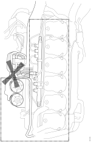

---
hide:
  - footer
---

## Чистење на 9, 11, 12 и 13 литарски мотори

Пред да се отпочне со интервенција на моторот, истиот треба да се испере.

Перењето треба да е се направи со топла вода. Ако е потребно треба да се користи и средство за одмастување.

Да се избегнува да се прска контролната единица на моторот, види цртеж. Да се очистат компонентите кои се во означената област на цртежот.

<figure markdown>
  { width="600" }
  <figcaption>Перење на моторот</figcaption>
</figure>

!!! warning "Предупредување"

    Внимавајте на топлата вода, носете заштитно одело.

!!! info "Важно"

    Справувањето со отпадната вода е според националните регулативи.