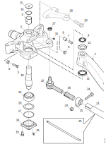
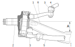

---
hide:
  - footer
---

{ width="500" } 

| &nbsp; | &nbsp; | &nbsp; | &nbsp; | &nbsp; | &nbsp; |
|-|-|-|-|-|-|
| 1.Греда на предната осовина |2.Управувачки зглоб | 3.Лизгачо лежиште | 4.Заптивен прстен | 5.Завртка | 6.Навртка |
| 7.Стега |8.Чаура | 9.Чеп | 10.Централна осовина | 11.Заптивен прстен | 12.Конусно лежиште |
| 19.Завртка | 20.Одстојник | 21.Спојка | 22.Топчест зглоб | 23.Навртка | 24.Завртка |
| 25.Стега | 26.Ракавец за подесување | 27.Крунаста навртка | 28.Влечна спојка | 29.Завртка | &nbsp; |

## Спецификација

| Тип | максимална тежина (kg) | офсет (mm) | 
|-|-|-|
| AM740 | 7500 | 112 |
| AMA860 | 8000 | 82 |
| AM950 | 9000 | 142 |

## Начин на работа

Општо

{ width="600" } 

Главните делови на предната осовина е гредата (1) на предната осовина, управувачкиот зглоб (2), топчест глоб (3), влечна спојка (4), управувачка шипка (5) и влечна спојка.

### Греда на предната осовина

Гредата на предната осовина е L-профил од кована и зајакнета легура на челик. На гредата има рамни површини за монтажа на пружините и конусни отвори н асекој крај за монтажа на централните осовини. 
Офсетот (A) претставува растојание од центарот на тркалата и контакната површина за пружините.

### Управувачки зглоб

Радиалните сили се распределуваат на чаурата во горниот дел и на цилиндричното лежиште или чаурата во долниот дел.

Аксијалните сили (притисокот од трклата) се абсорбирани од централната сосовина преку цилиндричните лежишта.

