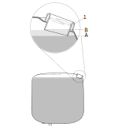

## Објаснување

Ако потрошувачката на гориво која се прикажува на инструмент таблата се разликува од стварната потрошувачка, може да се внесе фактор за калибрација во SDP3 така да прикажаната вредност на инструмент таблата ќе одговара на потрошувачката.

Факторот за калибрација во SDP3 програмот е прикажан во EMS (систем за управување со моторот), под Adjustment јазичето.

Тестот, кој мора да се спроведе со цел да се открие разликата помеѓу прикажаната и стварната вредност на потрошувачката на гориво се состои од следните чекори:

- Да се наполни резервоарот за гориво до рефернтно ниво
- Да се ресетира покажувачот за изминат пат (на инструмент таблата).
- Возилото да се вози нормално а надополнувањена со гориво да се надгледува и пресмета.
- Последното надополнување на гориво да биде до референтното ниво.
- Да се пресмета вкупната количина на гориво и да се пресмета факторот K.

## Надополнување на гориво до референтно ниво

Со цел да отцени, што е можно, попрецизно стварната потрошувачката на гориво, потребно е да волуменот на горивото во резервоарот биде ист при првото и последното надополнување.

Затоа е потребно да се придржуваме до процедурата, објаснета подолу, во текот на првото и последното надополнување на гориво.

- Да се одбере референтно ниво во резервоарот, Scania го препорачува референтното ниво A, ако е можно. Ако е тешко да се види нивото во точката A, може да се користи референтната точка B, највисоката точка на цевката за полнење.

<figure markdown>
  { width="460" }
  <figcaption>Референтно ниво на резервоарот, да се одбере точката A, ако е можно. 1. Цевка за полнење</figcaption>
</figure>

Ако возилото има двоен резервоар, истата процедура се спроведува на секој резервоар.

- Потребно е да се одбере бензиска пумпа со што е можно порамна платформа. Но сепак е најважно при првото и последното полненето да се биде доследен. Ова значи дека возилото треба да се надополни со гориво на истата пумпа а возилото да биде на истата позиција со истиот наклон и во ист смер

## Ресетирање на покажувачот на изминат пат

Покажувачот на изминат пат треба да се ресетира после првото надополнувањена гориво а пред отпочнување на возењето.

!!! info "Важно"

    Треба да се користи Trip 3. Со цел да се избегне несаконо бришење на информацијата зачувана во текот на патувањето Trip 3 може да се заштити со PIN код.

a. Ресетирање на покажувачот на изминат пат се врши н аследниот начин:

- Да се активира дисплејот со притисок на INFO копчето а потоа на долната стрелка.
- Да се одбер покажувачот на изминат пат - десна стрелка - Trip 3 - десна стрелка.
- Да се притиска десната стрелка додека не се дојде до опцијата Reseting Trip 3. Да се одговори yes.
- Да се внесе PIN код.
- Да се притиска левата стрелка додека не се дојде до главното мени.
  
b. Да се бележат сите надополнување, после ресетирањето. Колку што е подолго тест растојанието току поверодостојни резултати се добиваат.

## Возење и нормално надополнување со бележење на количината на гориво

Да се вози возилото и да се надополнува вообичаено со запишување на колилината на гориво која е додадена, по можност да се запишуваат и децималите.

Со цел да се добијат што е можно попрецизни резултати резултатите се прецизни, возилото треба да помине најмаку 10 000 km во тек на тест возењето.

Треба да се знае дека што подолг тест се вози толку попрецизни резултати ќе се добијат. Затоa, ако е можно треба да се вози повеќе од 10 000 km.

Кога ќе се оцени дека е доволно возење, резервоарот треба да се надополни до истото референтното ниво како и при првото полнење. За разлика од првото дополнување, последното дополнување треба да се вклучи во тестот.

## Преглед и пресметка на K факторот

- Да се пресмета вкупната потрошувачка на гориво. За разлика од првото надополнување, последното надополнување до референтното ниво треба да се вклучи во тестот.
- Да се отчита бројот на потрошени литри, како што е во покажувачот на изминат пат Trip 3.
- Да се одбере покажувач на изминат пат - десна стрелка - Trip 3 - десна стрелка.
- Вкупен број на поминати километри - десна стрелка.
- Вкупно литри потрошени.

Факторот на потрошувачка на гориво се пресметува на следниот начин:

K = R/S

K - фактор за калибрација

R - вистинска потрошувачка, вкупно литри ставени во резервоарот во тек на тестот

S - покажана потрошувачна, вкупно потрошени литри гориво прикажани на инструмент таблата.

Можно е да се внесе само фактор на калибрација со вредност во интервалот 0.81 - 1.20.

## Повторна калибрација

Ако после одредено време на возење се мисли дека резултатите од калибрацијата не се задоволителни и се сака да се повтори калибрацијата, тоа може да се направи на два начина.

- Пред да се отпочне нов тест, со SDP3 да се ресетира факторот на калибрација на вредност 1.0.
- Да се изврши нов тест и потоа добиениот фактор на калибрација да се помножи со постојниот поставен во SDP3 за да се добие нов фактор на калибрација.

Пример за опцијата 2

Нека резултатот за факторот на калибрација при првиот тест бил 0.94

Возилото било калибрирано со оваа вредност на факторот на калибрација, но по извесно време на возење е установено дека прикажана вредност за потрошувачка на гориво на инструмент таблата не соодветствува на стварната потрошувачка.

Поради тоа се изведува втор тест.

Резултатите на вториот тест покажуваат дека сеуште постои разлика со фактор 0.96 помеѓу отцитаната и стварната потрошувачка.

Нов фактор на калибрација се пресметува на следниот начин:

0.94 x 0.96 = 0.9024

Бидејки факторт на калибрација се внесува со две децимали новата вредност е 0.90