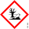

## Спецификација

### Технички податоци

| &nbsp; | ED95 | FAME Biodiesel, EN14214 | Diesel, EN590 | HVO, Hydrogenated Vegetable Oils, EN15940 |
|-|-|-|-|-|
| боја | чиста течност која може да биде обоена | златно-жолта до зелено-жолта | чиста делумно жолта течност | чиста, често безбојна течност |
|мирис| делумно оштар | нежен | агленводород | нежен на јагленводород |
| време на складирање | 24 | 6 | 12 | 24 |
| осетливост на студ (Turbiditi point °C)  точка кога јагленокарбонатите почнувааат да кристализираат | не е применливо | Зависи од пазарот, клима и суровинире за производство. Поосетлив од дизел. | Зависи од пазарот и климата. | Зависи од пазарот и климата. |
| густина (kg/m³) | 810-830 | 860-900 | 820-845 | 765-810 |
| точка на вриење (Boiling point °C) температура при која течноста врие | 78 | 280-350 | 180-360 | 190-310 |
| точка на палење (Flashpoint °C) најниска температура при која течноста ослободува толку запаливи гасови така да мешавината со воздух станува запалива  | 12 | >101 | >55 | >55 |
| растворливост во вода | се раствара | не се раствара | не се раствара | не се раствара |

### Физички и хемиски особини на дизел горивото

- изглед: жолта течност
- мирис: карактеристичен
- праг на мирис: -
- pH: -
- точка на топење/смрзнување: =-40-<= 6
- точка на вриење: 150
- опсег на вриење: 150-390
- точка на палење (во затворен сад според EN 22 719): 150-390
- релативна брзина на испаруваење (етер=1): -
- опасност од пожар: -
- горна, долна граница на запаливост: 1-6
- притисок на испарувањето, 20&deg;C: <1.00 при 37&deg;C
- релативна густина на испарувањето (воздух=1): -
- релативна густина во вакум 20&deg;C/4&deg;C: 817kg/m3
- разредување во вода: Не се разредува во вода
- температура на самопалење: >220&deg;C
- температура на самопалење: >220&deg;C
- температура на распагање: -
- вискозност, 20&deg;>C: 1.50 - 4.50 cSt (mm2/S)
- експлозивност: -
- особини на оксидација: -
  
*<small>праг на мирис - минимална концетрација при која мнозинството на особи можат да го идентификуваат горивото</small>

### Физички и хемиски особини на биодизел горивото

- изглед: чиста течност
- мирис: нежен
- праг на мирис: -
- pH: -
- точка на топење/смрзнување: -20&deg;C
- точка на вриење: -
- опсег на вриење: 180-320
- точка на палење (во затворен сад според EN 22 719): >61&deg;C
- релативна брзина на испаруваење (етер=1): -
- опасност од пожар: -
- горна, долна граница на запаливост: -
- притисок на испарувањето, 20&deg;C: 0.087kPa при 25&deg;C
- релативна густина на испарувањето (воздух=1): -
- релативна густина во вакум 20&deg;C/4&deg;C: 817kg/m3
- разредување во вода: Не се разредува во вода
- температура на самопалење: >220&deg;C
- температура на самопалење: >204&deg;C
- температура на распагање: -
- вискозност: 4.0 mm2/s на 20&deg;C 2.6.0 mm2/s на 40&deg;C 
- експлозивност: -
- особини на оксидација: -

## Дизел

### Ознака на производот

Дизел - Diesel

### Означување на информации

#### Пиктограми

{ width="460" }

{ width="460" }

{ width="460" }

*Резервоарите со гориво мораат да бидат обележани со горните симболи*

**Клучни зборови**

Опасност

**Индикации за опасност**

- H304: Може да доведе до смртни последици ако се проголта и навлезе во респираторниот систем.
- H315: Надразнува кожа.
- H336: Може да предизвика зашеметеност и вртоглавица.
- H411: Отровно за водни организми со долгорочни последици.
  
**Изјави за претпазливост**

- EUH066: Постојан контакт доведува до напукната или сува кожа.
- P101: Ако се бара медицинска помош да се однесе примерок на горивото или името на трговската марка.
- P102: Да се скалдира вод допир на деца.
- P261: Да се избегнува вдишување.
- P273: Да се избегнува излевање во околината.
- P280: Да се носат заштитни ракавици, заштитна облека, заштитни наочари и маска за лице.
- P301 + P310 + P331: Во случај на голтање веднаш да се посети центар за токсикологија. Да не се провоцира повраќање.
- P501: Складирањето да биде според локалните прописи.

### Прва помош

**Општи насоки**

Повредениот мора веднаш да се помести од местото на изложеност. Да се даде нормална прва помош, да се одмори, загрее и да се дише чист воздух.

**Вдишување**

Повредениот да се премести на свеж воздух и да се надгледува. Лицето во бесознание да се легне бочно и да се увери дека респираторните патишта се слободни. Ако дишењето престанало да се даде вештачко дишење. Да се побара лекарска помош.

**Голтање**

Да не се предизвикува повраќање. Во случај на повраќање главата да се држи ниско, така да содржината на желудникот не може да влезе во белите дробови. Да се побара лекар или брза помош.

**Контакт со кожа**

Веднаш да се соблече контаминираната облека. Да се измие кожата со сапун и вода. Во случај на постојана непријатност да се повика лекар.

**Контакт со очи**

Веднаш да се исплакне со вода во траење од 5 мин. Ако се има да се извадат контакните леќи.

**Изгореници**

Да се плакне со вода додека не престане болката. Секоја облека која не се лепи за кожа да се отстрани.Да се повика лекар и да се транспортира во болница. Ако е можно да се продолжи со плакнење додека не превземе медицнскиот персонал.

**Симптоми и ефекти, акутни и одложени**

Може да се предизвика хемиско белодробно заболување со проблеми при голтањето и повраќање. Симптоми на труење можат да се појават и после неколку часа. Во случај на голтање пациентот треба да се надгледува најмалку 48 часа. Дизел горивото содржи супстанци кои можат да предизвикаат иритации во случај на контак со очи или кожа или пак ако се вдишат. Контакнта област може да биде подложна на алергии. Ако е можно да се продолжи со плакнење додека не превземе медицнскиот персонал.

**Третман**

Лекарска помош треба да се побара во случај на егзема, отежнато дишење, изгореници или повреда на очите.

### Гасење пожар

**Средство за гасење на пожар**

Пожарот треба да се гаси со пражок, пена од јаглен диоксид или водена магла. Да не се гаси со вода бидејки тоа може да го прожири оганот. Вода и водена пара треба да се користи за ладење на незапалените делови.

**Посебни опасности кои може да ги ги предизвика течноста или супстанците**

Да се избегнува вдишување на испарувањата и гасовите. Во случај на пожар може да се создадат опасни облаци од чад кои содржат јаглен моноксид. Изложување на производи на разложувањето може да предизвика опасност по здравјето.

**Инструкции за противпожарниот персонал**

Противпожарниот апарат треба да носи соодветна заштитна опрема и да е опремен со автономни апарати за дишење. Пакети изложени на пожарот мора да се изладат со вода. Да не се дозволи загадената вода да ја запуши одводната инсталација.

### Проблеми со стартување на моторот при ниски температури

{ width="400" }

*При ниски температури дизел горивото може да кристализира во парафин, што набрзо ќе го запуши филтерот.*

При ниски температури дизел горивото може да кристализира во парафин, што набрзо че го запуши филтерот. Тогаш моторот не може да се стартува. Во најлош случај ова може да се деси при +5&deg;C, во зависноат од квалитетот на дизелот. Квалитетот на дизел горивото е различен и добар дизел не би требало да кристализира до -30&deg;C.

Разни додатоци во биозиелот ја зголемуваат веројатниоста за кристализација.

Користење на квалитетен дизел е од суштинско значење, но често не се знаее квалитетот на дизелот. Добра пракса е да се надополнува гориво во климатска зона каде на ладно ќе се стартува моторот.

{ width="400" }

*Кристализацијата може да се види под капакот за филтерот во вид на снегулки.*

Кристализацијата може да се види под капакот за филтерот во вид на снегулки. Моторот можеби ќе стартува, но наскоро ќе изгасне бидејки филтерот ќе се запуши.

Греачот за гориво може да ја подигне температурата за 5&deg;. Но ова не е доволно ако резервоарот е полн со дизел за летни температури. Кога филтерот ќе се запуши мора да се замени со нов. Греачот за гориво нема снага да го стопи парафинот формиоран во филтерот.

Ако не се знае дали возилото е полно со летен дизел истото треба да се паркира во загреана гаража. Во случај на нужада не треба да се гасне моторот. Нормално греачот за гориво треба да се користи за да ги подобри условите.

#### CFPP - температура при која филтерот е запушен

CFPP (Cold filter plugging point - ниска температура при која се запушува филтерот), е најниска температура при која дадена количина на дизел ќе поминува низ стандардна филтрација во одредено време кога се лади под одредени услови. CFPP се изразува во степени &deg;C.

#### CFPP - гориво подесно за климатски температури**

**Дизел за зимски услови** 

Европскиоот стандарd EN 590 дефинира 6 класи на дизел за температурни климатски зони од A до F.

Во централна и западна Европа, дизелот наменет за зимски услови треба да биде класа F. Ова се барања почнувајки од декември до крајот на февруари. Во тек на преодниот период (вообилаено од октомври до аперил), треба да се користи дизел со пониска класа.

**CFPP - гориво подесно за климатски температури**

| Class A | Class B | Class C | Class D | Class E | Class F |
| - | - | - | - | - | - |
| +5&deg;C | 0<&deg;C | -5&deg;C | -10&deg;C | -15&deg;C | -20&deg;C | 

#### Артички дизел

Европскиоот стандарd EN 590 дефинира 5 класи на дизел за артилки климатски зони од класа 0 до класа 4. Во скандинавските земји дизелот за зимски услови е класа 2.

 Class 0 | Class 1 | Class 2 | Class 3| Class 4 |
| - | - | - | - | - | 
| -20&deg;C | -26&deg;C | -32&deg;C | -38&deg;C | -44&deg;C |
