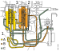

---
hide:
  - footer
---

## Општо

{ width="700" }

Системот за гориво го снабдува моторот со точно количество на гориво во точно време.

## Спецификации 13L XPI

| притисок | компоненти | вредност |
| - | - | - |
| Притисок на напојување | напојна пумпа | 9-14bar |
| Притисок на напојување за време на стартување | напојна пума | >2bar |
| Работен притисок | високо-притисна пума | 2100bar |
| Работен притисок, максимален | сигурносен вентил | 3100bar |
| Работен притисок на напојување при активиран сиурноен вентил | сигурносен вентил | 1000 ± 300bar |
| Притисок на повратниот вод | преливен вентил | 0.7bar |
| Отвор на преливниот канал | преливен вентил | 22mm |
| Димензии | пригушница за одзрачување на филтерот за притисок | 0.3mm |

## Функционален опис

### Нормален проток на горивото преку напојниот и филтерот за притисок

{ width="700" }

*A. Проток на горивото во напојниот вод*
*B. Проток на горивото во високо-притисниот вод*
*C. Поврат на гориво*

Напојната пумапа (2) го зема горивото реку напојниот филтер (1) и го потиска низ филтерот под притисок (3). Поради постоење на притисок во филтерот под притисок, можно е автоматско одзрачување. Автоматско одзрачување не е можно во напојниот филтер поради постоење на вакум.

### Системот на филтери после недоволно одзрачување а пред стартување на моторот

{ width="700" }

*A. Проток на горивото во напојниот вод*
*B. Проток на горивото во високо-притисниот вод*
*C. Поврат на гориво*

Во филтерите, откако претходно биле демонтирани може да остане воздух (1).

Цевката за гориво (2) од резервоарот за гориво влегува во напојниот филтер. Кога цевката се поврзува на филтерот таа е полна со воздух кој заедно со горивото се повлекува во филтерот. Количината на воздух во цевката може да варира.

Волуменот на напојниот филтер (3) е околу 1L.

### Проток на воздухот и горивото во тек и веднаш после првото стартување на моторот после недоволно одзрачување

{ width="700" }

*A. Проток на горивото во напојниот вод*
*B. Проток на горивото во високо-притисниот вод*
*C. Поврат на гориво*

Кога моторот стартува, заробениот воздух од цевката (1) оди во напојниот филтер заедно со горивото.

Горивото од напојниот филтер се потиска во филтерот под притисок во исто време кога напојниот филтер зема воздух од напојната цевка. Поради ова нивото на гориво (2) во напојниот филтер опаѓа.

Воздухот во филтерот под притисок (3) почнува да се компримира поради што нивото на гориво расте.

Во тек настартување на моторот извесна количина на воздух од филтерот под притисок се одзрачува низ отворот (4) за автоматско одрачување.

Сепак извесна количина на воздух навлегува во системот за гориво (5) бидејки системот за автоматско одзрачување може да исфрли само мала количина на воздух.

### Проток на воздухот и горивото во тек и веднаш после првото стартување на моторот после недоволно одзрачување, со стартуван мотор

{ width="700" }

*A. Проток на горивото во напојниот вод*
*B. Проток на горивото во високо-притисниот вод*
*C. Поврат на гориво*

Цевката за гориво (1) сега е полна со гориво а целокупниот воздух што предходно бил во неа сега е во напојниот филтер.

Бидејки горивот од напојниот филтер полесно се потиска отколку воздухот, нивото на гориво (2) во централниот столб е повисоко отколку во остатокот на филтерот.

Филтерот под во оваа фаза е скор полн (3).

Повратната линија (4) од високо притисната пумпа содржи воздух кој се потиска до високо притисната пумпа од филтерот под притисок.

Ако температурата на горивото е помеѓу 15 и 30°C, TRV вентилот (5) е отворен и горивото во овратната линија кое содржи воздух се вовлекува во напојниот филтер наместо да се враќа во резервоарот. Колку повеќе воздух се вовлекува во напојниот филтер толку повеќе паѓа нивото н агориво во напојниот филтер.

### Проток на воздухот и горивото после второ стартување на моторот после недоволно одзрачување

{ width="700" }

*A. Проток на горивото во напојниот вод*
*B. Проток на горивото во високо-притисниот вод*
*C. Поврат на гориво*

При второт стартување, филтерот под притисок (1) е речиси полн.

Моторот успева да стартува бидејки во напојната пумпа има доволно гориво за напојување на филтерот под притисок и одржување на притисокот за кратко време. (2)

Воздухот (3) оди од напојниот филтер до напојната пумпа. Ако голема количина на воздух навлезе во напојната пумпа, воздухот таму се заробува.

### После второто стартување на моторот со воздух во напојната пумпа

{ width="700" }

*A. Проток на горивото во напојниот вод*
*B. Проток на горивото во високо-притисниот вод*
*C. Поврат на гориво*

Ако голема количина на воздух од напојниот филтер навлезе во напојната пумпа, напојната пумпа ќе престане да го снабдува напојниот филтер со гориво (1), бидејки таа не може да пумпа воздух. Притисокот во филтерот под притисок тогаш ќе опадне.

Ако притисокот во филтерот под притисок опадне, протокот на високо притисната пумпа (2) се прекинува и моторот гаси.

Трето стартување на моторот не е можно без одрачување на системот.

### Одзрачување со рачна пумпа

{ width="700" }

*A. Проток на горивото во напојниот вод*
*B. Проток на горивото во високо-притисниот вод*
*C. Поврат на гориво*

Со рачната пумпа горивото се потиска низ системот за гориво (1).

Одредена количина на воздух се внесува во системот за гориво заедно со горивото но може да се исфрли преку автоматскиот систем за одзрачување (2) во филтерот под притисок.

Но голема количина на воздух се уште има во напојниот филтер (3). Ова може да се избегне со олабување на капакот на напојниоот филтер кога се користи рачната пумпа. На овој начин се отстранува воздухот и се полни напојниот филтер. Ако напојниот филтер на е наполнет моторот може да не стартува иако моторот стартувал веднаш по користењето на рачната пумпа.

### Знаци на присуство на воздух во филтерот

{ width="700" }

Ако филтерот се користел во систем со недоволно одзрачување на него ќе има видлива поделба помеѓу делот потопен во гориво и на кој бојата му е сменета и делот кој бил во воздушниот џеб.

Филтерот кој бил во систем со доволно одзрачување ќе бисе рамномерно обоен. 

