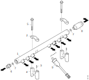
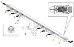
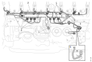
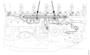
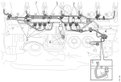

---
hide:
  - footer
---

{ width="700" }

||||||
|-|-|-|-|-|
| 1.Акумулатор | 2.Капачка | 3.Водилка | 4.Држач | 5.Завртка |
| 6.Спојка | 7.Заптивна подлошка |8.Безбедносен вентил | 9. Сензор за температура и притисок на гориво |

## Спецификации

!!! info "Важно"

    Високопритисните цевки можат да се употребат само пет пати. Секоја демонтажа да се обележи со стега.

Момент на затегање 13L XPI

| Спој | момент на затегање|
|-|-|
| Акумулатор, приклучоци | 27Nm + 90° |
| Сигурносен вентил | 27Nm + 90° |
| Спојка кон сигурносниот вентил | 55Nm |
| Сензор за притисок и температура, T199 | 47Nm |
| Сензор за притисок на гориво | 47Nm |
| Високопритисни цевки | 38Nm |

## Функционален опис

Горивото се пумпа (1) во акумулаторот од високопритисната пумпа и се собира во акумулаторот (2) пред да се распредели на бризгалките. Притисокот на горивото во акумулаторот достигнува 2400bar. Високиот притисок е потребен за да се овозможи висок и подеднаков притисок на бризгалките а со тоа и рамномерна распределба на горивото на бризгалките. Горивото под висок притисок од акумулаторот (2), преку високопритисните цевки, се распределува на бризгалките.

На акумулаторот е инсталиран сензор за притисок и температура (4). Сензорот го мери притисокот на горивото и податоците ги праќа до контролниот уред на моторот. Ако постои некаква неисправност во системот за гориво притисокот во акумулаторот може да порасне. Ако притисокот порасне до 3000bar, ќе отвори сигурносниот вентил (5). Вентилот, преку повратна цевка го пропушта горивото кон колекторот и како резултат на тоа притисокот опаѓа на приближно 1000bar.

{ width="700" }

## Одржување

### Чистота кога се работи на системот за гориво

!!! info "Важно"

    Целиот систем за гориво е чувствителен на нечистотии и мали делчиња. Надорешни делчиња во системот можат да предизвикаат сериозни неправилности. Затоа е особено важно се да биде чисто кога се работи на системот. Пред да се превземе било каква работа треба да се испере моторот.

    Забрането е да се работи со компримиран воздух или машински работи во близината на отворен систем за гориво.

    Кога се работи на системот за гориво треба да се користат чисти крпи кои не испуштаат конци и заштитни ракавици. 

    Пред да се користи рачниот алат треба да се испере. Да не се користи оштетен алат и алат со површинска заштита од хром бидејки може да отпадне парче хром. 

    Пред да се одспојат приклучоците истите и нивната околина да се очисти. 
    
    Отворите на приклучоците треба да се заштитат од навлегување на нечистотија.

### Демонтажа

!!! warning "Предупредување"

    Системот за гориво може да биде под притисок од 3000bar. Секогаш треба да се смета дека системот е под притисок. 

    Пред отпочнување на работа системот треба да се одзрачи со помош на програмот SDP3 

    Кога се работи на системот за гориво треба да се носат заштитни ракавици и заштитни очила.

Припремни работи

| Операција | &nbsp; |
| - | - |
| 1.Да се испере моторот [Перење на мотор](../engine/010001.md) | &nbsp; |
| 2.Возилото да се поврзе со програмот SDP3 | { width="160" }|
| 3.Да се одзрачи системот за гориво ***SDP3>Checks and adjustment>Functions>Check>Powertrain>Engine>Fuel system>Reducing the fuel pressure.*** | &nbsp; |
| 4.Да се одспои негативниот поларитет на акумулаторската батерија. | &nbsp; |
| 5.Да се подигне кабината. | &nbsp; |
| 6.Да се отстрани звучната изолација (ако ја има) | &nbsp; | 
| 7.Да се постави крпа преку завртката на некоја од високопритисните цевки помеѓу акумулаторот и високопритисната пумпа на страната на акумулаторот. Потоа да се олабави навртката.   Ова е осигурување дека системот е одзрачен. | &nbsp; |

Расчистување на просторот

| Операција | &nbsp; |
| - | - |
| 1.Да се испере делот околу акумумоторот и приклучоците. | &nbsp; |
| 2.Да се отспои конекторот од сензорот за температура и притисок T111. | { width="600" }|
| 3.Да се одвојат стегите за цревата за одзрачување и цревото (2) да се тргне на страна. | &nbsp; |
| 4.Да се отстрани стегата за високопритисната цевка од високопритисната пумпа (3) и да се одспои од странана акумулаторот. Да се затворат отворите на високопритисната цевка и акумулаторот. | &nbsp; |
| 5.Да се одвојат високопритисните цевки (4, 5) од акумулаторот. | &nbsp; |
| 6.Да се отстрани цевката за поврат на гориво од колекторот (6). | &nbsp; | 

Демонтажа

| Операција | &nbsp; |
| - | - |
| 1.Да се одспојат завртките од капачките на држачите, види слика. | { width="600" } |
| 2.Да се подигне акумулаторот заедно со капачките. | &nbsp; |

### Монтажа

Припремни работи

| Операција | &nbsp; |
| - | - |
| 1.Да се очисти просторот каде што се монтира акумулаторот. | &nbsp; |
| 2.Ако приклучоците на високопритисните цевки пропуштаат гориво да се сменат со нови. | &nbsp; |
| 3.Да се постави стега на високопритисните цевки како ознака дека е повторно монтирана. | { width="600" } |

Поставување

| Операција | &nbsp; |
| - | - |
| 1.Да се постави акумулаторот и да се стегнат со рака капачките од држачите. | { width="600" }  |
| 2.Да се стегне со рака повратната цевка на колекторот (1). | { width="600" } |
| 3.Да се поврзат на акумулаторот високопритисните цевки (2, 3) и да се стегнат со рака. | &nbsp; |
| 4.Да се поврзе на акумулаторот високопритисната цевка од високопритисната пумап (4) и да се стегне со рака. | &nbsp; |
| 5.Да се затегнат капачките (5). | &nbsp; |
| 6.Да се затегне со момент од 38Nm цевката од високопритисната пумпа. | &nbsp; |
| 7.Да се затегнат цевките (2, 3) на акумулаторот со момент од 38Nm. | &nbsp; |
| 8.Да се затегнат носачите и стегите. | &nbsp; |
| 9.Да се поврзе сензорот за притисок и температура T111 (6). | &nbsp; |
| 10.Да се поврзе цревото за одзрачување (7). | &nbsp; |

Завршни работи

| Операција | &nbsp; |
| - | - |
| 1.Да се одзрачи системот. [Одзрачување](). | &nbsp; |
| 2.Да се поврзе акумулаторот. | &nbsp; |
| 3.Да се стартува моторот и да се провери дали има истекување на масло и гориво. Да се провери дали порастот на притисокот и одржувањето е исправно преку тестот ***SDP3>Checks and adjustments>Functions>Check>Powertrain>Engine>Fuel system>Check for internal leaks***. | { width="160" } |
| 4.Да се врати кабината. | &nbsp; |

