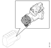
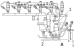

---
hide:
  - footer
---

## Местоположба

{ width="400" }

## Одржување

### Чистота кога се работи на системот за гориво

!!! info "Важно"

    Целиот систем за гориво е чувствителен на нечистотии и мали делчиња. Надорешни делчиња во системот можат да предизвикаат сериозни неправилности. Затоа е особено важно се да биде чисто кога се работи на системот. Пред да се превземе било каква работа треба да се испере моторот.

    Забрането е да се работи со компримиран воздух или машински работи во близината на отворен систем за гориво.

    Кога се работи на системот за гориво треба да се користат чисти крпи кои не испуштаат конци и заштитни ракавици. 

    Пред да се користи рачниот алат треба да се испере. Да не се користи оштетен алат и алат со површинска заштита од хром бидејки може да отпадне парче хром. 

    Пред да се одспојат приклучоците истите и нивната околина да се очисти. 
    
    Отворите на приклучоците треба да се заштитат од навлегување на нечистотија.

### Демонтажа

!!! warning "Предупредување"

    Системот за гориво може да биде под притисок од 3000bar. Секогаш треба да се смета дека системот е под притисок. 

    Пред отпочнување на работа системот треба да се одзрачи со помош на програмот SDP3 

    Кога се работи на системот за гориво треба да се носат заштитни ракавици и заштитни очила.

| Операција | &nbsp; |
| - | - |
| 1.Пред да се демонтира пумпата (А) треба да се извадат цевките (1) и (2). Цевките да се затнат за да с еспречи навлегување на прашина.| { width="500" } |
| 2.Да се одстраната завртките кои ја држат пумпата и да се извади. | &nbsp; |

### Монтажа

| Операција | &nbsp; |
| - | - |
| 1.Да се замени со нов О-прстенот и да се монтира пумпата. Внимателно да се поместува пумпата додека не навлезе спојката.| { width="500" } |
| 2.Пред да се зацврстат завртките да се увери дека пумпата е добро налегната на високопритисната пумпа. | &nbsp; |
| 3.Да се спојат цевките (1) и (2). | &nbsp; |