---
hide:
  - footer
---

{ width="240" }

{ width="360" }

1. *Завртка за високопритисна цевка*
1. *Завртка за приклучокот на високопритисна цевка*
1. *Чивија*
1. *Цилиндерска глава*
1. *О-прстен*
1. *Високопритисна цевка за поврзување на бризгалката*
1. *Приклучок*
1. *Завртка на држачот*
1. *Држач*
1. *О-прстен*
1. *Бризгалка*
1. *Комора за ладење*
1. *Заптивна подметка*
1. *Дизна на бризгалката*
1. *Ракавец*

## Начин на работа

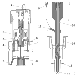{ width="460" }

|&nbsp;| &nbsp; | &nbsp; | &nbsp; | &nbsp; |
|-|-|-|-|-|
| 1.Електромагнетен вентил |4.Седиште на управувачкиот вентил | 7.Управувачки вентил | 10.Клип |13. Бакарна подлошка |
| 2.Намотки на вентилот | 5.О-прстен | 8.Контролен волумен |11.Влез на горивото | 14.Дршач на дизната на инјекторот |
|3.Арматура на вентилот |6.Вентилско седиште | 9.Повратен канал | 12.Дизна на инјекторот|

Инјекторот работи во две фази. Првата фаза е кога инјекторот е без електрично напојување и е затворен. Втората фаза е кога инјекторот е под електрично напојување и е отворен.

Главните делови на инјекторот се клип, клип на дизната, пружина и електромагнетно контролиран вентил за гориво.

Инјекторот е под постојан притисок од 2400bar. Кога вентилот ќе добие електричен сигнал отвара и вбризгува гориво во цилиндерот.

Времето на вбризгување и количината на гориво ја одредува контролниот уред на моторот. Времетраењето на вбризгување и притисокот на горивото во акумулаторот го одредува количеството на гориво кое се вбризгува во цилиндерот.

### Фаза 1 - електромагнетниот вентил е без напојување

Во оваа фаза вентилот на инјекторот е без електично напојување и е затворен. Во инјекторот владее притисок од 350-2400 bar.

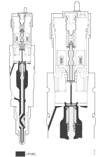{ width="460" }

### Фаза 2 - електромагнетниот вентил е под напојување

Во оваа фаза вентилот на инјекторот е под електично напојување и отвара, така да горивото навлегува во инјекторот. Поради разликата во притисокот која се зголемува клипот на инјекторот се придвижува нагоре и горивото се вбризгува во цилиндерот. 

Штом електричното напојување на вентилот се прекине притисокот на горивото во инјекторот го задвижува клипот надоле и го затвара инјекторот.

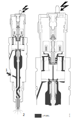{ width="460" }

### Различна изведба на дизни на инјекторот

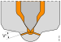{ width="300" }

Дизната на инјекторот е така дизајнирана да обезбеди облик на млаз кој ќе даде оптимално согорување во цилиндерот.

Дизајнот е раличен во следите детали:

- бројот на отвори во дизната
- аголот на отворите на врвот од дизната 
- разлика во внатрешните делови на дизната 

## Демонтажа на инјекторот

### Подготвтелна работа

| Операција | &nbsp; |
|-|-|
| 1.Да се испере моторот . | &nbsp; |
| 2.Да се поврзе возилото на програмот SDP3. Да се прочитаат кодовите на грешки. |  { width="120" } |
| 3.Да се одзрачи системот за гориво со програмот SDP3. ***SDP3>Check and adjustments>Functions>Checks>Powertrain>Engine>Fuel system>Reducing the fuekl pressure.***. | &nbsp; |
| 4.Да се подигне кабината. |  &nbsp; |
| 5.Да се постави крпа преку завртката на некоја од високопритисните цевки помеѓу акумулаторот и високопритисната пумпа на страната на акумулаторот. Потоа да се олабави навртката.   Ова е осигурување дека системот е одзрачен на високо-притисната страна. | &nbsp; |

### Расчистување на просторот

| Операција | &nbsp; |
|-|-|
| 1.Да се извади горниот капак од клацкалиците. | 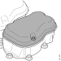{ width="320" } |
| 2.Да се одспои електричната инсталација од инјекторот и внимателно да се тргне на страна. | 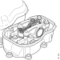{ width="320" } |
| 3.Да се одспои високо-притисната цевка на инјекторот. | 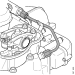{ width="320" } |
| 4.Да се демонтира навртката за висок притисок. | { width="320" } |
| 5.Да се демонтира приклучокот за висок притисок. | 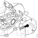{ width="320" } |
| 6.Да се стави приклучокот за висок притисок во кеса и кесата а се затвори. | &nbsp; |
| 7.Да се извади завртката од држачот на инјекторот. | { width="320" } |
| 8.Да се помести држачот на инјекторот на една страна. | 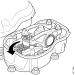{ width="320" }|
| 9.Да се вметне алатката ***99 475*** во просторот до инјекторот. | { width="320" } |
| 10.Да се одспои инјекторот со вмтнување на алатката во каналот и подигање. | 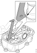{ width="320" } |
| 11.Да се извади инјекторот и да се завитка со чиста тканина која не пушта конци. | &nbsp; |

## Монтажа на инјекторот

### Припремни работи

| Операција | &nbsp; |
|-|-|
| 1.Да се провери инјекторот дали е оштетенособено електричните приклучоци. | 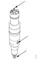{ width="320" } |
| 2.Да се замени заптивната подлошка со нова. Новата подлошка да се постави и натисне со рака. Завршното поставување на заптивката да с еизведе со клешта. | { width="320" }   { width="320" } |
| 3.Да се замени О-прстенот со нов. | 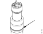{ width="320" } |
| 4.Да се запише кодот на инјекторот кој е на најнискиот ред. | 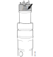{ width="320" } |
| 5.Да се провери високопритисниот приклучок, особено врвот (1) кој навлегува во инјекторот, клинот (2) и навојот (3) за високопритисната навртка. Да се провери дали има страни тела во ввнатрешноста на приклучокот (4). Да се замени О-прстенот (5). | 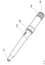{ width="320" } |
| 6.Да се провери држачот на инјекторот, водилката и крилото. |  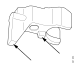{ width="320" } |
| 7.Да се провери високо притисната цевка, конусот (1). Да се постава стега секој пат кога цевката се демонтира (2). Високопритисната цевка може да се користи само пет пати. | { width="320" } |
| 8.Да се очисти отворот (1) во цилиндерската глава за монтажа на инјекторот и отворот за високопритисниот приклучок (2). | 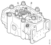{ width="320" }|

## Монтажа

| Операција | &nbsp; |
|-|-|
| 1.Да се постави држачот на инјекторот и да се стави инјекторот во отворот на цилиндерската глава. | 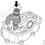{ width="320" } |
| 2.Да се провери дали инјекторот е правилно поставен со вртењена држаќот додека отворите за завртката во држачот и цилиндерската глава не се поклопат.. | 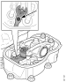{ width="320" } |
| 3.Да се затегне завртката од држачот со рака. | { width="320" } |
| 4.Да се подмачлка О-прстенот од високопритисниот приклучок. Исто така да се провери дали клинот е вметнат. | &nbsp; |
| 5.Да се вметне високопритисниот приклучок во цилиндерската глав со клинот завртен нагоре  во за тоа предвидениот отвор. | 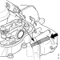{ width="320" } |
| 6.Да се постави високопритисната завртка и да се стегне со рака. |  { width="320" } |
| 7.Да се затегне завртката на инјекторот и навртката за високопритисниот приклучок. Затегањето да се изврши во четри чекора.  1. Држач на инјекторот 20Nm 2. Навртка на високопритисниот приклучок 20Nm 3. Држач на инјекторот 56Nm.  4. Навртка на високопритисниот приклучок 56Nm | &nbsp; |
| 8.Да се монтира високопритисната цевка. Да се прицврсти навртката со рака. Да се затегне завртката со сила 38Nm. | { width="320" }|
| 9.Да се монтира електричниот кабел на инјекторот. | { width="320" }|
| 10.Да се монтира горниот капак од клацкалиците и да се затегне со сила од 18Nm. | { width="320" }|
| 11.Да се поврзе возилото со програмот SDP3 и да се внесе кодот за новиот инјектор . ***SDP3>Check and adjustment>Functions>Calibrations>Powertrain>Engine>Fuel system>Calibration of injectors.*** | &nbsp; |
| 12.Да се ресетира подесувањето на количината на гориво. ***SDP3>Check and adjustment>Functions>Calibrations>Powertrain>Engine>Fuel system>Default setting of adaptation of the injectors.***| &nbsp; |

## Завршни работи

| Операција | &nbsp; |
|-|-|
| 1.Да се стартува моторот и да се провери дали има течење. | &nbsp; |
| 2.Да се провери дали притисокот на горивото е исправен ***SDP3>Check and adjustments> Functions>Checks>Powertrain>Engine>Fuel system>Check for internal leaks***. | { width="120" } |
| 3.Да се врати назад кабината. | &nbsp; |

## Проверка на инјекторот

| Операција | &nbsp; |
|-|-|
| 1.Да се поврзе програмот SDP3 и да се повери дали има кодови на грешка. | { width="120" } |
| 2.Да се провери функционирањето на инјекторите со активирање на инјекторите. ***SDP3>Check and adjusments>Functions>Check>Powertrain>Engine>Fuel system>Activating unit injector solenoid valves*** | &nbsp; |
| 3.Ако има дефектен инјектор да се ивади капакот од клацкалицата на цилиндерот и да се одспојат електричните кабли од вентилот на инјекторот. | &nbsp; |
| 4.Да се измери отпорноста на вентилот држејки ги приклучоите од инструментот најмаку 20 секунди за да се добие стабилна вредност. Вредноста на отпорот треба да биде помеѓу 0.2-0.6 &ohm; на собна температура кога моторот е ладен. | { width="160" } |
| 5.Да се измери дали намотката има куса врска према маса. Мерењето да се изврши на двата терминала. | &nbsp; |

!!! info "Информација"

    Ако инјекторите не можат да се проверат со SDP3, некој е инјекторите е можеби споен на маса преку шасијата. Во ваков случај контролната единица не може да функционира и нема да генерира код на грешка. Во овој случај треба да се проверат сите инјектори.

