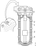

---
hide:
  - footer
---

## Општо

### Намена

Селективната каталитичка редукција (SCR) се користи за намалување на количината на азотни оксиди (NOx) во издувните гасови со помош на каталитичка редукција. Намалените емисии на азотни оксиди овозможуваат да се задоволат различните барања за емисија на издувни гасови од моторот и во исто време да се оптимизира моќноста на моторот и потрошувачката на гориво.

Со цел дополнително да се намали количината на јагленводороди (HC) и честички во емисиите на издувните гасови, системот SCR е дополнет со оксидациски катализатор и филтер за честички, што значи дека влијанието на емисиите на издувните гасови врз животната средина е дополнително намалено.

### Објаснување

***Дополнителен третман со SCT и EGR***

Со цел да се намали концентрацијата на азотни оксиди (NOx), честичките на саѓи (PM), јагленоводороди (HC) и јаглен моноксид (CO) се употребуваат различни каталитички конвертори и филтери заедно со редуктант (32.5% уреа и другото вода) кој се вбризгува во издувните гасови на влезот од регенеративниот филтер за честички. Како резултат на дополнителниот третман на издувните гасови од издувната цевка излегува вода (H2O), јаглен двеоксид (CO2) и азот (N2).

Долната илустрација е принципиелен цртеж на компонентите кои го сочинуваат дополнителниот третман на издувните гасови.

{ width="1000" }

<table>
    <tr>
        <td><small>1. Оксидациски каталитичли конвертор (DOC) кој ја намалува концентрацијата на јагленводороди. Ако е потребно овој конвертор испорачува топлина до филтерот за честички (DPF), односно преку согорување го чисти филтерот од саѓи.</small></td>    
        <td><small>4. Евапоратор кој го меша редуктантот со издувните гасови.</small></td>
        <td><small>7. Редуктант од резервоарот за редуктант.</small></td>
    </tr>
    <tr>
        <td><small>2. Регенеративен филтер за честички (DPF) кој ги чисти издувните гасови од честички.</small></td>   
        <td><small>5. SCR каталитички конвертор кој ги претвара (конвертира) азотните оксиди во азот и вода.</small></td> 
        <td><small>8.Дозер на редуктант кој вбризгува редуктант во издувните гасови.</small></td> 
    </tr>
    <tr>
        <td><small>3. Пумпа за редуктант.</small></td>    
        <td><small>6. Каталитички конвертор на амоњак кој го оксидира амоњакот во азот (N2).</small></td> 
        <td><small>&nbsp;</small></td>
    </tr>

</table>

### Општо

#### Дизајн на системот и компоненти за дополнителен третман на издувните гасови со SCR и EGR

Системот за дополнителен третман на издувните гасови се состои од електронска контролна единица EEC (Exhaust Emission Control system), со сензори и електрични компоненти и коло на редуктантот. Други компоненти кои влегуваат во системот се пригушувачот со катачитички конвертор и резервоарот за редуктант. Дополнителниот третман на издувните гасови ги чисти и конвертра опасните по здравје честички и супстанци.

#### Контролен систем за дополнителниот третман на издувните гасови

Контролниот систем се состои од контролна единица (EEC3), NOx сензор, сензор за температура и притисок, сензор ниво и температура во резервоарот за редуктант, пумпа за редуктантот, дозер на редуктант, вентил за разладна течност и електрично греени црева за редуктант.

{ width="600" }

<table>
    <tr>
        <td><small>1.Контролна единица EEC3</small></td>    
        <td><small>4.Сензер за ниво и температура во резервоарот за редукрант</small></td>
        <td><small>7.Дозер на редуктант</small></td>
    </tr>
    <tr>
        <td><small>2.Вентил за разладна течност</small></td>   
        <td><small>5.Електрично греени црева за редуктант</small></td> 
        <td><small>8.NOx сензор</small></td> 
    </tr>
    <tr>
        <td><small>3.Сензор за температура</small></td>    
        <td><small>6.Пумпа за редуктант</small></td> 
        <td><small>9.Сензор за притисок</small></td>
    </tr>

</table>

***Контролна единица EEC3 (E67)***

Контролната единица прима податоци од сензорите на системот и компонентите и комуницира со контролната единица на моторот EMS. Контролната единица EMS одлучува кои операции треба да се извршатиот, на пример колкава количина на редуктант да се уфрли во издувните гасови и за тоа ја известува контролната единица EEC3. Контролната единица EEC3 е независна и одговорна за функцијата која уфрла редуктант во издувните гасови. Зависно од верзијата локацијата на контролната единица е или на рамката од резезвоарот за редуктант или на рамот од возилото.

{ width="400" }

{ width="400" }

***NOx сензор (T115 i T131)***

Во системот има NOx сензори. Тие ја мерат количината на азотни оксиди пред и после дополнителниот третман на издувни гасови. Овие сензори измерените вредности ги проследуваат до контролната единица EEC3 која за известува контролната единица EMC. Сензорите се греат електрично преку контролната единица EEC3. Електронскиот уред е лоциран на пригушувачот и има сензор во внатре во пригушувачот.

{ width="400" }

***Сензор за температура (T158)***

Во системот има сензор со со три одвоени сензори за температура за мерење на температурата на издувните гасови пред и после каталичкиот конвертор и после филтерот за честички. Овој сензор измерените вредности ги праќа до контролната единица EEC3 која ја известува контролната единица EMS. Оваа единица е сместена на пригушувачот а сензорите за температура се сместени во пригушувачот.

{ width="400" }

***Сензор за притисок (T141)***

Во системот има сензор за притисок за мерење на диференцијалниот притисок на филтерот за честички. Сензорот го мери притисокот пред и после филтерот за честички. Овој сензор измерените вредности ги праќа до контролната единица EEC3 која ја известува контролната единица EMS. Сензорот е сместен на пригушувачот.

{ width="400" }

***Сензор за ниво и температура (T116)***

Во резервоарот за редуктат е сместен сензор за ниво и температура. Сензор измерените вредности ги праќа до контролната единица EEC3.

{ width="400" }

- 1.Цевка за разладна вода
- 2.Цевка за редуктант
- 3.Сензор за ниво
- 4.Сензор за температура

***Резервоар за редуктант***

Резервоарот за редуктант е достапен во повеќе варијанти и димензии. Димензијата на резервоарот се прилагодува според потрошувачка на гориво. Редуктантот се надополнува кога се надополнува гориво.

Редуктантот во резервоарот, при ниски надворешни температури се загрева со помош на разладната течност од моторот. Приклучокот за редуктант и разладна вода се наоѓа на врвот од резервоарот и содржи и сензор за температура, сензор за ниво и филтер за редуктант.

Подоле се прикажани различни типови на резервоари.

<figure markdown>
  { width="400" }
  <figcaption>стара верзија, камиони</figcaption>
</figure>

<figure markdown>
  { width="400" }
  <figcaption>нова верзија, камиони</figcaption>
</figure>

<figure markdown>
  { width="400" }
  <figcaption>скриена верзија, камиони</figcaption>
</figure>

***Пумпа за редуктант (V186)***

За да се постигне потребниот притисок и количина на редуктантот, пред да се уфрли во издувните гасови, во системот постои електрично погонувана пумпа со контролирана променлива брзина. Пумпата се активира и надгледува од контролната единица EEC3. Пумпата е сместена на носачот од резервоарот за редуктант.

{ width="400" }

***Дозер за редуктант (V117)***

Редуктантот во потребна количина се вбризгува во издувните гасови преку дозерот кој е електрично погонуван а се активира и надгледува од контролната единица EEC3. Дозерот се загрева електрично а е сместен на пригушувачот.

{ width="400" }

***Вентил за разладна течност (V118)***

Во системот има вентил кој ја пропушта или запира разладната течност од системот за ладење на моторот до резерввоарпт за редуктант и пумпата за редуктант. Разладната вода го загрева редуктантот во резервоарот и во пумпата при ниски надворешни температури. Вентилот го активира контролната единица EEC3. Локацијата на вентилот зависи од изведбата на каросеријата.

{ width="400" }

***Електрично греени црева за редуктант (H25, H26, H27 и H28)***

Цревата наменети за редуктант се електрично грееени со цел да се спречи формирање на мраз при ниски температури. Електричното греење го активира контролната единица EEC3. Цревата го пренесуваат редуктантот од пумпата кон дозерот и повратно од дозерот во резервоарот за редуктант.

{ width="400" }

#### Хидраулично коло на редуктантор

Хидрауличното коло за системот на дополнителен третман на издувни гасови се состои од резервоар за редуктант, сензор за ниво и температура на редуктантот (со приклучоци за редуктант и разладна вода) во резервоарот, пумпа за редуктант, дозер за редуктант и црева за редуктантот со електрично греење. Разладната течност се користи за загревање на редуктантот во резервоарот и пумпата кога надворешната температура е ниска. На долната слика со сиви линии е означено колото на редуктантот а со црни линии колото на разладната течност.

{ width="600" }

<table>
    <tr>
        <td><small>1.Резервоар за редуктант</small></td>    
        <td><small>4.Сензер за ниво и температура во резервоарот за редукрант</small></td>
        <td><small>7.Црево за редуктант</small></td>
    </tr>
    <tr>
        <td><small>2.Вентил за разладна течност</small></td>   
        <td><small>5.Црева за редуктант и разладна течност</small></td> 
        <td><small>8.Дозер за редуктант</small></td> 
    </tr>
    <tr>
        <td><small>3.Мотор</small></td>    
        <td><small>6.Пумпа за редуктант</small></td> 
        <td><small>9.Сензор за притисок</small></td>
    </tr>

</table>

#### Компоненти за дополнителниот третман на издуни гасови

***Пригушувач***

Пригушувачот содржи оксидационен каталитички конвертот (DOC), регенерирачни филтер за честички (DPF), испарувач за редуктантот, два SCR каталитички конвертори и два каталитички конвертори на амоњак. Дозерот за редуктант, сензорот за температура и притисок и сензорот за NOx се монтирани на пригушувачот.

{ width="600" }

## Начин на работа

### Вовед

Според новите стандарди и прописи, за контрола и намалување на штетните материи во издувните гасови, не се доволни селективно каталитичка редукција (SCR) или вбризгување гориво со помош на XPI и EGR.

Поради тоа е развиен нов контролен систем и компоненти за дополнителна обработка на издувните гасови за филтрирање и чистење на издувните гасови на мотори опремени со XPI вбризгување гориво и рециркулација на издувните гасови (EGR).

За да се разбере како функционира дополнителниот третман на издувните неопходно е да се проучи системот . Основните цртежи дадени подолу опишуваат што се случува за време на дополнителниот третман на издувните гасови за време на различни работни услови.

Исто така треба да се проучи и функцијата на пригушувачот.

{ width="800" }

<table>
    <tr>
        <td><small>1. Контролна единица EEC3</small></td>    
        <td><small>7. Вентил за регулација на влезниот воздух</small></td> 
        <td><small>13. SCR каталитички конвертор</small></td>       
        <td><small>19. Сензор за температура пред испарувачот</small></td>    
    </tr>
    <tr>
        <td><small>2. Дозер на редуктант</small></td> 
        <td><small>8. Коччница на издувни гасови</small></td>   
        <td><small>14. Kаталитички конвертор на амоњак (ASC)</small></td>   
        <td><small>20. Сензор за азотни оксиди (NOx) на излезот на дополнителниот третман на издувните гасови</small></td>

    </tr>
    <tr>
        <td><small>3. Пумпа за редуктант.</small></td>  
        <td><small>9. EGR вентил</small></td>  
        <td><small>15. Сензор за азотни оксиди (NOx) на влезот на дополнителниот третман на издувните гасови</small></td>     
        <td><small>21. Црева за редуктант</small></td>

    </tr>
    <tr>
        <td><small>4. Резервоар на редуктант со сензотр за ниво и температура и греење</small></td>    
        <td><small>10. Оксидациски катачлитички конвертер</small></td>
        <td><small>16. Сензор за температура преде оксидационо каталитички конвертор</small></td>
        <td><small>&nbsp;</small></td>
    </tr>
    <tr>
        <td><small>5. Вентил за разладна течност</small></td> 
        <td><small>11. Филтер за честички</small></td>  
        <td><small>17. Сензор за температура после оксидационо каталитички конвертор</small></td>  
        <td><small>&nbsp;</small></td>   
    </tr>
    <tr>
        <td><small>6. Црева за редуктант</small></td>  
        <td><small>12. Испарувач, (комора во пригушувачот за вбризгување и испарување на редуктантот)</small></td>  
        <td><small>18. Сензор за диференцијален притисок на филтерот за честички.</small></td>
    </tr>

</table>
 

### Принцип на работа

Дополнителниот третман на издувни гасови работи во шест различни работни услови:

- Нормално стартување и стартување со загревање на замрзнат редукент
- Нормално функционирање и дозирање на редуктант
- Нормално функционирање и регенерација на филтерот за честички
- Принудна регенерација на филтерот за честички
- Регенерација на филтерот за честички во работилница
- Ладење на дозерот на редуктантот после гасење на моторот

***Нормално стартување***

Пумпата ќе стартува со работа кога ќе се исполната следните услови:

- Контролната единица (EEC3) ќе ја заврши проверката на системот.
- Моторот е стартуван.
- Каталичкиот конвертор ја достигнал работната температура (над 200°C).
- Загревањето (ако требало) на редуктантот е завршено.
- Пумпата ќе го подигне притисокот на 9bar така да дозерот може да вбризгува редуктант во пригушувачот за испарувачот и SCR каталитичкиот конвертор.

{ width="600" }

- Контролната единица EEC3 (1) ги надгледува вредностите на сите функции од сите сензори
- Моторот е стартуван
- Пумпата (3) го подига притисокот до 9bar
- Кога сензорот за температура (19) ќе покаже дека температурата на издувните гасови надминала 200°C, контролната единица EEC3 го активира дозерот за редуктант, кој вбризгува редуктант во испарувачот (12) во пригушувачот. Количината на вбризганиот редуктант ја одредува контролната единица на моторот EMS основа на вредностите на сензорот за азотни оксиди NOx (15) и модот на согорување кој моментално се извршува.
- SCR каталитички конвертот (13) ја намалува вредноста на азотните оксиди NOx.
  
***Стартување со загревање на замрзнатиот редуктант***

{ width="600" }

- Контролната единица EEC3 (1) ги надгледува вредностите на сите функции од сите сензори
- Моторот е стартуван
- Контролната единица EEC3 го отвара вентилот за разладна течност (5), разладната течност го загрев редуктантот во резервоарот (4) цревото за редуктант (6) и пумата за редуктант (3) преку цревото за редуктант (21). Контролната единица EEC3 исто така го вклучува греењето на цревата за редуктант (6) и електричното греење на дозерот (2).
- Контролната единица EEC3 регистрира, преку сензорите за температура во резервоарот за редуктант (4) и дозерот (2) кога температурата на редуктантот е над -5°C и ја стартува пумпата (3).
- Кога сензорот за температура (19) ќе покаже дека температурата на издувните гасови надминала 200°C, и кога вреноста од сензорот за азотни оксиди NOx е проследена до контролната единица на моторот EMS, контролната единица EEC3 го активира дозерот за редуктант (2), кој вбризгува редуктант во испарувачот (12) во пригушувачот. Количината на вбризганиот редуктант ја одредува контролната единица на моторот EMS основа на вредностите на сензорот за азотни оксиди NOx (15) и модот на согорување кој моментално се извршува.
-SCR каталитички конвертот (13) ја намалува вредноста на азотните оксиди NOx.

!!! info "Информација"

    При ниски надворешни температури не се генерира код на грешка.

***Нормална работа и дозирање на редуктант***

{ width="600" }

- Контролната единица на моторот (EMS) ги надгледува и ги третира издувните гасови во неколку чекори пред крајно да бидат ослободени преку испусната цевка. Концентрацијата на азотни оксиди NOx се мери со сензорот за NOx (15), а контролната единица EEC3 (1) ја пренесува измерената вредноста до контролната единица на моторот. После тоа, температурата на издувните гасови се мери со сензорот за температура (16) а контролната единица EEC3 ја пренесува вредноста до контролната единица на моторот. Оксидациониот катализатор (10) го согорува вишокот на дизел и ја зголемува содржината на азотен двооксид NO2 во издувните гасови. За да се започне со намалување на азотните оксиди NOx во SCR каталитичките катализаторите (13), потребно е зголемување на температурата на издувните гасови кога температурите на издувните гасови се ниски.
- Кога издувните гасови ќе го поминат оксидациониот катализатор (10), температурата на издувните гасови се мери со температурниот сензор (17). Вредноста се отчитува од контролната единица EEC3 и се пренесува до контролната единица на моторот. Вредностите на сензорите за температура (16, 17 и 19) ги користи контролната единица на моторот за да ја контролира количината со која оксидациониот катализатор (10) ја регулира температурата на издувните гасови. Ова се прави со промена на односот воздух и гориво. На пример, намалениот волумен на воздух во однос на додадениот волумен на гориво значи дека оксидациониот катализатор ја зголемува температурата на издувните гасови. Компонентите вентилот за влезен воздух (7), кочницата на издувни гасови (8) или EGR вентилот (9) се користат поединечно или во комбинација за да се постигне оваа промена на односот на воздухот и горивото.
- Издувните гасови потоа минуваат низ филтерот за честички (11) каде што честичките од саѓи се филтрираат. Повратниот притисок на издувните гасови низ филтерот за честички се мери со сензорот за притисок (18). Вредноста се отчитува од контролната единица EEC3 и се пренесува до контролната единица на моторот. Ако разликата на притисокот е преголем, контролната единица на моторот го менува режимот на контрола на согорувањето со цел да потикне зголемување на температурата и регенерација на филтерот за честички.
- Издувните гасови минуваат низ испарувачот (12), каде што се вбризгува редуктантотт. За да може процесот да функционира, температурата на издувните гасови мора да надмине 200°C. Температурата на издувните гасови се мери со температурниот сензор (19) поставен наспроти испарувачот. Вредноста се отчитува од контролната единица EEC3 и се пренесува до контролната единица на моторот. Ако температурата е премногу ниска или превисока, контролната единица на моторот го прилагодува режимот за контрола на согорувањето.
- Контролната единица EEC3 го контролира количеството на редуктант, што се црпи од резервоарот за редуктор (4) со активирање и прилагодување на брзината на пумпата за редуктант (3), како и дозата до дозерот на редукторот (2).
- Волуменот на редуктант кој се вбризгува во издувните гасови во испарувачот (12) се одредува од контролната единица на моторот и се контролира од контролната единица EEC3. Вредностите од сензорите за NOx (15 и 20), сензорот за температура (19) и режимот за контрола на согорувањето на контролната единица на моторот ја формираат основата за одредување на волуменот на редукторот што треба да се вбризга.
- Кога редукторот е измешан со издувните гасови (испарување), издувните гасови поминуваат низ SCR катализаторот (13), каде што азотните оксиди NOx се претвараат во вода и азот. Во последниот чекор, издувните гасови поминуваат преку катализатор на амонијак (14) кој го намалува нивото на амонијак.
- Пред издувните гасови да се испуштат во оклината, концентрацијата на азотни оксиди NOx се мери со сензорот за NOx (20). Вредноста се отчитува од контролната единица EEC3 и се пренесува до контролната единица на моторот. Вредноста се споредува со концентрацијата на азотни оксиди NOx од сензорот за NOx (15) и се формира основата за контрола на режимот на согорувањето на контролната единица на моторот и се врши прилагодување на температурата на издувните гасови или дозата на редуктант.

***Нормална работа и регенерација на филтерот за честички***

!!! info "Информација"

    Ако моторот работи во празно, или под мал товар подолго време (часови) количината на нечистотии од масло во оксидацискиот каталитички конвертор и филтерот за честички ќе се зголеми бидејки температурат во оксидацискиот каталитички конвертор паѓа под 180°C. Ова загадување може да ги оштети оксидацискиот каталитички конвертор и филтерот за честички. За да се спречи ова, после одреден период, контролната единица на моторот стартува принудна регенерација.

{ width="600" }

- Издувните гасови се чистат од сите честички во издувните гасови кои можат да се фатат во филтерот (саѓи, пепел итн.) со филтрирање во филтерот за честички (11). Нормално има постојана оксидација на честичките саѓи во филтерот нешто што е познато како пасивна регенерација (саѓите се оксидираат со помош на азот диоксид, NO2). Неорганскиот материјал кој не е изгорен (пепел) останува во филтерот за честички. Доколку работните услови не се целосно поволни за континуирана пасивна регенерација, се превземаат мерки за принудно отпочнување на регенерацијата. Контролната единица на моторот потоа го менува односот на воздухот и горивото така што оксидациониот катализатор ја зголемува температурата на издувните гасови. Компонентите вентил за влезен воздух (7), кочница на издувни гасови (8) или EGR вентилот (9) се користат поединечно или во комбинација за да се постигне оваа промена на односот на воздухот и горивото, така што оксидациониот катализатор (10) ја зголемува температурата на издувните гасови. Ова доведува до зголемување на температурата во филтерот за честички со цел да се изгорат собраните честички саѓи. Присилната регенерација обично се случува додека се вози возилото, и може да се забележи преку промената на звукот на моторот.

- Филтерот за честички се надгледува со диференцијалниот сензор за притисок (18). Сензорот го мери притисокот на издувните гасови пред и после филтерот за честички. Разликата на притисокот се пренесува до контролната единица EEC3 (1) која го проследува до контролната единица на моторот.

- Ако разликата на притисокот ја надмине поставената вредност, тоа значи дека филтерот за честички треба да се регенерира. За да започне регенерација при нормална работа на моторот и да се зголеми температурата на издувните гасови над оксидациониот катализатор (10) кај сензорот за температура (17), контролната единица на моторот го менува режимот на согорувањето со менување на односот воздух - гориво.

-Кога разликата на притисокот на филтерот за честички ќе се врати во нормални граници, регенерацијата се прекинува.

!!! info "Информација"

    При ниски надворешни темпаратури, кога редуктантот е замрзнат и нема вбризгување на редуктант, регенерацијата на филтерот за честички е исклучена

***Рачна, принудна регенерација на филтерот за честички***

!!! warning "Предупредување"

    При принудната регенерација постои опасност од изгореници поради зголемувањето на температурата на издувните гасови и компонентите на издувниот систем.

{ width="600" }

- Ако разликата на притисокот на филтерот за честички (11) опстојува, и пасивното регенерирање не помага, на инструмент таблата ќе се запали сигналан сијалица за предупредување која покажува дека мора да се изврши рачна принудна регенерација на филтерот за честички. Принудната регенерација се прави кога возилото е во мирување и моторот работи и трае приближно 30 минути. Возачот ја активира регенерацијата преку прекинувач на инструмет таблата.

- Регенерацијата започнува кога контролната единица на моторот го менува режимот на согорувањето преку менување на односот воздух - гориво. Ова се изведува со помош на вентилот за влезен воздух (7), кочницата на издувни гасови (8) или EGR вентил (9) или комбинација од нив. Дополнително, има дополнителна доцна фаза на вбризгување на горивото во моторот, што предизвикува вишок на дизел во издувните гасови изгорени во оксидациониот катализатор (10) и зголемување на температурата во филтерот за честички (11). Зголемувањето на температурата се следи со сензорите за температура (16), (17) и (19). Кога филтерот е исчистен и разликата на притисокот на филтерот за честички се намалува на дозволени граници и сензорот за притисок (18), ја прекинува присилната регенерација.

***Регенерација на филтерот за честички во работилница***

!!! warning "Предупредување"

    За време на регенерацијата, температурата на издувните гасови се зголемува до 500°C. Уверете се дека нема запаливи материјали во близина на издувната цевка.

!!! warning "Предупредување"

    За време на регенерацијата во работилница, поради зголемената температура на издувните гасови и компонентите на издувниот систем, постои ризик од изгореници.

- Ако и после рачната принудна регенерација, разликата на притисокот на филтерот за честички остане, потребно е да се изврши регенерација на филтерот за честички во работилница. Регенерацијата во работилницата е слична на рачната принудна регенерација, види погоре, со таа разлика што трае подолг период со цел да се избегне оштетување на филтерот поради високата температура на регенерација. Регенерацијата трае приближно 60 минути и се активира преку SDP3.

- Причината за дефектот може да биде функционална грешка или поради тоа што рачната принудна регенерација филтерот за честички што не е изведена кога било потребно.

***Ладење на дозерот на редуктантт при гасење на моторот***

!!! info "Информација"

    Ладењето на дозерот за редуктант се врши во исклучителни случаи кога моторот е многу топол или после влечење на тежок товар.

{ width="600" }

- Кога моторот се исклучува кога бил изложен на големо оптоварување и ослободување на топлина, пумпата за редуктор (3) ќе продолжи одреден период да испорачува редуктант до дозерот на редуктантот (2). Меѓутоа, редуктантот не се вбризгува во испарувачот (12), туку се враќа во резервоарот за редуктант (4) со цел да се олади дозерот на редуктантот (2). За време на ладење на дозерот не сме да се исклучи главниот прекинувач на акумулаторската батеријата инаку дозерот може да се оштети од топлина од пригушувачот. Дека ладењето е во тек се означува на инструмент таблата.

## Опис на работни задачи

### Ракување со редуктант

Редуктантот може да се исуши и да формира кристали. Кристалите може да бидат во форма на бели или сивокафени наслаги. Кристалите се остри и можат да ги пресечат О-прстените и другите гумени заптивки. Наслагите од кристали исто така можат да го блокираат системот.

Кристалите вообичаено се раствораат многу брзо во топла вода, но погустите наслаги некогаш треба да се изгребат или да се загреат на повеќе од 500°C за да се отстранат.

!!! info "Важно"

    Секогаш треба да се очисти протечениот редуктант кога се работи на системот за редуктор за да спречи истурениот редукент да се исуши и да формира кристали кои може да навлезат во системот и да го блокираат.
    Секогаш треба да се монтираат нови О-прстени кои треба темелно да се очистат како и површината за заптивање кој атреба да биде чиста без кристали.

!!! info "Важно"

    Конекторите треба да се заштитат од прсање на редуктантот бидејки истиот е високо корозивен.

### Сигурносни мерки при работа со систем на редуктант

Иако редуктантот не е отровен, следното треба да се земе во обзир кога се работи со редуктант.

- Во случај очите да дојдат во контакт со редуктантот, очите веднаш треба да се исперат со вода а пото да се побара медицинска помош.
- Во случај на контакт со кожа, да се исплаке со вода.
- Во случај на разлевање по облек, облеката веднаш да смени.
- Во случај на вдишување на испарувања да се вдишува голема количина на чист воздух.

!!! warning "Предупредување"

    Ако постои опасност од прскање на редуктант потребно е да се носат заштитни очила и ракавици.

!!! warning "Предупредување"

    При работа на моторот, деловите од издувниот систем постигаат големи температури. Потребно е да се причека, температурата на деловите да опадне пред да се отпочне со работа.

!!! warning "Предупредување"

    Редуктантот се загрева со разладната течност на моторот. Системот за ладење на моторот е под притисок и кога моторот е жежок течноста за ладење е жешка. Да не се отвораат никакви црева без претходно да го запрете протокот на течноста за ладење во цревото.

!!! note "Забелешка"

    Кај резервоарите за редуктант произведени после 2017 година цревото за одзрачување е отстрането. Одзрачувањето се прави преку капакот за полнење на резервоарот.

### Проверка на квалитетот на редуктантот

| Операција |&nbsp;|
|-|-|
| 1. Ако се користи рефрактометар ***588 981*** при земање мостри и не се знае како треба да се отчитава, прво треба да се направи тест со мерење на вода, а потоа тест со мерење на редуктант со познат квалитет за да ја видите разликата во отчитувањето. Исто така, треба да се внимава рефрактометарот да биде на амбиентална температура кога се врши мерењет. | &nbsp; |
| 2. Да се земе мустра од резервоарот за редуктант и да се провери содржината на уреа во водата со рефрактометар. Препорачана содржина на уреа е 32.5%. Граничните вредност според ISO 22241 е 31.8 - 33.2%. Поголемата содржина претставува опсаснос за блокирање на системот поради можна кристализација. Пониската содржина пак значи дека системот не ќе може да ја редуцира вредноста на азотни оксиди NOx на баранато ниво. | &nbsp; |
| 3. Кога се менува редуктантот тој треба да се внесе во системот со вклучување на пумпата и извадено црево од пумпата за да не се дозволи стар редуктант да остане во пумпата. | { width="400" } |

### Отклонување на дефекти

Подоле се дадени информации за дефекти во другите системи или компоненти кои предизвикуваат неправилна работа на EEC3 системот. Наменети се како помош да се избегнат непотребните поправки на делови кои не се дефекни.

- Блокиран воздушен филтер
- Нивото на масло во моторот е превисоко
- Блокирана вентилација на резервоарот за гориво
- Избрана зимска положба за влезен воздух при топло време
- Истекување на влезниот воздух, што може да доведе до лажно очитување на сензорот за проток кое пак е последица да контролната единица на моторот подеси погрешена мешавина.
- Истекување на воздух помеѓу влезната гранка и цилиндерската глава.
- Дефектен или неправилно калибриран сензор за проток.
- Наслаги од нечистотии на сензорот за притисок на влезниот воздух, кој испраќа неисправни информации до контролната единица.
- Дефекнен сензор за температура или притисок кој испраќа неисправни информации до контролната единица.
- Неисправна кочница на издувни гасови.
- Неисправен EGR вентил.
- Дефектен термостат во отворена позиција кој не дозволува моторот да се загрее.
- Пробиен ладилник за влезен воздух кој протекува.
- Зачепен ладилник за влезен воздух кој не го лади доволно воздухот.
- Вентилатор за ладење со премногу пролизгувања, што резултира со лошо ладење на влезниот воздухот.
- Вентилатор за ладење со премалку пролизгувањеа, што доведува да моторот не се загрева доволно во зима.
- Решетката на ладилникот е целосно или делумно блокирана, така што протокот на воздух е попречен и нема доволено ладење.
- Ако возилото има циклонски прочистувач кој е неисправен, тоа може да влијае на протокот на воздух што влегува во моторот.
- Протекување или истршеност на турбополначот.
- Дефект на VGT делот на турбополначот.
- Пукната пластична цевка помеѓу воздушниот филтер и турбополначот.
- Пластичната цевка помеѓу воздушниот филтер и турбополначот во тек на кочење со кочницата на издувни гасови се собира и затнува.
- Истекува воздух на излезот од турбополначот поради напукната прирабница на компресорот.
- Наслаги во турбополначот кои го намалуваат притисокот на воздухот за полнење за 0,2 бари.
- Истекување на издувни гасови помеѓу издувна гранка и цилиндерска глава.
- Истекување на издувните гасови во еластичните споеви над турбополначот.
- Истекување на издувните гасови кај заптивката на турбополначот.
- Истекување на издувни гасови на спојот помеѓу кучиштето турбинското коло на турбополначот и кучиштето на лежиштата.
- Истекување на издувни гасови кај заптивните прстени на турбината на турбополначот при кочење со кочница на издувни гасови што може да резултира со високи нивоа на пренесување на масло во издувните гасови.
- Истрошени компоненти на моторот, како заптивни прстени на клипот, кошулица на цилиндарот, водилки за вентили, заптивки на стеблото на вентилите или вентили кои не заптиваат, што резултира со појава на масло и саѓи во издувните гасови.
- Истрошени компоненти на моторот, како заптивни прстени на клипот, кошулица на цилиндарот, водилки за вентили, заптивки на стеблото на вентилите или вентили кои не заптиваат, што резултира со појава на масло и саѓи во издувните гасови.
- Истрошена брегаста осовина, што може да резултира со недоволно подигање на вентилите на еден или повеќе цилиндри.
- Исцрпено, разредено или несоодветно моторно масло што резултира со масло или саѓи издувни гасови.
- Вбризгувач со слаба ефикасност (еден или повеќе) така што горивото е несоодветно дозирано, што пак резултира со издувни гасови со чад.
- Неквалитетен дизел со многу висока содржина на сулфур или друга загаденост.
- Неисправна вентилација на картерот.
- Повлекување на воздух во системот за гориво, што предизвика појава на воздушни меури кои го нарушуваат протокот на горивото.
- Блокиран филтер за гориво.
- Погрешно подесување на контролната единица.
- Свиткани шипки за поврзување поради заглавување на течноста, предизвикано од кондензација во воздушниот ладилник за влезниот воздух.
- Истекување во издувниот систем, што резултира со неисправни вредности проследени до контролната единица.
- Пригушувач кој е вдлабнат, удрен или оштетен на некој друг начин, што резултира со неправилна смеса на вбризгување на редуктант.
- Неквалитетен редуктант, загаден или разреден.
- Остатоци од редуктант во пригушувачот, што може да резултира со дефекти во комората за мешање.
- Воздушен компресор кој испорачува мрсен компримиран воздух за вбризгување на редуктантот.

 
 