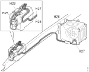

---
hide:
  - footer
---
## Општо

{ width="400" }

### Локација

{ width="400" } 

### Симбол

{ width="400" }

## Начин на работа

Цревата наменети за редуктант се електрично греени со цел да се формира мраз при ниски надворешни температури. Електричното греење го активира контролната единица (EEC3). Цревото H27 е врска помеѓу резервоарот за редуктант и дозерот.