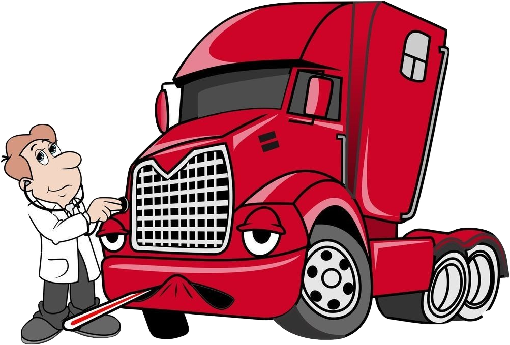

## Link Logistik N&N

Упатството за одржување се состои пред се од документи од SCANIA - Workshoop Manual, Scania Multi и упатство за програмот SDP3 а кои се однесуват за броевите на шасии кои ги поседува Link Lоgistik N&N.

Возила во сопственост на Link Logistik N&N

| VIN | Боја | Пуштена во сообраќај | мотор тип | Регистарска таблица | Мотор бр |
|-|-|-|-|-|-|
| YS2R4X20002102509 | Зелена | 01.09.2015 | DC13 124 L01 | SK-1524-BB |-|
| YS2R4X20002102805 | Зелена | 08.09.2015 | DC13 124 L01 | SK-3127-AZ | 1857180 |
| YS2R4X20002102840 | Зелена | 17.09.2015 | DC13 124 L01 | SK-9659-BB |-|
| YS2R4X20005361385 | Незнам | 31.07.2015 | DC13 115 L01 | SK-2753-BE | 6833358 |
| YS2R4X20005364181 | Незнам | 01.10.2015 | DC13 115 L01 | SK-4552-BB |-|
| YS2R4X20005374016 | Црвена | 29.01.2016 | DC13 115 L01 | SK-9658-BB |-|
| YS2R4X20005458644 | Црна | 01.03.2018 | DC13 115 L01 | SK-5072-BG |-|

Комплетен број на ECU (електронска контролна единица) <small>податоци земени со XCOM 2.30</small>

шасија: *2102805*

|&nbsp;| ACC ACC1 | APS APS1 | C007 | CTS CTR1 | CUV 1.00 | BMS EBS5 | EEC EEC3 | SMS ELC4 | ICL ICL2 C | LAS LAS2/RCL | GMS OPC5 | RET2 | EMS S8 DC13124 |
|-|-|-|-|-|-|-|-|-|-|-|-|-|-|
| производител | SRE | WABCO | SCANIA CV AB | ABAE | Hella | Knorr-Bremse | SCANIA CV AB | WABCO | STONERIDGE | STONERIDGE | SCANIA CV AB | SCANIA CV AB | SCANIA CV AB  |
| број | 2419809 | 2287595 | 2753529 | 2277970 | 1943668 | 2239955 | 2562200 | 2236807 | 2311534 | 2246313 | 2418841 | 2418841 | 2621337 |

:bootstrap-cup-hot:

