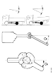
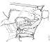

## Вибрации и нарушувањена удобност

Некои вибрации во возилото се нормални. Ако вибрациите го нарушуваат удобството на возење а не се од коловозот тогаш извор е самото возило. Не постои универзално решение за проблемите поврзани со вибрации.

## Испитување и решавање на проблемот

### Пробно возење и прашања за возачите

Исклучително е важно да се разбере кои вибрации возачот ги чувствува за проблем. Прашањата подолу може да се користат за испрашување на возачот или да се пополнат за време на тест возењето.

За врема на тест возењето треба да се внимава на следното:

- Доколку возилото има воздушнa суспенсија, да се провери висината и да се запише.

- Да се провери и запише висината на кабината.

- Пред тест возењето не треба да се прават никакви измени на возилото.

- Тестирањето на возилото треба да биде спроведено во исти услови при кои се појавува проблемот а врз основа на описот на возачот. Однесувањето на возилото при тест возењето треба да се запише.

- Тестирањето на возилото треба да се изврши со возачот кој го пријавил проблемот.

Прашања

| Прашање | Да | Не | Забелешка |
| - | - | - | - |
| Дали вибрациите се јавиле после работа врз возилото. | &nbsp; | &nbsp; | &nbsp; | 	 	 
| Дали вибрациите се чувствуваат на воланот, седиштето или друг дел на возилото. | &nbsp; | &nbsp; | &nbsp; | 	 	 
| Дали врз вибрациите има влијание состојбата на патот. | &nbsp; | &nbsp; | &nbsp; | 	 	 
| Дали вибрациите можат да се почуствуваат, видат или чујат. | &nbsp; | &nbsp; | &nbsp; |	 	 	 
| Дали вибрациите доаѓат од одреден смер. |	 	 	 
| Дали вибрациите доаѓат од одреден смер.	 	 	 
| Дали вибрациите се најголеми при одредена брзина.	 	 	 
| Дали вибрациите се најголеми при одреден број на вртежи на моторот.	 	 	 
| Дали вибрациите се поврзани со моментот на моторот, при забрзување, кочење или под инервција.	 	 	 
| Дали вибрациите се поврзани со големината или типот на товарот.	 	 	 
| Дали вибрациите зависат од тоа дали се вози приколица или не.	 	 	 
| Дали вибрациите се јавуваат кога се менува висината на возилото или се подига осовина.	 	 	 
| Дали вибрациите се под влијание на смерот на ветарот.	 	 	 
| Дали вибрациите се јавуваат кога се кочи. | &nbsp; | &nbsp; | &nbsp; | 

### Изоври на вибрации

#### Тркала

<figure markdown>
  { width="400" }
  <figcaption>Искривено тркало</figcaption>
</figure>

<figure markdown>
  { width="400" }
  <figcaption>Елипсесто тркало</figcaption>
</figure>

<figure markdown>
  { width="400" }
  <figcaption>Нерамномерна потрошувачка, рамно место</figcaption>
</figure>

Вибрациите, предизвикани од деформации на тркалата се јавуваат поради небаласираност или разлики во површината на шарата на гумата. Ова создава варијации на силата на осовината кое најјасно се гледа на рамни патишта.

Фреквенцијата на вибрациите се зголемува со зголемување на брзината на возилото и често се доживува како надолжно задвижување или бочно задвижување на кабината.

Да се проверат гумите во согласност со [Вибрации, проверка на тркалата](../wheels/090003.md)

#### Погонско вратило

{ width="400" }

Монтажата на погонската осовина може да предизвика до појава на реактивни сили во возилото. Колку е поголем аголот кај карданскиот склоп толку се поголеми реактивните сили.

Оштетен или непрописно балансирана погонска осовина може исто така да предизвика вибрации.

#### Налегнување на забите на запчаниците на менувачот

Вибрациите можат да се јават како резултат на промената во торзиониот мемент и снагата кои се како разелтат на налегнување на забите во запчаниците на менувачот.

{ width="400" }

Монтажата на погонската осовина може да предизвика до појава на реактивни сили во возилото. Колку е поголем аголот кај карданскиот склоп толку се поголеми реактивните сили.

Оштетен или непрописно балансирана погонска осовина може исто така да предизвика вибрации.

#### Мотор

Вибрациите од моторт можат да се осетат кога возилото е во движење и кога е во мирување.

Причина за вибрациите во моторт е самиот процес на согорување или подвижните делови. Фреквенцијата на вибрациите се зголемува како се зголемува бројот на вртежи на моторот.

#### Сопирачки

Вибрации од сопирачките се јавуваат при диск за сопирање кој е искривен или е со нерамномерна дебелина по обемот.

#### Коловоз

Нерамнините на патот можат да предизвикааат вибрации во возилото кои најчесто се нормални.

#### Ветер

Удари на директен ветер или бочен ветер можат да предизвикаат вибрации во возилото.

### Реакција на возилото

#### Отскокнување на возилото

{ width="400" }

Возилото отскокнува на задните гуми што во кабината се чувствува како подолжно движење. Кај возилата со воздушна амортизација потскокнувањето може да се случи кога возилото се вози празно или со мал терет. Кај возилата со амортизација со лиснати опруги потскокнувањето може да се случи при сите видови на терет иако е најчесто при мал терет.

Возилото потскокнува бидејки кај возилата кои немаат амортизери дел на движењата се случуваат во гумите. Одредено потскокнување на гумите е нормално, особено кога се вози празно возило.

***Можни причини за вибрациите***

- Нерамен пат
- Оштетени или не балансирани тркала на задната(и) осовина.

***Како да се открива отскокнувањена гумите***

- Кога вибрациите се случуваат при брзина 50-60km/h на равен пат на нетоварено возило со тркала со нормална големина со возење покрај возилото може да се примети потскокнувањето.
- Фрекфенцијата на вибрациите е околу 5Hz.

#### Поместување на осовината

***Завртување на осовината***

{ width="400" }

Завртувањето на осовината се манифестира на гумите. Задвижувањетото на осовините се случува, на пример кога се вози на пат со дупки.

***Можни причини за вибрациите***

- Елипсоидни тркала.
- Нерамен пат, на пример ненивелирани шахти и дупки.

***Како да се открива отскокнување на гумите***

- Движењето се случува при брзина 60-70km/h на равен пат. Потребна е проверка н атркалата.
- Фрекфенцијата на вибрациите е околу 11-13Hz и во кабината се чувствува како бочно движење.

#### Варијации на силата на сопирање

Варијација на силата на сопирање може да настане кога сопирачката на тркалото е дефекна што ќе се почуствува во кабината.

***Можни причини за варијациите***

- Елепсоидни или деформирани сопирачки барабани. Треба да се знае дека оштетен бандаж на тркалото може да доведе до елеисоидност на барабанот.
- Непрописно стегање на тркалата. Барабанот може да се оштети ако завртките се стегани по непрописен ред, ако има нечистија помеѓу бандажот и барабанот или нечистотија помеѓу барабанот и носачот на тркалото.

***Како да се открие дали има варијација на сопирачката сила***

- Се јавува движење само кога се сопира.

Ако има варијација на силата на сопирање треба:

- да се запознае намената и начинот на делување на сопирачката. 
- да се запознае со намената и начинот на работа на сопирачкиот барабан. 
- да се запознае со намената и начинот на работа на дискот за сопирање. 
- момент на затегање на тркалата. 
- волан, проверка и отклонување на дефекти. 

#### Поместување на рамот

{ width="400" }

Осцилациите на рамот се природно движење кое може да ја поремети удобноста ако пригушувањето е несоодветно или ако постои проблем поради искривени тркала.

***Можни причини за осцилациите***

- Неравен пат.
- Искривени тркала.
- Нерамномерна потрошувачка на тркалата на пример рамно место.

***Како да се открие дали има поместување на рамот***

- на вибрациите влиае товарот.
- вибрациите се јавуват во тесен осег на брзина и на рамен пат.

{ width="400" }

Во случај на осцилации на рамот да се преземат следните меки:

- Да се тестира возилото со приколица за која со сигурност се знае дека е исправна.
- Да се проверат точките на прицврстување на каросеријата. Лабавите споеви да се затегнат.
- Ако возилото има под рам да с епровери дали подрамот лежи н арамот.
- За возила со помошен рам да се провери растојанието од средишната точка на предната осовина до предниот приклучок н арамот. Кај возила со воздушна амортизациоја ова растојание е највеќе 600mm. За предни осовини со лиснати пружини ова растојание е највеќе 850mm.
- Ако се сомнева дека лежиштата за стабилизацијата на кабината се истрошени, да се проверат. Внатрешното гумено лежиште може да се провери само ако е демонтирано од кабината.
- Да се проверат тркалата дали се искривени или небалансирани.

#### Вибрации на воланот

{ width="400" }

Овие вибрации се чувствуваат на самиот волан. За повеќе инвормации д ас евиди овде [Волан]().

Да не се заборави дека причина за овие вибрации можат да бидат предната осовина или управувачката осовина која се спушта.

#### Поместување на погонот

***Можни причини за осцилациите***

- Небалансирани вибрации од моторот.
- Вибрации поврзани со согорувањето во моторот.
- Преголем агол на зглобот на погоското вратило.
- Небалансираност на погонското вратило.

***Како да се открие дали има небалансирани вибрации на моторот***
- Вибрациите се јасно видливи во опсегот од 2000-500rpm кога бројот на вртежи на моторот се намалува со отуштање на педалата за гас.

***Како да се открие дали има вибрации на моторот поради согорување***
- Вибрациите се јасно видливи кога моторот е оптеретен и со ист број на вртежи без обзир на степенот на пренос.
- Се приметува дека моторот не работи рамномерно при празен од.

Во случај на вибрации на погонот треба да се провери следното:

- дали погонскиот склоп се допира до шасијата.
- дали пригушувачите за вибрации на погонот се исправен тип и дали се оштетени.
- дали кабината се допира до шасијата.
- дали лежењето на кабината и системот за наслонување е исправен и исправно поставен.
- ако и после отклонување на утврдени горе наведени неправилност проблемот останува, дополнителни информации можат да се најдат во делот за отклонување на проблеми во системот за гориво.

***Како да се открие дали аголот на погонската осовина е добар***

- Вибрациите се јасно видливи при голем број на вртежи и на нив влијае дали пратечката осовина е подигната или не , или ако е променета висината на возилото.

Во случај на вибрации поради небалансираност на погонското вратило и погрешен агол на зглобот на вратилото треба да се провери следното:

- да се провери дали осовината е оштетена и дали теговите за балансирање се на место.
- да се провери дали има фрлање во зглобот на погонското вратило.
- да се провери дали нивото на возилото е исправно подесено. Непрописно ниво на возилото доведува до неправилен агол на зглобот на возилото.
- да се активира, на кратко, ELC контролата на возилото и да се види дали има вибрации при низок број на вртежи.
- ако и после отклонување на утврдени горе наведени неправилност проблемот останува, дополнителни информации можат да се најдат во делот за отклонување на проблеми на попгонската осовина.

#### Поместување во дополнително вградената опрема

***Можни извори на вибрации***

- Вибрации кои се чувствуваат на тркалата, погонската осовина, менувачот, моторот сопирачката и коловозот.
- Брзината на ветерот

***Како се открие дали има поместување во дополнително вградената опрема.***

- Таблите на кровот вибрираат.
- Вибрации во дополнително инсталираната кутија за алат.

Во случај на вибрации во дополнително вградената опрема треба:

- да се презатегнат лабавите врски на дополнително поставената опрема.

### Технички поими

#### Фрекфенција

Фрекфенцијата, се мери во Hz, покажува колку често одреден настан се повторува, какао на пример поместување. Поместување кое се повторува три пати во секенда има фрекфеција  од 3Hz. Поместување кое има фрекфенција од 6-7Hz може да се почуствува, на пример во стомакот или мускулите на подколеница.

#### Осцилација и амплитуда

{ width="400" }

Амплитуда е половина вредност од висината ***y***, на осцилацијата со период ***T*** кај поместување кое се јавува рамномерно.

Осцилациите се чувствуваат како поместување и нарушување на удобството особено во опсегот од 0-25Hz. Осцилациите над 25Hz се чувствуваат какао шум.

#### Природна фрекфенција

Природната фрекфенција е одредена од масата и крутоста (така наречена константа на пружината) н асистемот. Природната фрекфенција се намалува како расте масата и се зголемува со зголемување на крутоста на системот.

#### Пригушување

Објектот би осцилирал бескрајно кога не би постоело пригушувањето. Пригушувањето постои на пример во лиснатите пружини или во аморизерите.

 

