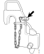
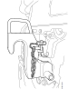
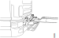
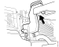
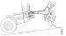
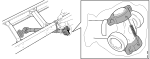
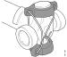
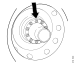
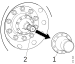

## Опис на работни задачи

## Влечење

Секогаш при влечењето и пренесувањето да се користи алатката ***99 340***.

{ width="400" }

!!! warning "Предупредување"

    Алатката треба да е поставена со забравникот.

Алатката е дизајнирана за правилно да ја распредели силата на подигање на носачите на кабината. Таа може да се користи кај возила со амортизација со пружини или воздушна но мора де се користи во пар.

!!! warning "Предупредување"

    Никогаш да не се подигаат носачите за влечење без користење на алатката.

!!! warning "Предупредување"

    Нормално е да при влечењето и префрлувањето неколку функции на возилото да се деактивираат.

!!! info "Важно"

    Да се одспои погонското вратило или полу вратило ако возилото треба да се повлече повеќе од 500m. Ако не се одспои погоското вратило може да с еоштети запчаничката кутија.

| Операција |&nbsp;|
|-|-|
| 1.Да се обезбеди алатката на носачот од кабината и за де забрави. | { width="400" } |
| 2.Возилото за влечење да се постави така да неговата греда дојде во контакт со куките на алатката. | { width="400" }|
| 3.Да се подигне гредата така да дојде во контакт со алатката. | { width="400" } |
| 4.Да се подигне возилото. Возилото да се влече со мала брзина и големо внимание. | { width="400" }|

## Одспојување на погонското вратило P400, P500

| Операција |&nbsp;|
|-|-|
| 1.Да се приложи паркирна кочница. | &nbsp; |
| 2.Возилото за влечење да се постави така да неговата греда дојде во контакт со куките на алатката. | { width="400" }|
| 3.Да се притиска носачот на лежиштето подеднакво од двете страни со помош на два одвртувачи. | { width="400" } |
| 4.Да се држи осовината и да се извадат завртките. | &nbsp; |
| 5.Да се закачи осовината на шасијата а зглобот и држачот на лежиштата да се заштитат со пластична кеса. Ако пружината е скршена или недостасува, држачите на лежиштата да се прицврстат на крстот од зглобот. Потоа осовинат ада зе прицврсти на шасијата. | { width="400" } { width="400" } |

## Одспојување на полуосовина

Погонските осовини треба да се одспојат од двете страни.

| Операција |&nbsp;|
|-|-|
| 1.Да се приложи паркирна кочница. | &nbsp; |
| 2.Да се очисти околу прирабницата на полуосовината. | &nbsp; |
| 3.Да се извадат навртките и капачките. | { width="400" } |
| 4.Да се извади прирабницата (1) од полуосовината (2). |  { width="400" }  |
| 5.Да се извади полуосовината. | &nbsp; |
| 6.Да се врати назад прирабницата за да се обезбеди заштита од прашина. | &nbsp; |
