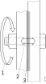
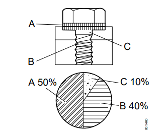
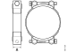

## Објаснување

### Зошто е потребен момент на затегање

| &nbsp; | &nbsp; |
|-|-|
|Кога спојот е затегнат, заврткaта е растегната. Колку повеќе завртката се затега толку поголема сила на спојот се создава. Ова овозможува да се добие пренапрегнат спој. Ова важи само до одредена граница, која не се знае ако не се користи момент клуч. Ако оваа граница се надмине завртката ке биде премногу растегната. Во овој момент звртката често пука и спојот ја губи пренапрегноста. Предоптерувањето кое настанува во спојот создава сила на затегање. Оваа сила на затегање обезбедува триење помеѓу површините и на тој начин ги држи заедно. - 1.3.Сила на затегање - 2.Предоптеретување во спојот - 3.Триње | { width="240" } |

### Затегање со момент клуч

{ width="240" }

Затегањето со момент клуч и понекогаш дополнително затегање со одреден агол обезбедува пренапрегање кое ја зголемува силата на затегање во спојот.
Околу 90 % од моментот на затегање се губи во совладувањето на отпорот на контакните површини на завртката и навртката. Останатите 10 % се претвараат во сила на затегање.
Моментот на затегање се пресметува, на тој начин , да се добие исправна сила на затегање, врз основа на големината на спојот и триењето.
Векот на траење на спојот зависи од силата на затегање. Секогаш треба да се користат наведени завртки, навртки и подметки и момент на затегање за да се обезбеди исправна сила н азатегање.

!!! info "Забелешка"

    Ако моментот на затегање и преголем, заврката може да се растегне намалувајки го триењето.

!!! info "Важно"

    - Рачката на момент клучот треба да се врти со рамномерна брзина.
    - Момент клучот не смее да се користи како чекан.
    - Рачката на момент клучот не смее да се продолжува освен ако момент клучот не е дизајниран за тоа.

### Аглово затегање и презатегање

Кога навојниот спој се затега, секогаш има свлекување на материјал. Најголемата количина на свлекување често се јавува веднаш по затегнувањето. Кај споевите подложени на големо оптоварување и/или големи температурни разлики, свлекувањето се случува во подолг временски период. Ова свлекување резултира со губење на претходното оптоварување кое мора да се компензира преку аглово затегање или   презатегање.

#### Аглово затегање

Типичен навоен спој кој бара аголно затегнување е затегнувањето на главата на цилиндерот на цилиндерскиот блок. Големината на аголот е различна за различни спевии. Секогаш треба да се следат упатствата во упатството за одржување.

{ width="400" }

- 1.Момент на затегање (често помало од нормалното затегање).
- 2.Дополнително затегање со одреден агол (аголот е така осбран да не дојде до престегање на завтката).
  
#### Повторно затегање

Повторното затегнување се врши кога спојот бил во употреба одреден временски период. Одредени споеви секогаш мора повторно да се затегнуваат. Другите споеви не смеат повторно да се затегнуваат под никакви околности. Секогаш треба да се следат инструкциите во упатството за одржување за да се види дали навојниот спој треба да се презатегне.

#### Повторно користење на завртките

Поради тоа што при секое затегање завртките се издолжуваат, завртките во одредени споеви можат да се користат само одреден број пати. Ова треба да се види во соодветното упатствата за одржување.

Навртки со најлонски влошки не смееат повторно да се употребуваат.

### Специфичeн, нормалeн и специјален момент на затегање

Различните барања за предоптеретувањето на навојните споеви се поделени како специфичен, нормален и специјален момент на затегање.

- ***Специфичен момент на затегање*** е сперцифичен за одреден навоен спој во возилото. Специфичниот момент е наведен во описот на работа во упатството за одржување. Ако специфичниот момент на затегање е наведен тој секогаш мора да се употребува.
-  ***Нормален момент на затегање*** се употребува во навојни споеви каде не е наведен специфичен момент на затегање и каде нормалниот момент на затегање е доволен.
-  ***Специјален момент на затегање*** се употребува во навојни споеви каде не е наведен специфичен момент за затегање, но каде има строги барања за распределбата на силата на предзатегање.

### Означување на завтки, навртки и подметки

#### Завртки со шестоаголна глава

| &nbsp; | &nbsp; |
|-|-|
| Означувањето е со две цифри, понекогаш одвоени со точка. Првата цифра (1) е една стоата од крајната цврстина. Пример: 10 значи цврстина од 1000 MPa. Производот на првата цифра (1) со втората цифра (2) е една десета од границата на пластичност. Пример: 8.8 значи дека границата на пластичност е 640 MPa додека 10.9 значи 900 MPa. | { width="400" } |

#### Навртки

Означувањето на навртките е со една цифра. Цифрата кажува дека навртката е изработена за употреба со завртка со истата прва цифра. Означувањето може да биде и со цртички со позиција како кај часовник и точка за 12 часот.

| класа 8 | класа 10 |
| - | - |
|{ width="400" } | { width="400" }|
| класа 12 | класа D5, ниска навртка |
|{ width="400" } | { width="400" }|

#### Левоодни завртки и навртка

| &nbsp; | &nbsp; |
|-|-|
| Левоодните завртки и навртки се означени со стрелка или втисната линија на работ за рамнината за клучот. | { width="400" }|

## Спецификација

### Нормален момент на затегање

!!! info "Важно"

    Секогаш , прво треба да се провери дали во упатството за работата е наведен посебен момент на затегање. Посебниот момент на затегање е со поголем приоритет од специјалниот и нормалниот момент на затегање.

- Ако ништо не е наведено се подразбира толеранција од ±15%.
- Пред да се изврши затегањето на контактната површина не треба да има боја и нечистотија.
- Завртките и навртките не се подмачкуваат без разлика на површинскиот третман. Сите исклучоци се наведени во упатствата за одртжување.

***Унија споеви***

Наведенит вредности се применуваат со толеранција од ±5%. Вредности се односе на затегање со контра-држачи.

***Навојна влошка***

Наведенит вредности на затегање се однесуваат и за навојни спеви со навојна влошка (Хели-коил). Навојните влошки често овозможуваат поголема цврстина во споредба со дирекно врежан навој. Тие чината појак навоен спој во на пример алуминиум. Од тие причини Scania ги користи во некои споеви.

!!! info "Забелешка"

    Кога оштетен навој се поправа со навојна влошка треба да се задржи навојот и пропишаното затегнување. Монтажата на навојната влошка треба да е соодветна на инструкциите во упатствата за одржување.

#### Шестаголни заврки, шестоаголен имбус, имбус со шест точки и шестоаголна навртка

{ width="600" }

| Навој | класа  8.8 или 8   Момент на затегање (Nm)|
|-|-|
| M4 | 2.9 |
| M5 | 6 |
| M6 | 9.5 |
| M8 | 24 |
| M10 | 47 |
| M12 | 84 |
| M14 | 135 |
| M16 | 210 |
| M18 | 290 |
| M20 | 420 |
| M22 | 580 |
| M24 | 730 |

#### Завртки и навртки со шестоаголна глава и интегрирана подметка

{ width="300" }

| Навој | класа  8.8  Момент на затегање (Nm)|
|-|-|
| M5 | 6.7 |
| M6 | 10.2 |
| M8 | 26 |
| M10 | 50 |
| M12 | 77 |
| M14 | 149 |
| M16 | 184 | 

#### Имбус завртки со шест точки и шестоаголна завртка со интегрирана подлошка

{ width="300" }

| Навој | класа  8  Момент на затегање (Nm)| класа  10  Момент на затегање (Nm)|
|-|-|-|
| M4 | 2.9 | - |
| M6 | 9.4| 11 |
| M8 | 24 |26 |
| M10 | 47 | 49
| M12 | 80 | 85 |
| M16 | 184 | 

#### Имбус завртки со шест точки и ST навој

{ width="300" }

| Навој | Момент на затегање (Nm)|
|-|-|
| ST2.9 | 1.1 |
| ST3.5 | 1.9 |
| ST4.2 | 3.1 |
| ST4.8 | 4.5 |
| ST5.5 | 7.1 |
| St6.3 | 9.7 |

#### Голи завртки во навоен отвор класа 8.8/8

{ width="300" }

***Метрички навој, груб чекор***

Едниот крај на голата завртка мора да се затегне за да при вадење на навртката не се олабави голата завртка. За да се затегне гола завртка во навоен отвор моментор треба само да го надмине триењето во навојот и да генерира преоптеретување. Моментот за забравување е 50% од нормалниот момент за завртка со шестоаголна глава.

### Спојни навртки за прстен, челична цевка

{ width="300" }

| &nbsp; | &nbsp; | Момент на затегање (Nm) | Момент на затегање (Nm) |
|-|-|-|-|
| Навој | дијаметар на цевка | челична цевка со челична навртка со обод | челична цевка со челична навртка со О-прстен |
| M10X1 | 5 | 15 | - |
| M12X1.5 | 6 | 20 | 12 |
| M14X1.5 | 8 | 30 | 12 |
| M16X1.5 | 10 | 40 | - |
| M18X1.5 | 12 | 45 | - |
| M20X1.5 | 12 | 55 | - |
| M22X1.5 | 15 | 60 | - |
| M24X1.5 | 15 | 60 | - |
| M30X2 | 22 | 120 | - |

### Спојни навртки за прстен, пластична цевка

{ width="300" }

| &nbsp; | &nbsp; | Момент на затегање (Nm) | Момент на затегање (Nm) |
|-|-|-|-|
| Навој | дијаметар на цевка | пластична цевка со челична или бронза навртка со обод | пластична цевка со обод од бронза и навртка со гумена заптивка |
| M10X1 | 5 | 10 | - |
| M12X1.5 | 6,8,12 | 10| - |
| M14X1.5 | 6,8 | 20 | -|
| M16X1.5 | 6,8,10,12 | 25 | 15 |
| M18X1.5 | 12 | 30 | 20 |
| M20X1.5 | 12 | 35 | - |
| M22X1.5 | 6,8,10,12,14,16 | 40 | - |
| M24X1.5 | 16 | 50 | 40 |
| M30X2 | 22 | 58 | - |

### Навртки за влез на спој

{ width="300" }

| Навој | Момент на затегање (Nm)|
|-|-|
| M12X1.5 |20 |
| M14X1.5 | 25 |
| M16X1.5 | 30 |
| M18X1.5 | 50 |
| M24X1.5 | 70 |
| M30X2 | 80 |

### Спојка со конусен навој за поврзување на порта

{ width="300" }

| навој | прав приклучок момент на затегање | аголен приклучок момент на затегање |
|-|-|-|
| M10X1k | 10 | 8 |
| M12X1.5k | 10 | 8 |
| M14X1.5k | 15 | 10 |
| M16X1.5k | 15 | 10 |
| M18X1.5k | 20 | 15 |
| M20X1.5k | 25 | 20 |
| M22X1.5k | 25 | 20 |
| M26X1.5k | 45 | 40 |

### Спојка, чеп и банџо завтка со цилиндричен навој со заптивање со бакарна подлошка или челично-гумена за поврзување на површина

{ width="300" }

| Навој | Момент на затегање (Nm)|
|-|-|
| M8X1 |10 |
| M10X1 | 20 |
| M12X1 | 20 |
| M14X1.5 | 25 |
| M16X1.5 | 30 |
| M18X1.5 | 35 |
| M20X1.5 | 45 |
| M22X1.5 | 50 |
| M24X1.5 | 60 |
| M26X1.5 | 70 |
| M28X1.5 | 110 |
| M30X2 | 115 |
| M32X1.5 | 115 |
| M36X1.5 | 160 |
| M38X1.5 | 170 |
| M45X1.5 | 270 |    

 
### Чеп со конусен навој

{ width="300" }

| Навој | Момент на затегање (Nm)|
|-|-|
| M10X1k |15 |
| M12X1.5k | 20 |
| M14X1.5k | 20 |
| M16X1.5k | 25 |
| M18X1.5k | 40 |
| M20X1.5k | 40 |
| M22X1.5k | 40 |
| M26X1.5k | 60 |

### Врска за вметнување за поврзување на порта со надворешен навој

{ width="300" }

| Навој | Момент на затегање (Nm)|
|-|-|
| M10X1 |18 |
| M12X1.5 | 24 |
| M14X1.5 | 28 |
| M16X1.5 | 35 |
| M18X1.5k | 40 |
| M20X1.5k | 40 |
| M22X1.5 | 40 |

### Врска за вметнување за спојка

{ width="300" }

| навој | прав приклучок момент на затегање | аголен приклучок момент на затегање |
|-|-|-|
| M14X1.5 | 4-8 | 10 |
| M18X1.5 | 12 | 15 |
| M24X1.5 | 16 | 25 |

### Завртки со крст со метрички навој и UNC навој

| Метрички навој | UNC | класа 4.8 Момент на затегање (Nm) | класа 4.8 Момент на затегање (Nm) |
|-|-|-|-|
| 3 | - | 0.4 | 0.7 |
| 3.5 | No. 6 UNC | 0.6 | 1 |
| 4 | No. 8 UNC | 1.5 | 2 |
| 5 | No. 10 UNC | 2 | 3 |
| - | No. 12 UNC | 3 | 5 |
| 6 | 1/4 UNC | 4 | 7 |
| 8 | 5/16 UNC |9 | 15 |
| 10 | 3/8 UNC | 18 | 30 |
| 12 | 7/16 UNC | 30 | 50 |

 
## Специјален момент на затегање

!!! info "Забелешка"

    Секогаш , прво треба да се провери дали во упатството за работата е наведен посебен момент на затегање. Посебниот момент на затегање е со поголем приоритет од специјалниот и нормалниот момент на затегање.

Специјалните моменти на затегање се применуваат за навојни споеви каде што има строги барања за распределба на силата на предзатегање. Распределбата на моментот на затегање е ±15%, што значи дека
  распределбата на силата на стегање ќе биде приближно ± 30%.

- Ако ништо не е наведено се подразбира толеранција од ±15%.
- Пред да се изврши затегањето на контактната површина не треба да има боја и нечистотија.
- Завртките и навртките не се подмачкуваат без разлика на површинскиот третман. Сите исклучоци се наведени во упатствата за одртжување.
  
### Шестаголни заврки, шестоаголен имбус, имбус со шест точки и шестоаголна навртка

Исто така се однесува и за завртки со интегрирана подлошка и за завртки со навој за чистење.

{ width="500" }

| Навој | класа  10.9/10   Момент на затегање (Nm)|
|-|-|
| M4 | 3.6 |
| M5 | 7.5 |
| M6 | 12 |
| M8 | 30 |
| M10 | 59 |
| M12 | 105 |
| M14 | 170 |
| M16 | 270 |
| M18 | 360 |
| M20 | 530 |
| M22 | 730 |
| M24 | 910 |

### Шестаголни заврки, шестоаголен имбус, имбус со шест точки и шестоаголна навртка

Исто така се однесува и за завртки со интегрирана подлошка и за завртки со навој за чистење.

{ width="240" }

| Навој | класа  10.9/10  Момент на затегање (Nm)|
|-|-|
| M5 | 8.1 |
| M6 | 13 |
| M8 | 32 |
| M10 | 63 |
| M12 | 115 |
| M14 | 187 |

## Момент на затегање - стеги за црева

Се однесува за стегање со рака

| { width="240" } | Максималниот момент на затегање за нова, немонтирана стега е 1 Nm. |
|-|-|
| A = Широчина (mm) | Момент на затегање [±15% Nm] |
| 7.5-9 | 1.5 |
| 12 | 5 |

| { width="240" } | { width="240" } |
|-|-|
| A = Широчина (mm) | Момент на затегање [±15% Nm] |
| 20 | 10 |
| 25 | 20 |

