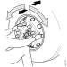
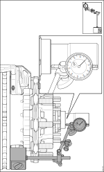

---
hide:
  - footer
---

## Спецификација

Максимално дозволено фрлање на лежиштата од тркалото: 0.0mm

*не се однесува за RH832, RH735/835 или AD/ADA1300/D.*

## Опис на работни задачи

### Фрлање на лежиштата од тркалото

#### Предна осовина

*Link Logistk N&N: АМ740*

| Операција |&nbsp;|
|-|-|
| 1.Да се подигне и потпре осовината. За исправно држење на осовината да се види во: [Подигање и потпирање на држач](000103.md). | &nbsp; |
| 2.Да се отпушти рачната кочница. | &nbsp; |
| 3.Проверката на лежиштата се состои од следните операции.   - Тркалото да се заврти со рака и да се слуша дали има некакво тропкање во лежиштата.   -Да се провери дали има течење од лежиштата. - Да се постави компараторот [98 075]() и носачот се прецизно подесување [587 250]() како што е прикажано на сликата. Компараторот треба да се постави на ракавецот на осовината. - Да се притисне и во исто време да се заврти тркалото додека цилиндрите на лежиштето не легнат. Да се подеси нула на компараторот. - Да се повлече тркалото кон себе и во исто време да се заврти. Да се отчита фрлањето. Постапката да се повтори неколку пати по што да се пресмета средната вредност на фрлањето.   Ако зазорот е поголем од 0.0mm да се замени лежиштето. | { width="400" } { width="400" }|

#### Задна осовина, без редукција во носачот на тркалото

*не се однесува за RH832, RH735/835 или AD/ADA1300/D.*

*Link Logistk N&N: ADA1110*

| Операција |&nbsp;|
|-|-|
| 1.Да се подигне и потпре осовината. | &nbsp; |
| 2.Да се демонтира тркалото со помош на подигачот на тркала [587 121 ](). | &nbsp; |
| 3.***За возила со барабан сопирачка да се демонтира барабанот.***  |  &nbsp; |
| 4.Да се постави компараторот [98 075]() и носачот се прецизно подесување [587 250]() како што е прикажано на сликата. Компараторот треба да се постави на ракавецот на осовината. | { width="400" } |
| 5.Да се притисне и во исто време да се заврти тркалото додека цилиндрите на лежиштето не легнат. Да се подеси нула на компараторот. | &nbsp; |
| 6.Да се повлече тркалото кон себе и во исто време да се заврти. Да се отчита фрлањето.   Ако зазорот е поголем од 0.0mm да се замени лежиштето. | &nbsp; |

