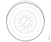
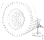

---
hide:
  - footer
---

## Објаснување

Ако има сомнеж дека причината за вибрациите на возилото се гумите потребно е да се провери радиалното и аксиалното фрлање на тркалата.

!!! info "Информација"

    При пријава на овој дефект потребно е да се изготви и сочува резултатаот од испитувањето.

## Спецификација

Формулар за извештај од извршено испитување

<figure markdown>
  { width="1000" }
  <figcaption>&nbsp;</figcaption>
</figure>

## Опис на работни задачи

### Првична проверка

| Операција |&nbsp;|
|-|-|
| 1.Да се провери дали гумите се оштетени според [Возило/Вибрации,проверка и отклонување](../vehicle/000004.md) | &nbsp; |
| 2.За да се откријат неправилностите, тест возењето треба да го извршува возачот кој го пријавил дефектот. Да се провери дали осовината која се спушта ги предизвикува вибрациите. Од возачот, преку разговор да се проба проблемот да се сведе на одредена осовина. | &nbsp; |
| 3.Да се исперат гумите и бандажите од двете страни. Големи наслаги на нечистотии, кал и мраз можат да го наружат балансот и да предизвикаат вибрации. | &nbsp; |
| 4.Да се провери дали гумите и бандажите се неоштетени. | &nbsp; |
| 5.Да се изврши пробно возење и да се види дали нема вибрации. | { width="400" } |

### Проверка со машина за балансирање

| Операција |&nbsp;|
|-|-|
| 1.Да се подигне и осигура возилото. | { width="400" } |
| 2.Да се запише позицијата на тркалото во возилото, за да може да се врати на оргиналното место. | &nbsp;|
| 3.Да се извади тркалото и да се постави на машина за балансирање. | { width="400" } |
| 4.Да се провери аксијалното фрлање на тркалото. Фрлање поголемо од 2mm е доказ дека гумата или бандажот е оштетен. | { width="400" }|
| 5.Да се провери како лежи гумата на бандажот со вртење на баланс машината. Линијата за центрирање на гумата треба да биде рамномерна одалечена од ивицата на бандажот. | { width="400" } |
| 6.Да се провери дали тркалото е искривено. Да се обележи највисоката точка на гумата и да се запише вредноста за искривеност. Искривеноста не треба да е погиолема од 1.5mm. иако вибрации можат да се јават и при помали вредности. Искивеноста може да се намали со упарување на гума бандаж. | { width="240" } { width="200" }|
| 7. Да се балансираат тркалат од внатрешната и надворешната страна. При производство на возилото погонските тркалата не се балансираат а предните тркала се балансират само од надворешната страна. За да се осигура дека не балансирањето на тркалат е причина за вибрациите добро е сите тркала да се балансираат и однадво и од внатре. | &nbsp; |
| 8. Тркалото со најголема искривеност да се монтира според [Монтирање на тркало со најгола искривеност.](090001.мmd#). Кај осовината со двојни тркала потребно е да се упарат тркала иста искривеност. Кај осовина со единечно тркало, тркалото треба да има што помала искривеност или никаква. | &nbsp; |
| 9. Да се изврши пробно возење и да се види дали нема вибрации. | { width="400" }|
| 10.Ако проблемот останува и понатаму потребно е се одстанат највисоките точки на гумата и да се контактот гума бандаж. | &nbsp; |

### Проверка без машина за балансирање

| Операција |&nbsp;|
|-|-|
| 1.Да се подигне и осигура возилото. | { width="400" } |
| 2.Тркалат кои не се погонски да се завртат со машината за вртење ***588 618 ***. Ако се примети небалансираност на било кое тркало, тркалото треба да се одстрани и да се балансира динамички. | &nbsp;|
| 3.Да се провери како лежи гумата на бандажот при вртењето со машината. Линијата за центрирање на гумата треба да биде рамномерна одалечена од ивицата на бандажот. | { width="400" } |
| 4.Да се провери дали тркалото е искривено. Да се обележи највисоката точка на гумата и да се запише вредноста за искривеност. Искривеноста не треба да е погиолема од 1.5mm. иако вибрации можат да се јават и при помали вредности. Искивеноста може да се намали со упарување на гума бандаж. | { width="240" } { width="200" }|
| 5.Да се провери аксијалното фрлање на тркалото. Мерењето може да се изврши на пример од носачот на осовината. Фрлање поголемо од 2mm е доказ дека гумата или бандажот е оштетен. | { width="400" }|
| 6.Да се отстранат неисправните тркала. | &nbsp; |
| 7. Да се монтираат тркалат онака како што е покажано во [Тркала](092001.md). Кај осовината со двојни тркала потребно е да се упарат тркала иста искривеност. Кај осовина со единечно тркало, тркалото треба да има што помала искривеност или никаква. | &nbsp; |
| 8. Да се запише искривеноста и да се види дали има подобрување. [Мерење со лењир](#мерење-на-искивеност-со-лењир) [Мерење со компаратор](#мерење-на-искивеност-со-компаратор). Тркалото со најголема искривеност да се монтира според [Монтирање на тркало со најгола искривеност.](090001.мmd#). Кај осовината со двојни тркала потребно е да се упарат тркала иста искривеност. Кај осовина со единечно тркало, тркалото треба да има што помала искривеност или никаква. | &nbsp; |
| 9. Да се изврши пробно возење и да се види дали нема вибрации. | { width="400" }|
| 10.Ако проблемот останува и понатаму потребно е се одстанат највисоките точки на гумата и да се контактот гума бандаж. | &nbsp; |

### Мерење на искривеност со лењир

Прво е потребно да се подигне и потпре осовината. Да се врти тркалото и да се мери растојанието помеѓу гумата и лењирот на секоја завртка од тркалото.

<figure markdown>
  { width="600" }
  <figcaption>Мерењена искривеност</figcaption>
</figure>

Ако е најденено отстапување во вредноста на највисоката точка истата треба да се отстрани и да се оптимизира гумата со бандажот.

### Мерење на искривеност со компаратор

Кога се мери со компаратор, за да се избегне потскокнувањето на компараторот од шарата на гумата, на гумата треба да се облепи трака на која ќе с епостави компараторот.

<figure markdown>
  { width="600" }
 +
  <figcaption>Мерење на надворешно тркало</figcaption>
</figure>

<figure markdown>
  { width="600" }
  <figcaption>Мерење на внатрешно тркало</figcaption>
</figure>

<figure markdown>
  { width="600" }
  <figcaption>Мерење, бочно, на надворешно тркало</figcaption>
</figure>

<figure markdown>
  { width="600" }
  <figcaption>Мерење на бандаж</figcaption>
</figure>

Искривеноста (А) се одредува со споредување во однос на најниската вредност.

{ width="600" }

### Мерење на највисоката точка

| Операција |&nbsp;|
|-|-|
| 1.Со вртење на тркалото и мерење со компаратор да се одреди делот од тркалото кој е највисок. | { width="400" } |
| 2.Да се означи почетокот и крајот на делот. Делот не треба да е помал од 1/3 од обемот на тркалото. |  { width="400" } |
| 3.Да се означи средината помеѓу почетокот и крајот на делот. Треба да се знае и покрај тоа што највисокиот дел не на средината од делот, средината од делот има највисоко влијание за нарушувањена балансот. | { width="400" } |

### Спарување на гумата и бандажот

Ако гумата и бандажот имаат искривеност, искривеноста може да се намали со спарување на гумата и бандажот.

| Операција |&nbsp;|
|-|-|
| 1.Кај тркалото да се провери искривеноста и да се обележи највисоката точка. | { width="400" } |
| 2.Кај бандажот исто така да провери искривеноста и да се обележи највисоката. | { width="400" } |
| 3.Да се извади тркалото од возилото. | &nbsp; |
| 4.Да се извади гумата од бандажот и повторно да се стави, сега со највисоката точка спротивно од највисоката точка на бандажот. | { width="400" } |
| 5.Да се провери дали е добиен подобар резултат и да се обележи највисоката точка на тркалото ако е променета. | &nbsp; |
| 6.Тркалото да се монтира на возилото според нструкциите во [Монтирање на тркало со обележана највисокак точка.](#монтирање-на-тркало-со-обележана-највисока-точка). | &nbsp; |
| 7.Ако проблемот останува и понатаму да се контактирта професионална работилница која ќе ја отстрани највисоката точка и ќе ги оптимизира гумите со бандажот. | &nbsp; |

### Монтирање на тркало со обележана највисока точка

***Единечно тркало***

| Операција |&nbsp;|
|-|-|
| 1.Да се постави тркалото со обележана највисока точка нагоре. | &nbsp; |
| 2.Да се постават подлошките и завртките на тркалат и завртат додека не остане околу 1mm до крајната позиција. | &nbsp; |
| 3.Да се остави тркалото да падне на носачот на тркалото и потоа да се затегнат завртките како што е опишано во [Тркало/Спецификации/Момент на затегање](092000.md#). | &nbsp; |

***Двојно тркало***

| Операција |&nbsp;|
|-|-|
| 1.Да се постави внатрешното тркалото со обележана највисока точка нагоре. | &nbsp; |
| 1.Да се постави надворешното тркалото со обележана највисока точка надоле. | &nbsp; |
| 2.Да се постават подлошките и завртките на тркалат и завртат додека не остане околу 1mm до крајната позиција. | &nbsp; |
| 3.***Опција 1*** Да се подигне надворешното тркало. Да се остави надворешното тркалото да падне на носачот на тркалото и потоа да се затегнат завртките како што е опишано во [Тркало/Спецификации/Момент на затегање](092000.md#). ***Опција 2*** Да се спушти возилото така да надворешното трало се потпира на дрвена даска. Нека внатрешното тркало падне на носачот на тркало и завртките да с езатегнат како што е опишано во [Тркало/Спецификации/Момент на затегање](092000.md#). | &nbsp; |